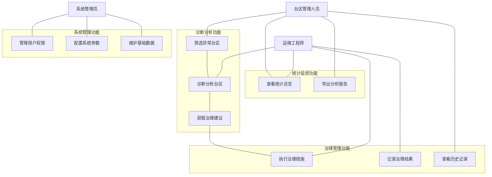
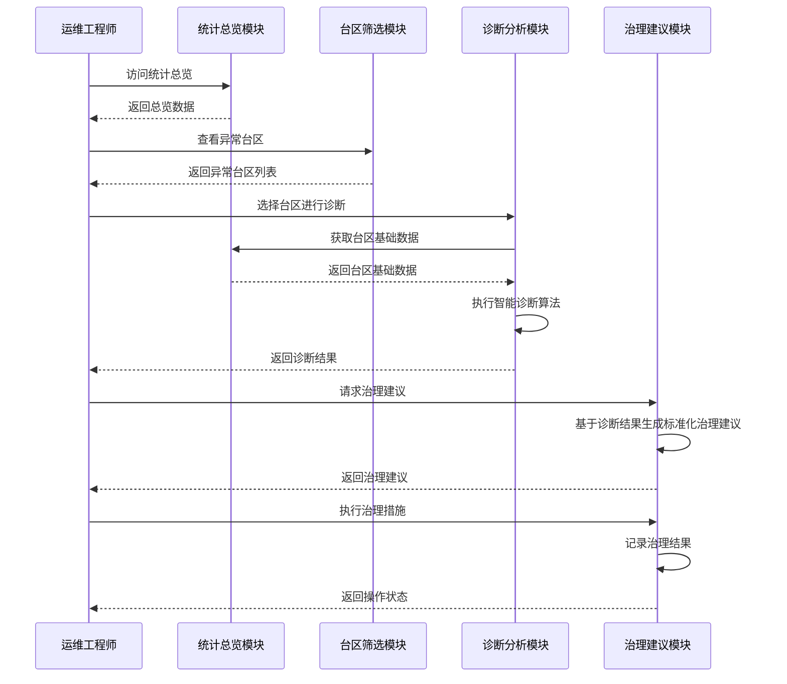
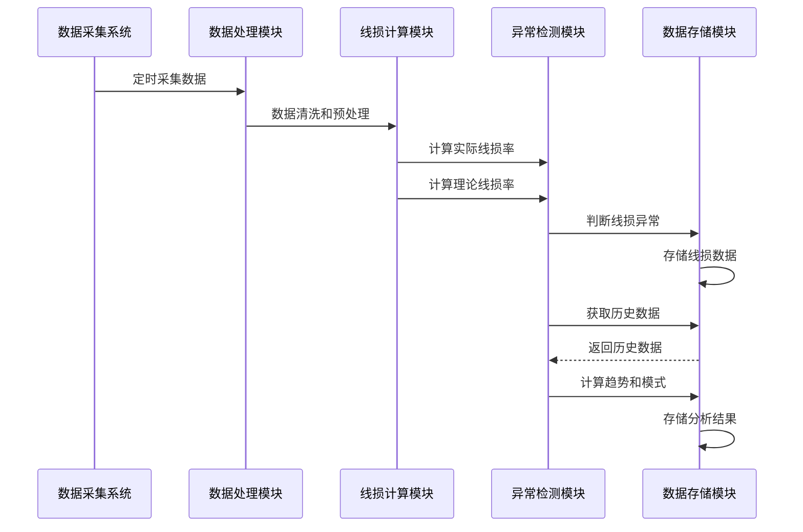
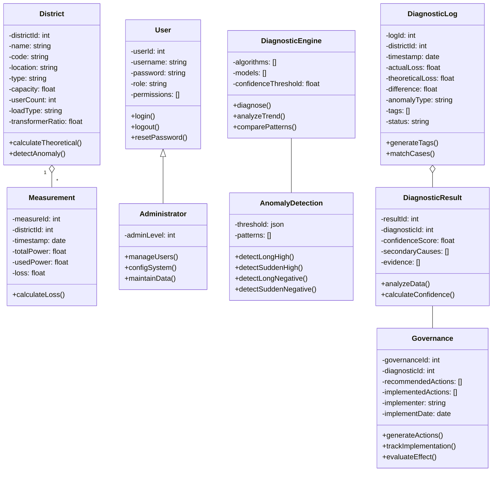

# 线损诊断分析应用 产品需求文档

## 目录
- [1. 项目概述](#1-项目概述)
- [2. 用例图](#2-用例图)
- [3. 序列图](#3-序列图)
- [4. 类图](#4-类图)
- [5. 功能详情](#5-功能详情)
  - [5.1 统计总览](#51-统计总览)
  - [5.2 台区筛选](#52-台区筛选)
  - [5.3 诊断分析](#53-诊断分析)
  - [5.4 治理建议](#54-治理建议)
  - [5.5 辅助功能](#55-辅助功能)
- [6. 交互说明](#6-交互说明)
- [7. 非功能性需求](#7-非功能性需求)

## 1. 项目概述

线损诊断分析应用是一款专为电力系统台区线损管理设计的Web应用。本应用通过采集、分析电力系统运行数据，实现对台区线损的智能监测、异常诊断和治理建议，帮助电力运维人员快速发现线损异常情况，并提供标准化治理方案，有效降低线损率，提高电网运行效率。

### 1.1 产品目标

- 提供台区线损数据的全面可视化展示，实现数据的直观呈现
- 建立线损异常识别的标准，实现线损异常的自动检测
- 通过智能诊断算法，快速定位线损异常原因
- 提供标准化的治理流程和建议，指导工作人员高效处理异常情况
- 形成线损分析和治理的知识库，提升线损管理水平

### 1.2 用户角色

| 角色 | 职责描述 | 关注点 |
| ---- | -------- | ------ |
| 运维工程师 | 负责日常线损监测、异常处理和治理实施 | 异常检测、诊断分析、治理建议 |
| 台区管理人员 | 负责台区整体运行状况监控和资源调配 | 统计总览、异常台区筛选、绩效数据 |
| 系统管理员 | 负责系统配置、用户管理和数据维护 | 系统设置、权限管理、数据备份 |
| 决策管理层 | 制定线损管理策略，评估治理效果 | 统计报表、趋势分析、经济效益评估 |

## 2. 用例图

## 3. 序列图

### 3.1 线损异常诊断流程序列图

### 3.2 数据采集与分析序列图

## 4. 类图

## 5. 功能详情

### 5.1 统计总览
**功能ID: F-001**

统计总览功能为用户提供台区线损情况的全局视图，通过可视化图表和关键指标展示系统整体运行状况。

#### 5.1.1 功能描述
- 核心指标卡片：展示台区总数、异常台区数量、平均理论线损率和实际与理论线损差值等关键指标
- 绝对线损区间分布图：以图表形式展示不同线损率区间的台区数量分布
- 线损趋势分析：展示线损率随时间变化的趋势，支持日、周、月不同时间粒度的查看
- 相对线损分布：通过散点图展示理论线损与实际线损的分布关系
- Top 5异常台区：展示线损异常最严重的五个台区，包括其基本信息和异常状态

#### 5.1.2 用户界面
统计总览页面布局采用响应式设计，主要包含以下界面元素：
- 顶部筛选条件：时间范围选择（最近7天、30天、本季度、本年度）
- 核心指标卡片区：采用四等分布局，每个卡片包含图标、指标名称和数值
- 线损分布和趋势图表区：采用两列布局，左侧为线损区间分布柱状图，右侧为线损趋势折线图
- 相对线损散点图区：单列布局，展示散点分布图
- 异常台区列表区：表格形式展示Top 5异常台区

#### 5.1.3 交互说明
- 时间范围选择：用户可通过下拉菜单选择不同的时间范围，系统会自动更新所有图表和数据
- 导出报告：点击导出按钮可将当前统计总览数据导出为PDF或Excel格式报告
- 趋势图时间粒度切换：用户可点击"日"、"周"、"月"按钮切换时间粒度
- 异常台区查看：点击"Top 5异常台区"中的"诊断"链接，可跳转至对应台区的诊断分析页面
- 散点图交互：鼠标悬停在散点上可查看该台区的详细信息

### 5.2 台区筛选
**功能ID: F-002**

台区筛选功能提供多维度的筛选条件，帮助用户从大量台区中精准筛选出符合特定条件的台区，支持异常台区报表、自定义筛选和识别标准配置。

#### 5.2.1 功能描述
- 异常台区报表：展示所有被识别为异常的台区，包括详细的线损数据和异常类型
- 台区筛选：提供多维度筛选条件，包括区域、线损率范围、台区类型、异常类型等
- 识别标准：允许查看和配置线损异常的识别标准，包括各类异常的定义阈值
- 筛选配置保存：支持保存常用的筛选条件组合，方便下次快速使用
- 批量导出：支持将筛选结果批量导出为Excel或CSV格式

#### 5.2.2 用户界面
台区筛选页面采用标签页设计，主要包含以下界面元素：
- 标签页导航：包含"异常台区报表"、"台区筛选"、"识别标准"三个标签页
- 筛选条件区：提供所属区域、异常类型、台区类型、日期范围等筛选条件
- 筛选结果表格：以表格形式展示筛选后的台区列表，包含详细的线损数据
- 功能按钮区：包含保存配置、生成诊断报告等功能按钮

#### 5.2.3 交互说明
- 标签页切换：点击标签页导航可切换不同的功能视图
- 筛选条件应用：设置筛选条件后，点击搜索按钮应用筛选
- 保存配置：点击"保存配置"按钮可将当前筛选条件保存为命名配置
- 生成诊断报告：选择特定台区后，点击"生成诊断报告"可生成该台区的诊断报告
- 表格排序：点击表格列头可按该列进行排序
- 诊断分析：点击表格中的"诊断分析"链接可跳转至对应台区的诊断分析页面

### 5.3 诊断分析
**功能ID: F-003**

诊断分析功能是系统的核心，通过智能算法对异常台区进行多维度分析，识别异常原因并生成诊断标签。

#### 5.3.1 功能描述
- 台区基本信息展示：展示所选台区的基本信息和线损异常概况
- 智能诊断标签：通过算法分析，生成可能的异常原因并附带匹配概率
- 线损波动溯源图：展示线损率随时间的变化，并标记关键节点
- 多维度对比分析：从用电量、负荷曲线、功率因数等多个维度分析异常原因
- 历史诊断记录：展示该台区历史上的诊断记录和处理情况
- 指标异常分析：展示与线损相关的各项指标异常情况
- 用户用电异常分析：识别台区内异常用电行为的用户

#### 5.3.2 用户界面
诊断分析页面采用模块化设计，主要包含以下界面元素：
- 台区选择器：下拉菜单选择需要诊断的台区
- 台区基本信息卡片：展示台区基本信息和线损异常概况
- 诊断分类看板：以卡片形式展示智能诊断标签及匹配概率
- 线损波动溯源图：折线图展示线损率变化趋势
- 多维度分析图表：多种图表展示不同维度的分析结果
- 指标异常分析表格：表格形式展示各指标异常情况
- 用户用电异常列表：列表形式展示异常用电用户

#### 5.3.3 交互说明
- 台区切换：通过下拉菜单选择不同的台区，系统会自动加载对应台区的诊断数据
- 诊断标签查看：点击智能诊断标签可展开查看该异常类型的详细说明
- 时间范围调整：可通过图表控件调整线损波动溯源图的时间范围
- 维度切换：点击标签可在不同维度的分析结果之间切换
- 生成治理建议：点击"生成治理建议"按钮，系统基于诊断结果生成治理建议并跳转至治理建议页面
- 异常用户详情：点击异常用户可查看其详细用电数据

### 5.4 治理建议
**功能ID: F-004**

治理建议功能基于诊断分析结果，为用户提供标准化的治理流程和具体操作建议，帮助用户高效解决线损异常问题。

#### 5.4.1 功能描述
- 治理信息概览：展示线损异常相关的核心信息，如差值、影响电量、持续时间等
- 标准化治理流程：基于异常类型，提供分步骤的标准化治理流程
- 专家操作建议：根据诊断结果和历史案例，提供具体的操作建议
- 相似案例参考：展示历史上相似的案例及其解决方案
- 经济效益分析：分析线损异常造成的经济损失和治理后的预期收益
- 治理工单生成：支持一键生成治理工单，指派给相关人员
- 治理效果追踪：记录治理措施实施情况和效果评估

#### 5.4.2 用户界面
治理建议页面采用流程化设计，主要包含以下界面元素：
- 台区选择器：下拉菜单选择需要治理的台区
- 治理信息概览卡片：展示线损异常关键信息
- 标准化治理流程图：时间线形式展示治理流程步骤
- 专家建议卡片：展示针对当前异常的专家建议
- 相似案例列表：列表形式展示相似案例
- 经济效益分析图表：图表形式展示经济效益分析
- 工单生成表单：包含工单相关信息的表单

#### 5.4.3 交互说明
- 台区切换：通过下拉菜单选择不同的台区，系统会自动加载对应台区的治理建议
- 流程步骤展开：点击流程步骤可展开查看该步骤的详细说明和操作指南
- 相似案例查看：点击相似案例可查看案例详情
- 工单生成：填写工单表单，点击提交生成治理工单
- 导出报告：点击"导出报告"按钮可将治理建议导出为PDF格式
- 治理效果追踪：点击"记录结果"按钮可记录治理实施情况和效果

### 5.5 辅助功能
**功能ID: F-005**

辅助功能提供系统使用说明、计算工具、系统状态监控等支持性功能，提升用户使用体验。

#### 5.5.1 功能描述
- 系统功能说明：提供各模块功能的详细说明
- 数据采集说明：说明系统数据的采集频率、来源和质量标准
- 常见问题解答：解答用户常见疑问
- 计算工具：提供线损率计算、CT倍率计算等常用计算工具
- 系统状态监控：展示系统运行状态、数据采集状态等
- 帮助支持：提供用户手册、接口文档、在线帮助等资源链接

#### 5.5.2 用户界面
辅助功能页面采用分区设计，主要包含以下界面元素：
- 左侧内容区：展示系统说明、数据采集说明、常见问题等内容
- 右侧工具区：包含计算工具、系统状态、帮助支持等功能模块

#### 5.5.3 交互说明
- 计算工具使用：输入相关参数，点击计算按钮获取计算结果
- 系统状态查看：查看系统运行状态和数据采集状态
- 帮助资源访问：点击相关链接访问用户手册、接口文档等资源

## 6. 交互说明

### 6.1 系统导航与信息架构
系统采用扁平化的导航结构，通过顶部导航栏实现主要功能模块之间的切换。信息架构遵循"从宏观到微观"的设计原则，用户可从统计总览开始，逐步深入到具体台区的诊断和治理。

#### 6.1.1 导航流程
- 统计总览 → 台区筛选：用户可从总览页面发现异常情况，点击"查看全部"进入台区筛选页面
- 台区筛选 → 诊断分析：用户在筛选结果中选择特定台区，点击"诊断分析"进入诊断页面
- 诊断分析 → 治理建议：用户在诊断页面点击"生成治理建议"进入治理建议页面
- 全局导航：用户可通过顶部导航栏在任意页面之间切换

### 6.2 数据筛选与过滤
系统提供丰富的数据筛选和过滤功能，帮助用户从海量数据中快速定位所需信息：
- 时间范围筛选：支持预设时间范围（最近7天、30天、本季度、本年度）和自定义日期范围
- 多维度筛选：支持按区域、台区类型、异常类型、线损率范围等多维度组合筛选
- 筛选配置保存：支持将常用筛选条件保存为命名配置，便于复用
- 快速排序：支持按不同指标对结果进行排序

### 6.3 数据可视化交互
系统大量使用图表进行数据可视化，并提供丰富的交互功能：
- 图表缩放：支持通过鼠标拖拽、滚轮缩放等方式调整图表显示范围
- 数据点悬停：鼠标悬停在数据点上可查看详细信息
- 图表联动：相关图表之间支持联动交互，一个图表的选择会影响其他图表的显示
- 图表类型切换：部分图表支持在不同图表类型之间切换（如折线图、柱状图）
- 数据下钻：支持从宏观数据逐步下钻到微观详情

### 6.4 操作反馈机制
系统提供清晰的操作反馈机制，确保用户了解当前操作状态：
- 加载状态：数据加载过程中显示加载动画
- 操作成功提示：操作成功后显示成功提示
- 错误提示：操作失败时显示错误原因
- 确认对话框：重要操作前显示确认对话框
- 自动保存提示：数据自动保存时显示保存状态

### 6.5 报表导出与分享
系统支持将分析结果导出为多种格式，便于分享和存档：
- 导出格式：支持PDF、Excel、CSV等多种格式
- 内容范围：支持选择导出的内容范围（完整报告、摘要、仅数据等）
- 定时报告：支持设置定时生成并发送报告
- 分享链接：支持生成分享链接，便于在系统内分享分析结果

## 7. 非功能性需求

### 7.1 性能需求

| 需求ID | 需求描述 | 指标 |
| ------ | -------- | ---- |
| NF-001 | 页面加载时间 | 首次加载≤3秒，二次加载≤1秒 |
| NF-002 | 数据查询响应时间 | 简单查询≤1秒，复杂查询≤3秒 |
| NF-003 | 智能诊断分析时间 | ≤5秒/次 |
| NF-004 | 报表导出时间 | ≤10秒/次 |
| NF-005 | 并发用户数 | ≥100用户同时在线 |

### 7.2 安全需求

| 需求ID | 需求描述 | 实现方式 |
| ------ | -------- | -------- |
| NF-006 | 用户认证 | 基于角色的认证授权机制，支持多因素认证 |
| NF-007 | 数据加密 | 传输数据采用HTTPS协议，敏感数据存储加密 |
| NF-008 | 访问控制 | 基于角色和权限的细粒度访问控制 |
| NF-009 | 操作审计 | 记录所有关键操作的日志，支持审计追溯 |
| NF-010 | 安全漏洞防护 | 防SQL注入、XSS攻击、CSRF攻击等常见Web安全漏洞 |

### 7.3 可用性需求

| 需求ID | 需求描述 | 指标 |
| ------ | -------- | ---- |
| NF-011 | 系统可用性 | ≥99.9%（年度计算） |
| NF-012 | 数据采集成功率 | ≥99.5% |
| NF-013 | 故障恢复时间 | 重大故障≤2小时，一般故障≤30分钟 |
| NF-014 | 备份与恢复 | 每日增量备份，每周全量备份，支持30天内任意时间点恢复 |

### 7.4 兼容性需求

| 需求ID | 需求描述 | 支持范围 |
| ------ | -------- | -------- |
| NF-015 | 浏览器兼容性 | 支持Chrome、Firefox、Edge、Safari最新版本 |
| NF-016 | 设备兼容性 | 支持PC、平板电脑，采用响应式设计 |
| NF-017 | 数据接口兼容性 | 支持标准数据格式（JSON、XML），提供完整API文档 |

### 7.5 可扩展性需求

| 需求ID | 需求描述 | 实现方式 |
| ------ | -------- | -------- |
| NF-018 | 数据存储扩展 | 支持水平扩展，单台区历史数据支持保存5年 |
| NF-019 | 功能模块扩展 | 采用插件式架构，支持新功能模块的灵活集成 |
| NF-020 | 诊断算法扩展 | 支持诊断算法的热插拔，无需停机即可更新算法 |
| NF-021 | 第三方系统集成 | 提供标准化API接口，支持与其他系统集成 |
