# 大数据线损诊断分析应用技术与业务方案报告

**版本：** 1.0.0
**日期：** 2023年5月

## 目录

- [1. 概述](#1-概述)
  - [1.1 业务背景](#11-业务背景)
  - [1.2 建设目标](#12-建设目标)
  - [1.3 业务价值](#13-业务价值)
  - [1.4 总体架构](#14-总体架构)
- [2. 线损计算与分析方法](#2-线损计算与分析方法)
  - [2.1 核心指标定义](#21-核心指标定义)
  - [2.2 台区相对线损率计算](#22-台区相对线损率计算)
  - [2.3 线损理论模型](#23-线损理论模型)
- [3. 异常台区识别机制](#3-异常台区识别机制)
  - [3.1 台区异常分类体系](#31-台区异常分类体系)
  - [3.2 异常台区识别标准](#32-异常台区识别标准)
  - [3.3 扫描与预警流程](#33-扫描与预警流程)
- [4. 智能诊断体系](#4-智能诊断体系)
  - [4.1 诊断标签与规则库](#41-诊断标签与规则库)
  - [4.2 高损台区诊断方法](#42-高损台区诊断方法)
  - [4.3 负损台区诊断方法](#43-负损台区诊断方法)
  - [4.4 多维度数据分析模型](#44-多维度数据分析模型)
- [5. 治理闭环与效能评估](#5-治理闭环与效能评估)
  - [5.1 标准化治理流程](#51-标准化治理流程)
  - [5.2 工单派发与跟踪机制](#52-工单派发与跟踪机制)
  - [5.3 治理效果评估方法](#53-治理效果评估方法)
- [6. 系统实现与技术架构](#6-系统实现与技术架构)
  - [6.1 技术架构设计](#61-技术架构设计)
  - [6.2 核心功能模块](#62-核心功能模块)
  - [6.3 数据处理流程](#63-数据处理流程)
  - [6.4 AI诊断引擎](#64-ai诊断引擎)
- [7. 实施规划与效益分析](#7-实施规划与效益分析)
  - [7.1 实施路径规划](#71-实施路径规划)
  - [7.2 预期效益分析](#72-预期效益分析)
  - [7.3 运维保障措施](#73-运维保障措施)
- [8. 附录](#8-附录)
  - [8.1 术语表](#81-术语表)
  - [8.2 参考文献](#82-参考文献)

## 1. 概述

### 1.1 业务背景

在当前能源转型和电网智能化发展背景下，线损管理作为衡量电网运行效率与资产利用水平的关键指标，已成为电力企业降本增效、提升经营质量的重要抓手。在国家"双碳"战略目标和新型电力系统建设要求下，精益化的线损管理对电网企业的经营管理提出了更高要求。

目前，我国电网企业在线损管理工作中面临以下主要痛点与挑战：

1. **线损异常问题识别难**：随着配网规模扩大，台区数量呈几何级增长，依靠人工巡检方式已难以及时发现异常问题。传统线损监测方法缺乏精准的异常识别机制，无法有效锁定问题台区。

2. **线损原因诊断复杂**：线损异常原因涉及技术损耗、管理损耗与窃电损耗等多种类型，问题成因复杂多样，传统诊断方法依赖人工经验，缺乏系统化的分析方法，诊断效率低下。

3. **线损治理缺乏闭环**：线损管理工作缺乏标准化流程和闭环管理机制，问题发现到解决的全过程追踪不足，治理效果评估方法欠缺，难以形成持续改进的良性循环。

4. **数据资源未充分挖掘**：电力企业积累了海量的用电数据、设备台账和运行数据，但未能充分整合利用这些数据资源，数据价值潜力未被充分释放。

在此背景下，亟需建立基于大数据和人工智能技术的线损诊断分析应用，通过数据驱动的方式，实现线损异常的精准识别、智能诊断和闭环治理，提升线损管理的科学化、精细化和智能化水平。

### 1.2 建设目标

大数据线损诊断分析应用旨在构建一套覆盖"监测-诊断-治理-评估"全流程的线损管理解决方案，实现以下具体目标：

1. **建立多维线损指标体系**：构建包含绝对线损率、理论线损率、相对线损率等在内的多维线损指标体系，为线损分析提供科学的评价标准。

2. **实现异常台区智能识别**：基于大数据技术建立台区线损异常识别模型，实现对长期高损、突发高损、长期负损、小负损、突发负损等异常类型的自动识别与分类，并形成高效的预警机制。

3. **构建智能诊断引擎**：融合领域专家经验和机器学习算法，构建线损异常诊断规则库，实现对异常台区问题原因的准确诊断，并给出诊断概率排序，支撑管理决策。

4. **打造标准化治理流程**：针对不同类型的线损异常问题，制定标准化的治理流程，实现问题闭环管理，建立治理效果评估机制。

5. **搭建线损管理一体化平台**：整合线损计算、异常识别、智能诊断、治理跟踪等功能，构建直观、易用的线损管理平台，支撑基层管理人员日常工作。

### 1.3 业务价值

大数据线损诊断分析应用的建设将为电力企业带来以下显著价值：

1. **经济效益**
   - 降低线损率预计可实现0.3-0.5个百分点的提升，按照每降低0.1个百分点可节约电量1.2亿千瓦时计算，每年可为企业减少电量损失约3.6-6亿千瓦时
   - 提高工作效率，减少人力投入，预计每年可节约人工成本约1500万元
   - 延长设备寿命，减少因线损问题导致的设备故障，降低设备维修和更换成本

2. **管理效益**
   - 建立数据驱动的线损管理模式，实现从"经验驱动"到"数据驱动"的转变
   - 形成标准化的线损问题处理流程，提升管理规范性和可复制性
   - 沉淀线损治理知识库，实现经验积累和知识传承
   - 提升线损管理的精细化水平，支撑配网精益化管理

3. **社会效益**
   - 降低电网损耗，减少资源浪费，每年可减少碳排放约30万吨
   - 提高供电可靠性，改善用户用电体验
   - 有效发现和遏制窃电行为，维护电力市场秩序
   - 响应国家节能减排政策，助力"双碳"战略目标实现

### 1.4 总体架构

大数据线损诊断分析应用采用"数据层-模型层-应用层-展现层"的总体架构设计，实现线损管理全流程的智能化和数字化。

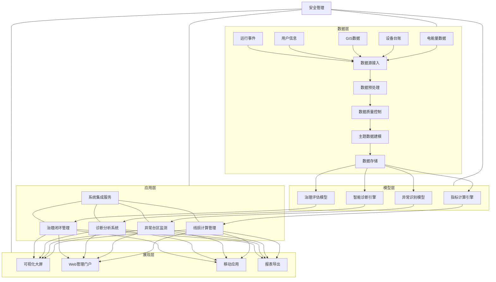

**架构说明：**

1. **数据层**：负责各类数据源的接入、预处理、质量控制和存储，为上层分析提供可靠的数据基础。主要包括电能量数据、设备台账、GIS数据、用户信息、运行事件等数据源。

2. **模型层**：基于数据层构建各类分析模型和计算引擎，实现线损指标计算、异常识别、智能诊断和治理评估等核心功能。

3. **应用层**：围绕线损管理业务流程，提供线损计算管理、异常台区监测、诊断分析系统、治理闭环管理等应用功能，支撑日常业务开展。

4. **展现层**：通过可视化大屏、Web管理门户、移动应用和报表导出等多种形式，实现数据和分析结果的直观展示，满足不同层级用户的需求。

5. **安全管理**：贯穿各层级的安全保障体系，确保数据安全、系统安全和访问控制。 

## 2. 线损计算与分析方法

### 2.1 核心指标定义

线损管理的基础在于科学、准确的线损指标体系。本系统建立了多维度的线损指标体系，以支撑线损异常识别与诊断分析。

#### 2.1.1 基础线损指标

1. **供电量**：指计量周期内电力系统向用户供应的电能量，一般通过电力计量装置测量得到。

2. **售电量**：指计量周期内电力企业向用户实际销售的电能量，一般通过电能表计量记录。

3. **线损电量**：指电能在输送过程中消耗的电量，计算公式为：
   
   $$线损电量 = 供电量 - 售电量$$

4. **台区供电量**：特定台区在计量周期内的总供电电量，通过台区总表计量获取：
   
   $$台区供电量 = \sum_{i=1}^{n} 总表计量值_i$$
   
   其中$n$为计量周期内的采集点数量。

5. **台区售电量**：特定台区在计量周期内的总售电电量，通过汇总台区内所有用户电表计量值获取：
   
   $$台区售电量 = \sum_{j=1}^{m} \sum_{i=1}^{n} 用户表计量值_{j,i}$$
   
   其中$m$为台区内用户数量，$n$为计量周期内的采集点数量。

#### 2.1.2 线损率指标

1. **绝对线损率（同期线损率）**：指线损电量占供电量的百分比，是衡量线损水平的基本指标，计算公式为：
   
   $$绝对线损率 = \frac{线损电量}{供电量} \times 100\%$$

2. **台区绝对线损率**：特定台区在计量周期内的线损率，计算公式为：
   
   $$台区绝对线损率 = \frac{台区供电量 - 台区售电量}{台区供电量} \times 100\%$$

3. **理论线损率**：基于电网理论计算模型得出的线损率，反映在理想状态或标准运行条件下电网应有的线损水平。

4. **相对线损率**：实际线损率与理论线损率的差值，是识别线损异常的关键指标，计算公式为：
   
   $$相对线损率 = 绝对线损率 - 理论线损率$$

#### 2.1.3 线损分析周期

为全面监测线损变化趋势，系统支持多周期线损分析：

1. **日线损**：每日计算线损指标，适用于实时监控和突发异常检测
2. **周线损**：每周汇总计算线损指标，适用于短期趋势分析
3. **月线损**：每月汇总计算线损指标，是线损管理的主要周期
4. **季线损**：每季度汇总计算线损指标，适用于季节性分析
5. **年线损**：每年汇总计算线损指标，适用于长期绩效评估

### 2.2 台区相对线损率计算

相对线损率是识别线损异常的核心指标，其计算过程包括台区绝对线损率计算和台区理论线损率计算两个关键步骤。

#### 2.2.1 台区绝对线损率计算流程

台区绝对线损率的计算需要保证数据的准确性和完整性，计算流程如下：

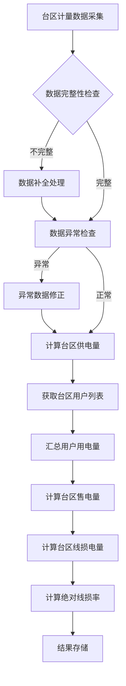

#### 2.2.2 数据质量控制

为确保线损计算的准确性，系统实施严格的数据质量控制措施：

1. **数据完整性检查**：检查计量数据是否存在缺失，对于缺失数据采用以下策略处理：
   - 短期缺失：采用线性插值法补齐
   - 周期性数据：参考历史同期数据进行填补
   - 长期缺失：标记为异常台区，人工干预处理

2. **异常值检测**：采用统计分析方法识别异常计量值：
   - 3σ原则：识别远离均值的数据点
   - 时间序列分析：识别与历史趋势不符的数据点
   - 同期比对：与历史同期数据比对识别异常

3. **台户关系校验**：确保台区用户归属关系的准确性：
   - 定期同步台户关系数据
   - 自动检测台户关系变更
   - 对异常的台户关系进行标记和提醒

### 2.3 线损理论模型

准确的理论线损率计算是相对线损率分析的基础。本系统支持多种理论线损率计算方法，根据台区特性和数据可用性选择最适合的计算模型。

#### 2.3.1 技术线损计算法

基于电力系统物理特性和网络拓扑结构，计算线路、变压器等设备在运行过程中产生的技术损耗。

1. **计算原理**：将台区网络划分为变压器、干线、支线等组件，分别计算各组件的损耗，然后汇总得到台区整体技术损耗。

2. **核心公式**：

   **线路损耗计算**：

   $$P_{线路} = 3 \times I^2 \times R \times L \times 10^{-3}$$

   其中：
   - $P_{线路}$：线路损耗功率(kW)
   - $I$：线路电流(A)
   - $R$：线路单位长度电阻(Ω/km)
   - $L$：线路长度(km)

   **变压器损耗计算**：
   $$P_{变压器} = P_{0} + \beta^2 \times P_{k}$$

   其中：
   - $P_{变压器}$：变压器总损耗(kW)
   - $P_{0}$：变压器空载损耗(kW)
   - $P_{k}$：变压器额定负载损耗(kW)
   - $\beta$：变压器负载率

   **台区技术线损率**：
   $$\eta_{技术} = \frac{W_{技术损耗}}{W_{供电}} \times 100\%$$

3. **优缺点**：
   - 优点：物理原理明确，计算结果可解释性强
   - 缺点：需要详细的网络参数和精确的负荷分布数据，数据需求量大

#### 2.3.2 压降法

通过测量电网不同节点的电压降落，结合负荷分布情况，推算线损水平。

1. **计算原理**：利用配电线路电压与电流的关系，通过测量网络不同节点的电压降，计算线路损耗。

2. **核心公式**：
   $$P_{损} = \frac{P_{负荷} \times \Delta U}{U_{额定}} \times k$$
   
   其中：
   - $P_{损}$：线路损耗功率(kW)
   - $P_{负荷}$：线路负荷功率(kW)
   - $\Delta U$：线路电压降落值(V)
   - $U_{额定}$：额定电压值(V)
   - $k$：修正系数，与功率因数和负荷特性有关

3. **优缺点**：
   - 优点：计算简便，对网络参数要求较低
   - 缺点：精度较技术线损法低，受测量误差影响大

#### 2.3.3 回归法

基于历史数据建立统计回归模型，分析供电量与线损量之间的关系，预测线损水平。

1. **计算原理**：通过分析历史数据中供电量、环境因素、负荷特性等因素与线损率的关系，建立多元回归模型。

2. **核心模型**：
   $$\eta_{理论} = \alpha_0 + \alpha_1 \times P_{负荷} + \alpha_2 \times T + \alpha_3 \times F_{负载} + ... + \varepsilon$$
   
   其中：
   - $\eta_{理论}$：理论线损率
   - $P_{负荷}$：负荷功率
   - $T$：环境温度
   - $F_{负载}$：负载因数
   - $\alpha_0, \alpha_1, \alpha_2, ...$：回归系数
   - $\varepsilon$：误差项

3. **优缺点**：
   - 优点：模型适应性强，可考虑多种影响因素
   - 缺点：依赖历史数据质量，需要定期更新模型参数

#### 2.3.4 赋值法

根据台区类型、负荷特性等因素，参照行业标准或历史经验，为不同类型的台区赋予标准的理论线损率。

1. **计算原理**：基于台区分类和标杆管理思想，按照台区的关键特征进行分类，为每类台区设置标准理论线损率。

2. **赋值标准示例**：

   | 台区类型 | 负荷密度 | 供电半径 | 理论线损率基准值 |
   |---------|--------|---------|--------------|
   | 城市住宅 | 高     | 短      | 3.2%         |
   | 城市商业 | 高     | 短      | 3.8%         |
   | 城乡结合部 | 中   | 中      | 4.5%         |
   | 农村台区 | 低     | 长      | 5.5%         |
   | 工业台区 | 极高   | 短      | 2.8%         |

3. **调整系数**：
   
   基准线损率还需根据以下因素进行调整：
   - 季节因素：夏季 × 1.15，冬季 × 1.10，春秋季 × 1.0
   - 电缆化率：每提高10%，线损率 × 0.98
   - 变压器利用率：利用率偏低，线损率 × 1.05；利用率适中，线损率 × 1.0；利用率偏高，线损率 × 1.08
   - 三相不平衡度：每增加5%，线损率 × 1.03

4. **优缺点**：
   - 优点：实施简单，维护成本低
   - 缺点：精确度较低，难以适应台区运行状态的动态变化

#### 2.3.5 模型选择策略

系统根据台区特性和数据可用性，采用以下策略选择最适合的理论线损计算模型：

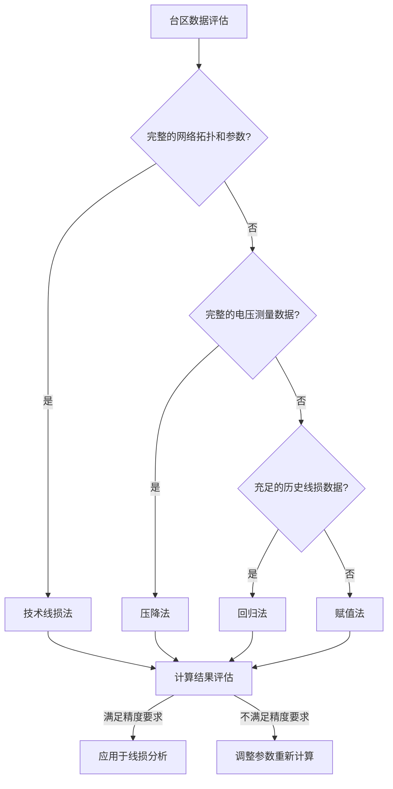

在实际应用中，系统会不断收集和优化模型参数，提高理论线损计算的准确性。同时，系统还支持针对不同台区特点组合使用多种方法，取其加权平均值作为最终的理论线损率。

## 3. 异常台区识别机制

### 3.1 台区异常分类体系

#### 3.1.1 异常分类原则

台区线损异常分类基于以下原则进行：

1. **相对线损率导向**：以实际线损率与理论线损率的差值（相对线损率）作为主要分类依据，既考虑线损异常的方向（高损或负损），也考虑其幅度。

2. **时间维度区分**：根据异常状态持续的时间长短，区分长期异常与突发异常，以便采取不同的治理策略。

3. **管理重点突出**：突出管理重点，将对电网运行质量和经济效益影响较大的异常类型作为重点分类对象。

4. **原因导向分类**：分类体系设计考虑异常背后的可能原因，使分类结果能够直接指导后续诊断和治理工作。

#### 3.1.2 线损异常分类体系

基于上述原则，系统建立以下线损异常分类体系：

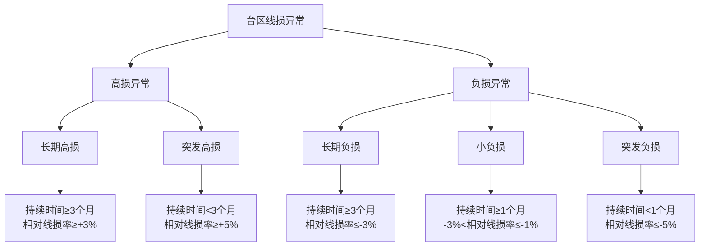

**各类型异常特征说明：**

1. **长期高损台区**
   - 定义：相对线损率持续≥+3%，且异常持续时间≥3个月的台区
   - 主要特征：线损率长期高于理论水平，且偏差稳定
   - 典型原因：计量装置问题、档案管理问题、低压线路老化、用电窃漏电等长期存在的问题

2. **突发高损台区**
   - 定义：相对线损率短期内≥+5%，且异常持续时间<3个月的台区
   - 主要特征：线损率在短期内急剧升高，与历史水平相比有显著变化
   - 典型原因：设备突发故障、短期大负荷、季节性因素影响、计量装置突发异常等

3. **长期负损台区**
   - 定义：相对线损率持续≤-3%，且异常持续时间≥3个月的台区
   - 主要特征：实际线损率长期低于理论水平，甚至出现负值
   - 典型原因：计量装置接线错误、互感器极性反接、台区户表对应关系错误等

4. **小负损台区**
   - 定义：相对线损率在-3%到-1%之间，且持续时间≥1个月的台区
   - 主要特征：线损率轻微为负，但波动不大
   - 典型原因：理论线损模型参数设置不合理、计量误差、负荷变化等

5. **突发负损台区**
   - 定义：相对线损率短期内≤-5%，且异常持续时间<1个月的台区
   - 主要特征：线损率在短期内急剧下降至负值
   - 典型原因：计量装置突发故障、数据采集异常、互感器短时异常等

#### 3.1.3 异常类型与治理优先级

不同类型的线损异常对电网运行和经济效益的影响不同，系统对各类异常设定治理优先级，指导资源分配和治理排序：

| 异常类型 | 优先级 | 优先级说明 |
|---------|-------|----------|
| 长期高损 | 最高 | 长期存在大量电量损失，经济损失严重，需优先处理 |
| 突发高损 | 高   | 可能存在安全隐患，需快速响应处理 |
| 长期负损 | 中高 | 长期计量不准，影响经营数据准确性，但无直接经济损失 |
| 突发负损 | 中   | 可能预示设备故障，需及时跟进 |
| 小负损   | 低   | 影响有限，可在资源充足时处理 |

### 3.2 异常台区识别标准

#### 3.2.1 识别标准设计原则

异常台区识别标准设计遵循以下原则：

1. **客观性**：基于可测量的数据指标，避免主观判断
2. **差异化**：针对不同类型的异常，设置差异化的识别标准
3. **适应性**：考虑不同类型台区的特点，标准具有一定灵活性
4. **可操作性**：标准简明清晰，便于系统自动判断和操作人员理解

#### 3.2.2 长期高损台区识别标准

长期高损台区需同时满足以下条件：

1. **相对线损率条件**：台区相对线损率 ≥ +3%
2. **持续时间条件**：异常状态持续时间 ≥ 3个月
3. **稳定性条件**：连续3个月的相对线损率标准差 < 2%，表明异常状态相对稳定
4. **排除条件**：排除季节性负荷变化导致的周期性高损，如果夏季空调负荷导致的高损，不属于此类

**判定公式**：
$$\begin{cases}
\Delta\eta_i = \eta_{实际,i} - \eta_{理论,i} \geq 3\% \\
Count(\Delta\eta_i \geq 3\%) \geq 3个月 \\
\sigma(\Delta\eta_{近3个月}) < 2\%
\end{cases}$$

其中，$\Delta\eta_i$表示第i个月的相对线损率，$\sigma$表示标准差。

#### 3.2.3 突发高损台区识别标准

突发高损台区需同时满足以下条件：

1. **相对线损率条件**：台区相对线损率 ≥ +5%
2. **持续时间条件**：异常状态持续时间 < 3个月
3. **变化率条件**：相比前一时段，相对线损率增长 ≥ 3个百分点
4. **历史比对条件**：当前线损率超过历史同期平均水平的2倍

**判定公式**：
$$\begin{cases}
\Delta\eta_i = \eta_{实际,i} - \eta_{理论,i} \geq 5\% \\
\Delta\eta_i - \Delta\eta_{i-1} \geq 3\% \\
\eta_{实际,i} \geq 2 \times \overline{\eta_{实际,同期}}
\end{cases}$$

其中，$\overline{\eta_{实际,同期}}$表示历史同期实际线损率的平均值。

#### 3.2.4 长期负损台区识别标准

长期负损台区需同时满足以下条件：

1. **相对线损率条件**：台区相对线损率 ≤ -3%
2. **持续时间条件**：异常状态持续时间 ≥ 3个月
3. **稳定性条件**：连续3个月的相对线损率标准差 < 2%
4. **数据质量条件**：确保计量数据完整性 ≥ 95%，排除数据质量问题导致的假象

**判定公式**：
$$\begin{cases}
\Delta\eta_i = \eta_{实际,i} - \eta_{理论,i} \leq -3\% \\
Count(\Delta\eta_i \leq -3\%) \geq 3个月 \\
\sigma(\Delta\eta_{近3个月}) < 2\% \\
数据完整率 \geq 95\%
\end{cases}$$

#### 3.2.5 小负损台区识别标准

小负损台区需同时满足以下条件：

1. **相对线损率条件**：-3% < 台区相对线损率 ≤ -1%
2. **持续时间条件**：异常状态持续时间 ≥ 1个月
3. **波动条件**：线损率波动不大，月度变化率 < 1%
4. **数据质量条件**：确保计量数据完整性 ≥ 98%

**判定公式**：
$$\begin{cases}
-3\% < \Delta\eta_i = \eta_{实际,i} - \eta_{理论,i} \leq -1\% \\
Count(-3\% < \Delta\eta_i \leq -1\%) \geq 1个月 \\
|\Delta\eta_i - \Delta\eta_{i-1}| < 1\% \\
数据完整率 \geq 98\%
\end{cases}$$

#### 3.2.6 突发负损台区识别标准

突发负损台区需同时满足以下条件：

1. **相对线损率条件**：台区相对线损率 ≤ -5%
2. **持续时间条件**：异常状态持续时间 < 1个月
3. **变化率条件**：相比前一时段，相对线损率下降 ≥ 4个百分点
4. **事件关联条件**：通常与设备更换、停电、线路改造等事件时间相关

**判定公式**：
$$\begin{cases}
\Delta\eta_i = \eta_{实际,i} - \eta_{理论,i} \leq -5\% \\
\Delta\eta_{i-1} - \Delta\eta_i \geq 4\% \\
存在关联事件记录
\end{cases}$$

### 3.3 扫描与预警流程

#### 3.3.1 多层次扫描机制

系统实现多层次、多频率的台区线损异常扫描机制，确保及时发现各类线损异常问题：

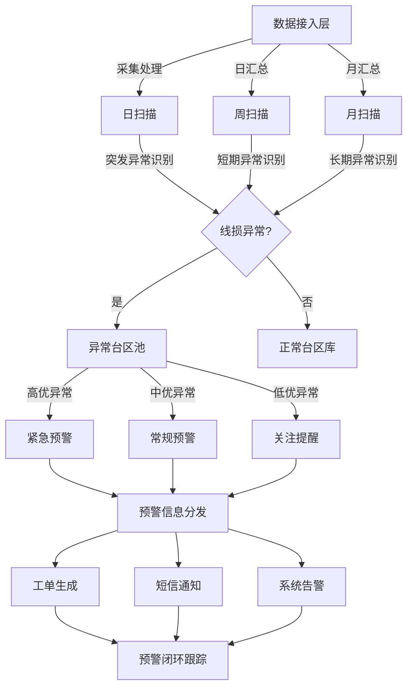

**扫描层次说明**：

1. **日扫描**：
   - 频率：每日1次
   - 目标：识别突发性高损和突发性负损台区
   - 关注点：日线损率异常波动、计量数据异常、设备运行事件关联

2. **周扫描**：
   - 频率：每周1次
   - 目标：识别短期异常趋势和小负损台区
   - 关注点：连续多日异常、周环比变化、负损发展趋势

3. **月扫描**：
   - 频率：每月1次
   - 目标：识别长期高损和长期负损台区
   - 关注点：月度同比、环比分析，长期趋势判断

#### 3.3.2 智能预警分级

系统根据异常类型、严重程度和影响范围，将线损异常预警分为三级：

1. **一级预警（紧急预警）**：
   - 触发条件：
     - 长期高损台区中相对线损率 ≥ +8%
     - 突发高损台区中相对线损率 ≥ +10%
     - 突发负损台区中相对线损率 ≤ -8%
   - 响应要求：24小时内必须响应并启动处理
   - 通知方式：短信+系统告警+工单派发+电话通知

2. **二级预警（常规预警）**：
   - 触发条件：
     - 一般长期高损台区（+3% ≤ 相对线损率 < +8%）
     - 一般突发高损台区（+5% ≤ 相对线损率 < +10%）
     - 长期负损台区（相对线损率 ≤ -3%）
     - 突发负损台区（-8% < 相对线损率 ≤ -5%）
   - 响应要求：3个工作日内响应并启动处理
   - 通知方式：系统告警+工单派发

3. **三级预警（关注提醒）**：
   - 触发条件：
     - 小负损台区（-3% < 相对线损率 ≤ -1%）
     - 相对线损率接近预警阈值的台区（相对线损率在+2.5%到+3%之间）
   - 响应要求：纳入常规工作计划，优先级较低
   - 通知方式：系统提醒

#### 3.3.3 分区域扫描策略

考虑到不同区域台区特点和管理需求的差异，系统支持分区域制定差异化的扫描策略：

| 区域类型 | 扫描频率 | 高损阈值调整 | 负损阈值调整 | 重点关注 |
|---------|---------|------------|------------|---------|
| 城市核心区 | 日扫描 | 默认 | 负损阈值更严（-2%） | 突发高损、突发负损 |
| 城乡结合部 | 2日/次 | 默认 | 默认 | 长期高损 |
| 农村区域 | 周扫描 | 阈值放宽（+4%） | 默认 | 长期高损、小负损 |
| 工业园区 | 日扫描 | 阈值收紧（+2%） | 默认 | 突发高损、长期负损 |
| 高损片区 | 日扫描 | 分级阈值 | 默认 | 所有类型异常 |

#### 3.3.4 预警信息闭环管理

系统实现预警信息的全生命周期管理，确保每一条预警都得到妥善处理：

1. **预警生成**：基于扫描结果，系统自动生成包含以下信息的预警：
   - 台区基本信息（名称、编号、位置、容量等）
   - 异常类型及特征描述
   - 关键指标数值（实际线损率、理论线损率、相对线损率等）
   - 历史同期对比数据
   - 预警等级及处理时限

2. **预警分发**：根据预警等级和所属区域，系统将预警信息分发至相关责任人：
   - 一级预警：分发至区域经理、线损管理员、运维班组
   - 二级预警：分发至线损管理员、运维班组
   - 三级预警：分发至线损管理员

3. **预警处理**：预警接收人通过系统进行预警处理：
   - 确认接收预警
   - 现场核查安排
   - 诊断结果反馈
   - 处理措施录入
   - 处理结果上传

4. **预警关闭**：预警闭环条件包括：
   - 核查结果录入完成
   - 问题原因明确
   - 处理措施实施并记录
   - 治理后数据监测（至少7天）显示问题已解决
   - 相关负责人确认关闭

5. **预警评估**：系统自动对已关闭预警进行效果评估：
   - 处理及时性评分
   - 问题解决彻底性评分
   - 相关责任人处理质量评价
   - 预警信息准确性评价（用于优化预警规则）

## 4. 智能诊断体系

### 4.1 诊断标签与规则库

智能诊断体系的核心是建立一套完善的诊断标签和规则库，通过多源数据融合和智能算法，实现台区线损异常的精准诊断和根因分析。

#### 4.1.1 诊断标签体系

针对不同类型的线损异常，系统构建了结构化的诊断标签体系：

```mermaid
graph TD
    A[线损异常诊断标签] --> B[高损异常标签]
    A --> C[负损异常标签]
    
    B --> B1[计量装置类]
    B --> B2[线路设备类]
    B --> B3[负荷特性类]
    B --> B4[管理因素类]
    B --> B5[窃电行为类]
    
    C --> C1[计量装置类]
    C --> C2[数据异常类]
    C --> C3[档案不符类]
    C --> C4[接线错误类]
    C --> C5[系统参数类]
    
    B1 --> B11[CT互感器倍率错误]
    B1 --> B12[电能表超容量运行]
    B1 --> B13[采集设备故障]
    
    B2 --> B21[三相不平衡度高]
    B2 --> B22[线路老化损耗增加]
    B2 --> B23[设备故障泄漏]
    
    B3 --> B31[用电负荷突增]
    B3 --> B32[功率因数偏低]
    B3 --> B33[谐波含量高]
    
    B4 --> B41[档案户变关系异常]
    B4 --> B42[计量点配置不合理]
    B4 --> B43[台区边界不清]
    
    B5 --> B51[疑似低压窃电]
    B5 --> B52[疑似旁路窃电]
    B5 --> B53[疑似破坏性窃电]
    
    C1 --> C11[电表计量故障]
    C1 --> C12[倍率变更未同步]
    C1 --> C13[电表时钟超差]
    
    C2 --> C21[数据采集质量差]
    C2 --> C22[数据计算错误]
    C2 --> C23[采集通道异常]
    
    C3 --> C31[台户关系不一致]
    C3 --> C32[光伏发电档案错误]
    C3 --> C33[台区总表前接电]
    
    C4 --> C41[电表正反向接错]
    C4 --> C42[计量装置接线错误]
    C4 --> C43[联合接线盒故障]
    
    C5 --> C51[理论模型计算偏差]
    C5 --> C52[互感器配置不合理]
    C5 --> C53[功率因数补偿设备异常]
```

#### 4.1.2 诊断规则库构建

系统诊断规则库基于以下来源构建：

1. **专家知识固化**：通过线损管理专家访谈和知识提取，将专家经验转化为结构化规则

2. **案例库分析**：对历史线损异常案例进行系统性分析，提取典型特征和判断模式

3. **机器学习训练**：基于已知异常原因的历史数据，通过机器学习方法，提取特征与原因的关联规则

4. **现场验证反馈**：通过现场验证结果的反馈，不断优化和调整诊断规则

**规则构成要素**：

- **触发条件**：引发规则判断的条件集合，可包含多个指标及其阈值
- **证据项**：支持诊断结论的数据特征或事实
- **置信度**：表示诊断结论可信度的数值，范围0-1
- **诊断结论**：异常原因的诊断标签
- **建议措施**：针对诊断结果的处理建议

**规则示例**：

```json
{
  "rule_id": "LH001",
  "rule_name": "CT互感器倍率错误诊断",
  "anomaly_type": "长期高损",
  "trigger_conditions": [
    {"indicator": "relative_loss_rate", "operator": ">=", "value": 3.0},
    {"indicator": "duration_months", "operator": ">=", "value": 3}
  ],
  "evidence_items": [
    {"name": "ct_ratio_check", "description": "CT倍率核查信息", "weight": 0.5},
    {"name": "load_pattern", "description": "负荷特性分析", "weight": 0.3},
    {"name": "history_change", "description": "历史变更记录", "weight": 0.2}
  ],
  "confidence_calculation": {
    "method": "weighted_sum",
    "threshold": 0.75
  },
  "diagnosis": "CT互感器倍率错误",
  "suggested_actions": [
    "核对系统CT倍率与现场是否一致",
    "检查CT是否发生异常",
    "复核计量装置技术参数"
  ]
}
```

#### 4.1.3 诊断规则执行机制

系统采用混合推理机制，结合规则推理和统计学习方法，实现智能诊断：

1. **规则匹配**：根据异常台区的特征，匹配可能的诊断规则

2. **证据收集**：针对匹配的规则，自动收集相关证据数据

3. **置信度计算**：基于证据项分析，计算各诊断假设的置信度

4. **多因素综合分析**：考虑多规则交叉匹配情况，通过贝叶斯网络等方法进行综合分析

5. **诊断结果排序**：根据置信度大小，对可能的异常原因进行排序，形成诊断建议清单

### 4.2 高损台区诊断方法

针对高损台区的诊断，系统采用分层递进的诊断策略，逐步定位问题根源。

#### 4.2.1 长期高损诊断方法

长期高损台区诊断主要针对持续3个月以上相对线损率≥3%的台区，诊断流程如下：

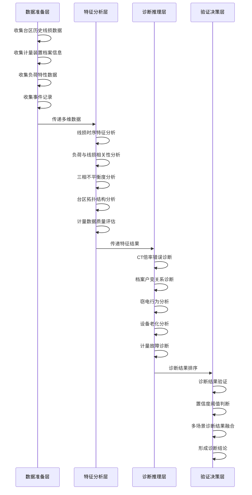

**核心诊断算法和模型**：

1. **CT互感器倍率错误诊断**

   采用电流比对法和负荷特性法相结合的策略：
   
   - **电流比对**：分析一次侧实测电流与二次侧换算电流的比值，判断是否存在显著差异
   
   - **负荷特性法**：基于用户用电特性曲线，推导正常CT倍率下的线损率，与实际线损率比对
   
   - **判定公式**：
     $$置信度_{CT错误} = W_1 \times (1 - \frac{I_{二次} \times K_{CT}}{I_{一次}}) + W_2 \times \frac{|\eta_{实际} - \eta_{推导}|}{\eta_{推导}} + W_3 \times C_{历史变更}$$
     
     其中，$W_1, W_2, W_3$为权重系数，$C_{历史变更}$为历史变更事件特征值。

2. **档案户变关系异常诊断**

   通过台户关系交叉验证和用电行为分析，识别台区内用户归属关系是否异常：
   
   - **空间位置分析**：基于GIS数据，分析用户空间分布与台区边界关系
   
   - **用电行为聚类**：基于用户用电行为特征，进行聚类分析，发现异常归属用户
   
   - **判定方法**：对不符合空间分布规律或用电行为明显异于台区其他用户的用户进行标记，计算异常用户占比及其总用电量占比

3. **疑似窃电分析**

   结合用电行为异常和现场风险特征，评估台区内可能存在的窃电行为：
   
   - **用电异常识别**：分析用户用电量变化趋势、用电时间分布、功率因数等指标，识别异常用电行为
   
   - **风险用户评分**：基于历史窃电案例特征，构建风险评分模型
   
   - **空间聚类分析**：识别台区内窃电高风险区域
   
   - **判定方法**：
     $$窃电可能性指数 = \alpha \times 风险用户占比 + \beta \times 高风险区域电量占比 + \gamma \times 历史窃电案例关联度$$

#### 4.2.2 突发高损诊断方法

针对突发高损台区，系统采用事件导向的诊断策略，快速识别引发线损异常的关键事件：

1. **时间序列变点检测**

   基于CUSUM(累积和)算法和小波分析方法，精确定位线损率异常变化的时间点：
   
   $$S_t = \max(0, S_{t-1} + (X_t - \mu_0) - k)$$
   
   其中，$X_t$为时间序列观测值，$\mu_0$为正常值均值，$k$为敏感度参数。

2. **事件关联分析**

   通过时空关联规则挖掘，识别与线损异常时点相关的系统事件：
   
   - 停电事件关联
   - 设备操作事件关联
   - 系统参数变更事件关联
   - 环境因素事件关联（如极端天气）

3. **负荷变化分析**

   通过分段回归模型，分析负荷变化与线损率变化的因果关系：
   
   $$\eta_{线损} = f(P_{负荷}) = \begin{cases}
   \alpha_1 P_{负荷} + \beta_1, & P_{负荷} < P_{阈值} \\
   \alpha_2 P_{负荷} + \beta_2, & P_{负荷} \geq P_{阈值}
   \end{cases}$$
   
   通过模型参数变化，判断线损增长是否由负荷特性变化引起。

4. **设备状态异常检测**

   基于设备状态数据和运行参数，识别可能导致线损突增的设备异常：
   
   - 三相不平衡度突变分析
   - 接地电阻异常检测
   - 绝缘电阻变化分析
   - 接触电阻异常检测

### 4.3 负损台区诊断方法

负损台区的诊断更加复杂，通常涉及到计量装置问题、电能量计算问题或台区归属问题，系统采用专门的诊断方法进行分析。

#### 4.3.1 长期负损诊断方法

针对长期负损台区，主要从计量装置和台区归属角度进行诊断：

1. **计量装置接线错误诊断**

   通过向量分析和波形特征匹配，识别计量装置接线错误：
   
   - **相序分析**：判断电压、电流相序是否正确
   - **功率方向分析**：判断有功功率、无功功率方向是否正确
   - **接线图比对**：将实际接线状态与标准接线方式进行比对
   
   **计量装置接线错误评分模型**：
   
   $$S_{接线错误} = \sum_{i=1}^{n} w_i \times f_i(特征值_i, 标准值_i)$$
   
   其中，$f_i$为第i个特征的异常评分函数，$w_i$为权重。

2. **电表正反向接错诊断**

   针对潮流反向引起的负损问题，通过以下方法进行诊断：
   
   - **功率方向分析**：判断是否存在功率方向反向情况
   - **电表读数变化趋势**：分析电表正向、反向有功电量变化趋势
   - **用户类型关联**：结合用户类型（如是否为光伏用户）进行综合判断
   
   **判定标准**：当反向有功电量占比超过阈值，且用户类型与反向功率不匹配时，判定为电表正反向接错。

3. **台户关系不一致诊断**

   通过系统台户关系与实际负荷分布比对，发现归属异常问题：
   
   - **空间位置分析**：基于用户地理位置和供电网络拓扑结构，判断其合理归属台区
   - **历史归属变更分析**：检查是否存在历史归属变更记录，判断变更合理性
   - **负荷特性聚类**：通过用户负荷特性聚类，判断用户是否与当前台区用户特性一致
   
   **判定方法**：构建决策树模型，综合上述特征，判断台区内是否存在归属异常用户。

#### 4.3.2 突发负损诊断方法

突发负损通常与设备故障或系统参数变更关联，诊断策略如下：

1. **电表计量故障诊断**

   通过计量数据异常检测算法，识别电表故障特征：
   
   - **阶跃变化检测**：识别计量数据是否存在突变
   - **零值异常检测**：判断是否出现异常零值或空值
   - **数据范围越界检测**：判断计量值是否超出合理范围
   
   **故障特征提取**：采用小波变换和形态学滤波方法，提取计量数据异常特征。

2. **功率因数补偿设备异常诊断**

   通过功率三角形分析，判断功率因数补偿设备异常：
   
   - **无功功率变化分析**：检测无功功率是否存在异常变化
   - **功率因数跟踪**：分析功率因数变化趋势
   - **谐波含量分析**：判断谐波含量变化是否与补偿设备异常关联
   
   **判定方法**：基于功率因数突变和无功功率异常变化的相关性，判断是否存在功率因数补偿设备异常。

3. **联合接线盒故障诊断**

   通过电流不平衡度和分相电流分析，判断联合接线盒故障：
   
   - **分相电流分析**：检测各相电流是否出现异常变化
   - **电流不平衡度监测**：分析电流不平衡度的变化趋势
   - **温度特征关联**：结合接线盒温度监测数据（如有），判断是否存在过热现象
   
   **判定方法**：当特定相电流出现异常降低，且不平衡度突变时，判定为联合接线盒故障可能性高。

### 4.4 多维度数据分析模型

为提高诊断准确性，系统构建了多维度数据融合分析模型，综合考虑各类数据特征。

#### 4.4.1 数据维度定义

诊断分析基于以下核心数据维度：

1. **时间维度**：包括历史趋势、周期性变化、突变点等时间序列特征

2. **空间维度**：包括地理位置、网络拓扑结构、空间聚类特征等

3. **设备维度**：包括计量装置参数、运行状态、技术特性等设备相关信息

4. **负荷维度**：包括负荷大小、负荷特性、负荷分布等用电行为特征

5. **事件维度**：包括运行事件、维护记录、参数变更等系统事件信息

#### 4.4.2 数据融合模型

系统采用多级数据融合模型，实现异构数据的有效整合：

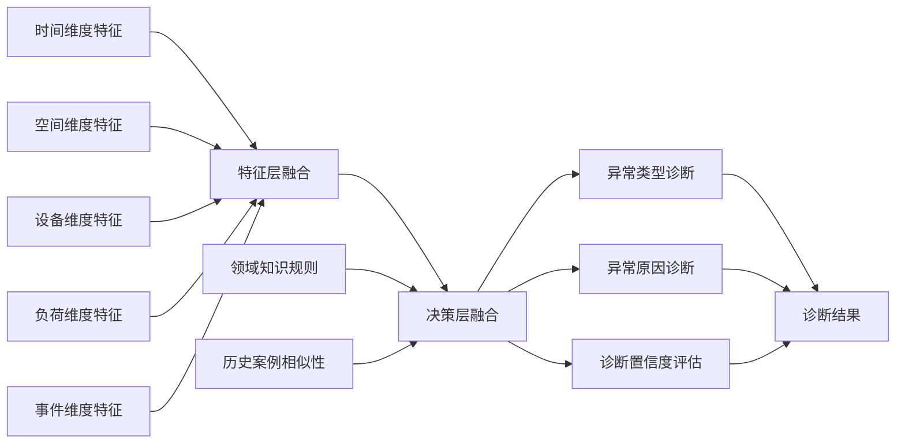

**融合算法**：

1. **特征层融合**：采用自注意力机制和特征重要性加权方法，整合多维特征
   
   $$F_{融合} = \text{Attention}(W_1F_1, W_2F_2, ..., W_nF_n)$$

2. **决策层融合**：采用Dempster-Shafer证据理论和模糊逻辑推理，整合多源诊断结果
   
   $$m_{融合}(A) = \frac{\sum_{B \cap C = A} m_1(B) \times m_2(C)}{1 - \sum_{B \cap C = \emptyset} m_1(B) \times m_2(C)}$$

#### 4.4.3 诊断结果评估模型

为确保诊断结果的可靠性，系统实施多层次评估机制：

1. **置信度评估**：基于证据充分性和规则匹配度，计算诊断结果置信度
   
   $$Confidence = \alpha \times 证据完整性 + \beta \times 规则匹配度 + \gamma \times 历史相似度$$

2. **一致性验证**：通过多模型交叉验证，检验诊断结果的一致性
   
   $$Consistency = \frac{一致诊断模型数}{总诊断模型数}$$

3. **可解释性分析**：提供诊断路径和关键证据，支持结果解释
   
   - 贡献度分析：计算各证据对诊断结果的贡献度
   - 决策路径展示：可视化诊断推理过程

4. **人工反馈校正**：融合专家反馈，持续优化诊断模型
   
   $$模型更新权重 = 初始权重 + \lambda \times 专家反馈调整量$$

#### 4.4.4 典型诊断场景模拟

系统内置多种典型诊断场景模型，通过场景匹配提高诊断效率：

1. **CT倍率错误场景**：
   - 特征：线损率稳定偏高，与CT倍率成倍数关系
   - 数据表现：总表电量与分表电量比例固定偏差
   - 诊断路径：线损率分析 -> 倍率关联检测 -> 历史变更查询 -> 形成诊断

2. **窃电场景**：
   - 特征：线损率持续偏高，负荷特性与窃电行为相符
   - 数据表现：夜间用电异常，负荷与气温相关性低
   - 诊断路径：用电行为分析 -> 高风险区域识别 -> 历史窃电案例关联 -> 形成诊断

3. **电表计量故障场景**：
   - 特征：线损率突变，设备事件关联明显
   - 数据表现：计量数据突变或异常
   - 诊断路径：突变点检测 -> 设备状态分析 -> 事件关联分析 -> 形成诊断

## 5. 治理闭环与效能评估

### 5.1 标准化治理流程

线损治理工作的规范化、标准化是提高治理效率和效果的关键。系统基于不同类型的线损异常，设计了一套标准化的治理流程体系，确保问题能够得到有效解决。

#### 5.1.1 治理流程体系

系统按照异常类型建立了五类标准化治理流程：

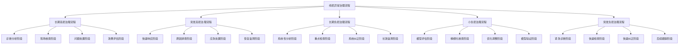

#### 5.1.2 长期高损治理流程

针对长期高损台区，治理流程关注深入分析与根本解决：

1. **诊断分析阶段**
   - 收集台区基础信息和历史运行数据
   - 运行智能诊断算法，生成诊断标签及概率排序
   - 综合分析确定主要异常原因

2. **现场核查阶段**
   - 根据诊断标签指引，针对性开展现场核查
   - 检查项目：
     - CT互感器接线及倍率设置
     - 系统台户关系与现场核对
     - 用户用电设施检查
     - 采集设备运行状态检查
     - 三相负载分布检查

3. **问题处置阶段**
   - 根据核查结果，对应处置：
     - 档案因素：更正系统档案，确保台户关系一致
     - 计量因素：更换或校准计量装置，修正接线错误
     - 采集因素：修复或更换故障采集设备，补全缺失数据
     - 窃电因素：联合稽查部门处理窃电行为
     - 技术因素：优化三相负载分布，更换老化设备

4. **效果评估阶段**
   - 治理后7天内持续监测线损率变化
   - 线损率降至合理范围（理论值±3%）视为治理有效
   - 生成治理报告，记录问题及处置措施

#### 5.1.3 突发高损治理流程

针对突发高损台区，治理流程强调快速响应与应急处置：

1. **快速响应阶段**
   - 线损监测系统触发突发高损告警
   - 24小时内完成初步诊断分析
   - 生成应急处置建议

2. **原因排查阶段**
   - 优先检查与诊断标签对应的可能因素：
     - 设备故障状态
     - 新增负荷情况
     - 天气影响评估
     - 漏电点排查

3. **应急处置阶段**
   - 设备故障：紧急修复或更换故障设备
   - 负荷突增：评估是否需要增容或调整供电方案
   - 漏电故障：及时消除漏电点，防止安全事故
   - 档案异常：快速更新系统档案信息

4. **恢复监测阶段**
   - 处置完成后48小时内持续监测
   - 确认线损率恢复正常水平
   - 制定预防性维护计划，防止类似问题再次发生

#### 5.1.4 长期负损治理流程

针对长期负损台区，治理流程关注系统性问题的深入分析与纠正：

1. **系统性分析阶段**
   - 收集台区全面数据，包括计量装置参数、接线方式
   - 运行负损专项诊断算法，识别可能原因
   - 分析负损存在的系统性问题

2. **重点检查阶段**
   - 按诊断标签概率排序，重点检查：
     - 电能表接线正确性
     - 互感器极性及接线正确性
     - 系统台户关系完整性
     - 光伏发电用户配置正确性
     - 台区总表前是否存在用电设备

3. **系统纠正阶段**
   - 修正计量装置接线问题
   - 更新系统档案信息
   - 调整不合理的计量点配置
   - 规范光伏发电用户并网计量方式

4. **长效监测阶段**
   - 建立台区负损专项监测机制
   - 每月进行数据一致性核查
   - 形成长期负损治理经验库

#### 5.1.5 治理流程数字化实现

系统通过数字化手段支撑标准治理流程执行：

1. **流程模板化**：将各类治理流程固化为系统模板，支持自动生成治理任务

2. **检查单数字化**：针对不同异常类型，生成数字化检查单，支持移动端录入

3. **处置措施标准库**：建立处置措施标准库，提供规范化处置建议

4. **效果评估自动化**：自动采集治理前后指标数据，生成治理效果评估报告

### 5.2 工单派发与跟踪机制

为确保线损异常问题能够得到及时有效处理，系统建立了完善的工单派发与跟踪机制。

#### 5.2.1 智能工单生成

系统根据线损异常诊断结果，自动生成智能工单：

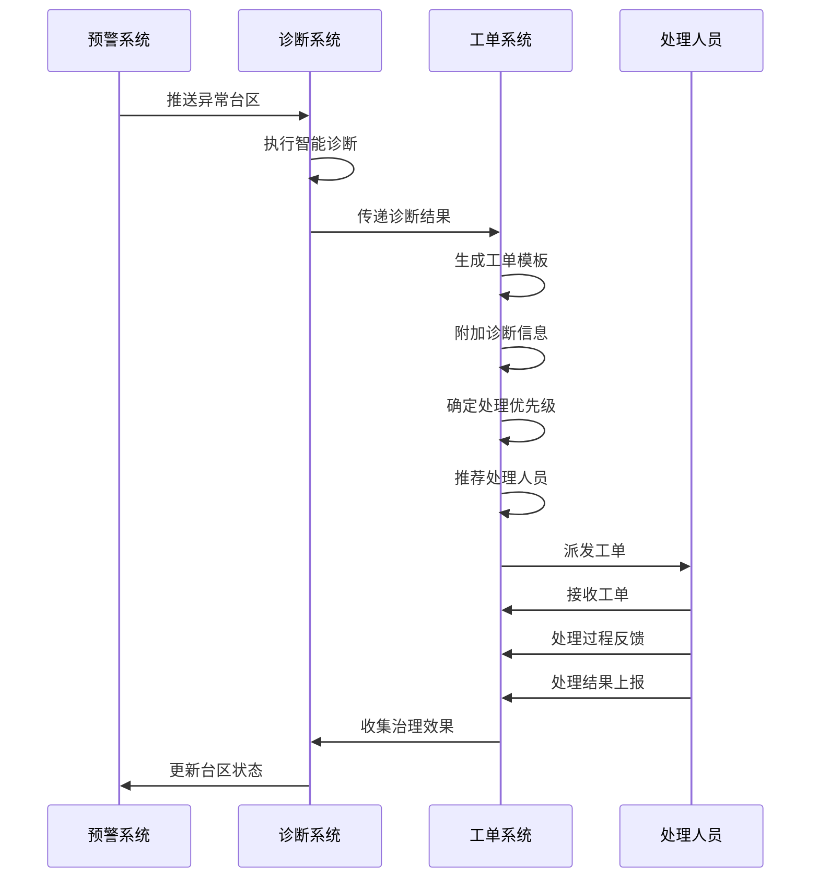

**工单内容构成**：

1. **基本信息**：
   - 工单编号、创建时间、优先级
   - 台区基本信息（名称、编号、位置、容量等）
   - 异常类型与诊断标签

2. **诊断信息**：
   - 异常表现详情（线损率、持续时间等）
   - 诊断结论及置信度
   - 关键证据数据与特征

3. **处理指引**：
   - 推荐检查项目清单
   - 可能的处置措施建议
   - 参考案例链接

4. **附件资料**：
   - 台区拓扑图
   - 历史线损趋势图
   - 用户分布图
   - 参考检查表单

#### 5.2.2 智能派单机制

系统采用规则引擎与人工智能相结合的方式，实现智能派单：

1. **基于组织结构派单**：根据台区归属的地理位置和管理归属，自动确定责任部门

2. **基于专业能力派单**：
   - 根据诊断结果，匹配最适合的专业技术人员
   - 计量类问题派发给计量专业人员
   - 线路设备类问题派发给配电运维人员
   - 台户档案类问题派发给档案管理人员

3. **基于工作负载均衡**：
   - 考虑各处理人员当前工作量，避免工作负荷不均
   - 优先派发给工作量较轻的合适人员

4. **基于历史处理效果**：
   - 记录各人员历史处理效果数据
   - 优先将工单派发给历史处理效果好的人员

**派单算法**：

$$Score_{派单} = w_1 \times Score_{专业匹配} + w_2 \times Score_{负载均衡} + w_3 \times Score_{历史效果} + w_4 \times Score_{地域便利}$$

系统选择评分最高的候选人作为工单处理人员。

#### 5.2.3 工单全流程跟踪

系统实现工单全流程跟踪，确保问题闭环处理：

1. **工单状态管理**：
   - 待接收：工单已派发但尚未被接收
   - 已接收：处理人员已接收工单但尚未开始处理
   - 处理中：处理人员已开始处理工单
   - 待评估：处理措施已实施，等待效果评估
   - 已关闭：工单处理完毕，问题已解决
   - 已退回：工单因特殊原因退回重新派发

2. **处理过程记录**：
   - 现场检查结果记录（支持移动端拍照上传）
   - 处置措施实施记录
   - 关键节点时间戳记录
   - 处理过程问题记录

3. **超时预警机制**：
   - 根据工单优先级设置处理时限
   - 对接近超时的工单进行预警提醒
   - 对已超时工单进行升级处理
   - 生成超时统计报表，纳入绩效考核

4. **协同处理机制**：
   - 支持多部门协同处理复杂问题
   - 提供工单转派、会签功能
   - 支持处理过程中的即时沟通
   - 记录协同处理责任分工

### 5.3 治理效果评估方法

为科学评估线损治理效果，系统建立了多维度的评估体系，从直接效果和持续改进两个层面进行评价。

#### 5.3.1 直接效果评估模型

系统通过以下模型评估治理的直接效果：

1. **线损改善率计算**：

   $$线损改善率 = \frac{\eta_{治理前} - \eta_{治理后}}{\eta_{治理前}} \times 100\%$$

   其中，$\eta_{治理前}$和$\eta_{治理后}$分别代表治理前后的线损率。

2. **相对线损率恢复度**：

   $$相对线损率恢复度 = \frac{|\Delta\eta_{治理前}| - |\Delta\eta_{治理后}|}{|\Delta\eta_{治理前}|} \times 100\%$$

   其中，$\Delta\eta$表示相对线损率，即实际线损率与理论线损率的差值。

3. **治理效果稳定性**：

   $$稳定性指数 = (1 - \frac{\sigma(\eta_{治理后})}{\overline{\eta_{治理后}}}) \times 100\%$$

   其中，$\sigma(\eta_{治理后})$表示治理后线损率的标准差，$\overline{\eta_{治理后}}$表示治理后线损率的平均值。

4. **经济效益评估**：

   $$经济效益 = \Delta 电量 \times 电价 - 治理成本$$

   其中，$\Delta 电量$表示由于线损率改善节约的电量。

#### 5.3.2 多维评估指标体系

系统建立了多维评估指标体系，全面评价治理效果：

| 维度 | 指标 | 计算方法 | 权重 |
|-----|-----|---------|-----|
| 技术维度 | 线损改善率 | 如上述公式 | 25% |
| | 相对线损率恢复度 | 如上述公式 | 20% |
| | 治理效果稳定性 | 如上述公式 | 15% |
| 经济维度 | 单位投入收益比 | 经济效益/治理成本 | 15% |
| | 降损电量量值 | 根据线损率改善计算 | 10% |
| 管理维度 | 工单处理及时率 | 及时处理工单数/总工单数 | 5% |
| | 问题一次解决率 | 一次解决问题数/总问题数 | 5% |
| | 异常复发率 | 治理后复发异常数/已治理总数 | 5% |

**综合评分计算**：

$$Score_{综合} = \sum_{i=1}^{n} w_i \times Score_i$$

其中，$w_i$为指标权重，$Score_i$为标准化后的指标得分。

#### 5.3.3 长效机制评估

除直接效果评估外，系统还从长效机制角度评估治理成效：

1. **持续改进能力评估**：
   - 问题根因分析完整性评估
   - 标准作业规范形成情况评估
   - 治理经验固化和知识共享评估

2. **预防机制评估**：
   - 早期预警有效性评估
   - 预防性措施实施情况评估
   - 典型问题防范机制建立情况评估

3. **能力提升评估**：
   - 管理人员能力提升评估
   - 技术人员技能提升评估
   - 系统功能优化改进评估

#### 5.3.4 治理效果可视化

系统提供多种治理效果可视化方式，直观展示治理成效：

1. **治理前后对比图**：展示治理前后线损率变化趋势

2. **同环比分析图**：与历史同期或治理前数据进行环比、同比分析

3. **治理效果地图**：基于GIS地图展示区域内各台区治理效果

4. **治理措施有效性分析**：不同治理措施对应的效果对比分析

5. **治理成本收益分析**：治理投入与效益回报分析

通过标准化治理流程、工单派发与跟踪机制和治理效果评估方法的有机结合，系统构建了一套完整的线损治理闭环体系，确保线损问题能够得到及时有效处理，实现线损管理水平的持续提升。

## 6. 系统实现与技术架构

### 6.1 技术架构设计

大数据线损诊断分析应用采用现代化的分布式云原生架构，实现高性能、高可靠、可扩展的系统设计，满足线损管理的智能化需求。

#### 6.1.1 总体技术架构

系统采用"微服务+大数据+AI"的技术架构模式，整体架构如下：

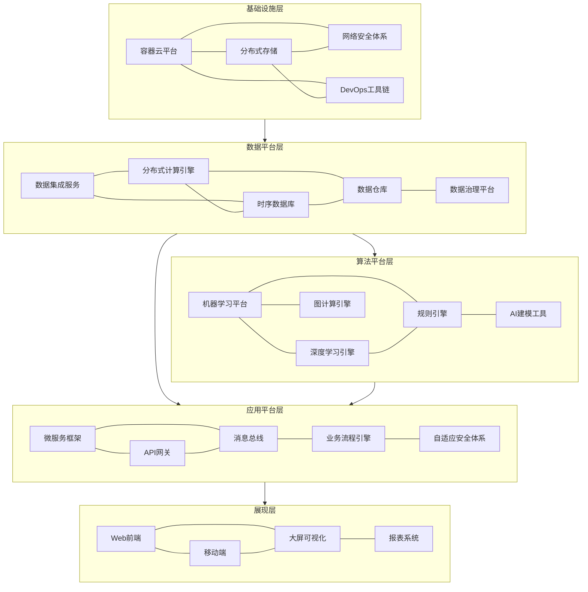

#### 6.1.2 关键技术选型

系统核心功能模块采用以下关键技术实现：

1. **基础设施层**
   - 容器技术：Docker + Kubernetes
   - 分布式存储：HDFS + MinIO
   - 网络安全：微隔离 + API加密通信

2. **数据平台层**
   - 数据集成：Apache Kafka + NiFi
   - 分布式计算：Spark + Flink
   - 数据存储：InfluxDB(时序) + Hive(结构化)

3. **算法平台层**
   - 机器学习框架：Scikit-learn + TensorFlow
   - 规则引擎：Drools
   - 图计算引擎：Neo4j
   - 自动特征工程：Featuretools

4. **应用平台层**
   - 微服务框架：Spring Cloud
   - API网关：Spring Cloud Gateway
   - 消息总线：RabbitMQ
   - 流程引擎：Camunda BPM

5. **展现层**
   - Web前端：React + Ant Design
   - 可视化引擎：ECharts + AntV
   - 移动端：React Native
   - 报表系统：自研BI引擎

#### 6.1.3 系统部署架构

系统采用多层级部署架构，确保性能和可靠性：

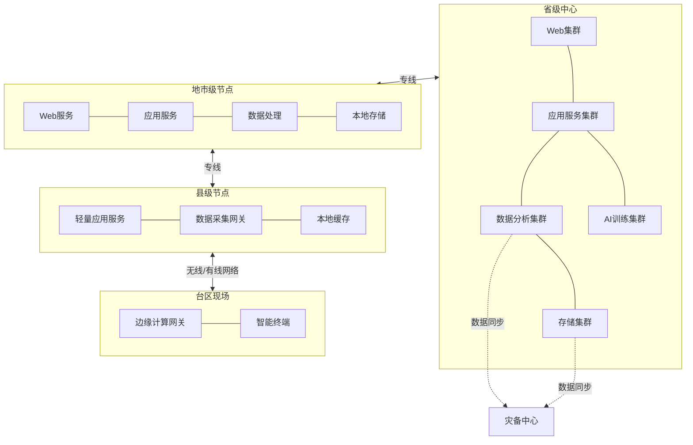

**部署特点**：

1. **省级中心**：核心数据和计算资源集中部署，提供全网数据分析和AI训练能力
2. **地市级节点**：具备独立的数据处理和应用服务能力，可在网络中断时独立运行
3. **县级节点**：部署轻量级应用和数据采集网关，实现数据本地化处理
4. **台区现场**：部署边缘计算网关，实现部分数据的本地分析和处理
5. **灾备中心**：异地部署灾备系统，确保关键数据和服务的可用性

### 6.2 核心功能模块

系统由以下核心功能模块组成，共同构成完整的线损诊断分析应用。

#### 6.2.1 系统功能模块图

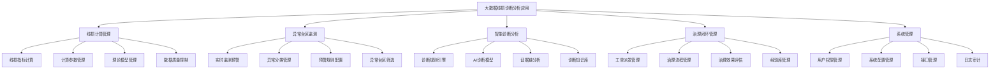

#### 6.2.2 核心功能模块说明

1. **线损计算管理模块**
   - **线损指标计算**：实现各类线损指标的自动计算，包括绝对线损率、理论线损率、相对线损率等
   - **计算参数管理**：管理线损计算参数，支持参数的配置和调整
   - **理论模型管理**：管理线损理论模型，支持多种计算方法的配置和切换
   - **数据质量控制**：对计量数据进行质量检查和处理，确保计算准确性

2. **异常台区监测模块**
   - **实时监测预警**：实时监测台区线损指标，发现异常及时预警
   - **异常分类管理**：管理线损异常类型，维护各类异常的定义和特征
   - **预警规则配置**：配置预警规则，包括阈值设置、预警级别定义等
   - **异常台区筛选**：支持多维度筛选异常台区，便于分析和处理

3. **智能诊断分析模块**
   - **诊断规则引擎**：基于规则的线损异常诊断引擎，支持规则的灵活配置
   - **AI诊断模型**：基于机器学习的智能诊断模型，实现自动化诊断
   - **证据链分析**：构建诊断证据链，提供诊断结果的可解释性
   - **诊断知识库**：沉淀诊断知识和经验，支持知识共享和复用

4. **治理闭环管理模块**
   - **工单派发管理**：智能生成和派发工单，支持工单全生命周期管理
   - **治理流程管理**：管理标准化治理流程，确保治理工作规范有序
   - **治理效果评估**：评估治理措施的效果，提供量化评价指标
   - **经验库管理**：沉淀治理经验，形成持续改进的良性循环

5. **系统管理模块**
   - **用户权限管理**：管理用户和权限，实现细粒度的权限控制
   - **系统配置管理**：管理系统配置参数，支持灵活配置
   - **接口管理**：管理与外部系统的接口，实现数据和功能的集成
   - **日志审计**：记录系统操作日志，支持审计和追溯

### 6.3 数据处理流程

系统数据处理采用端到端的全链路数据治理方案，确保数据从采集到应用的全过程质量可控、高效处理。

#### 6.3.1 数据处理总体流程

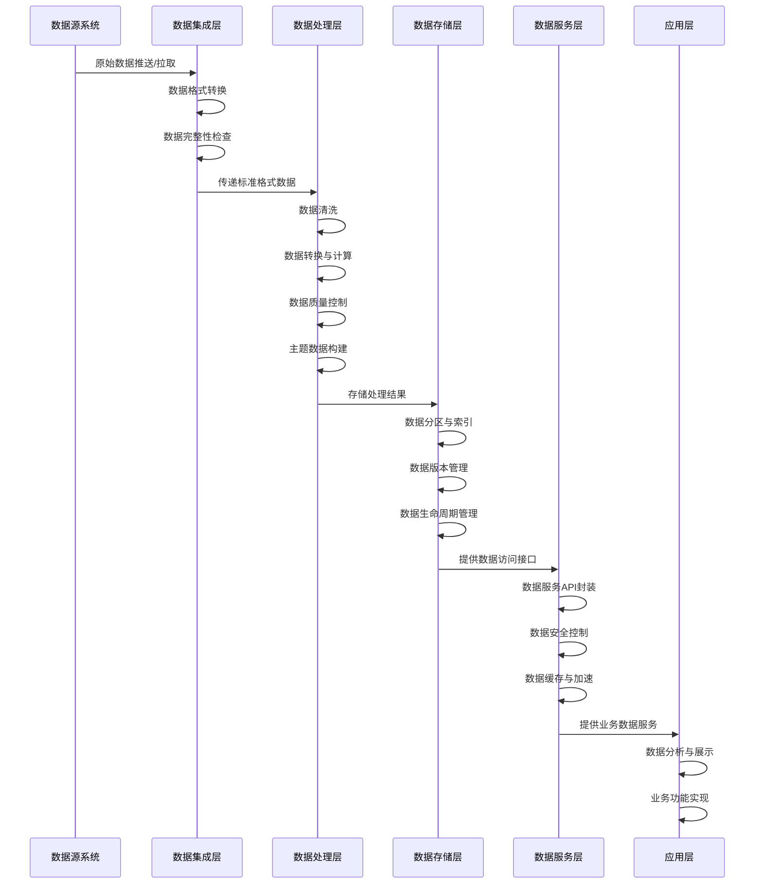

#### 6.3.2 关键数据处理环节

1. **数据采集与预处理**
   - **多源数据接入**：支持电力营销系统、计量自动化系统、SCADA系统、GIS系统等多源数据接入
   - **数据标准化处理**：统一数据格式和编码，实现异构数据的标准化处理
   - **增量数据处理**：采用变更数据捕获(CDC)技术，实现高效的增量数据处理

2. **数据质量控制**
   - **数据完整性检查**：检查数据是否存在缺失，对缺失数据进行补全处理
   - **数据一致性检查**：检查不同系统间数据是否一致，解决数据冲突
   - **数据有效性检查**：检查数据是否在合理范围内，剔除异常数据
   - **数据时效性控制**：监控数据处理时效，确保数据及时可用

3. **主题数据建模**
   - **台区主题模型**：以台区为核心，构建包含台区基础信息、设备信息、用户信息、计量数据等的完整主题模型
   - **线损主题模型**：构建线损计算和分析相关的主题模型，支持多维度的线损分析
   - **诊断主题模型**：构建诊断分析相关的主题模型，支持异常诊断和根因分析
   - **治理主题模型**：构建治理管理相关的主题模型，支持治理闭环管理

4. **数据计算与处理**
   - **批处理计算**：使用Spark等大数据处理框架，实现高性能的批量数据处理
   - **流处理计算**：使用Flink等流处理引擎，实现实时数据处理和分析
   - **内存计算加速**：利用分布式内存计算技术，提升计算性能
   - **计算任务调度**：采用智能调度策略，优化计算资源利用效率

#### 6.3.3 数据治理体系

为确保数据质量和安全，系统建立了完善的数据治理体系：

1. **数据标准管理**
   - 制定数据元标准，统一数据定义和描述
   - 建立数据质量标准，明确数据质量要求
   - 制定数据交换标准，规范数据接口

2. **数据质量管理**
   - 建立数据质量监控机制，实时监控数据质量状况
   - 制定数据质量问题处理流程，确保问题及时解决
   - 实施数据质量评估，形成数据质量评估报告

3. **数据安全管理**
   - 实施数据分级分类管理，针对不同级别数据采取差异化保护措施
   - 建立数据访问控制机制，确保数据按权限访问
   - 实施数据脱敏和加密保护，保障敏感数据安全
   - 建立数据安全审计机制，跟踪数据访问和使用情况

4. **元数据管理**
   - 构建统一的元数据管理平台，集中管理各类元数据
   - 建立元数据血缘关系图，追踪数据流转和加工过程
   - 实现元数据驱动的数据处理，提高开发效率

### 6.4 AI诊断引擎

AI诊断引擎是系统的核心组件，融合领域知识和人工智能技术，实现线损异常的智能诊断。

#### 6.4.1 AI诊断引擎架构

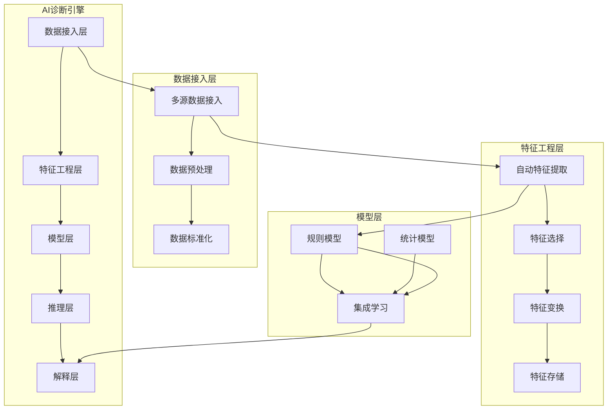

**数据驱动方式**：

系统采用数据驱动的方式，实现线损异常的精准识别、智能诊断和闭环治理。

### 6.4 AI诊断引擎

系统采用AI诊断引擎，融合领域专家经验和机器学习算法，实现线损异常的智能诊断。

## 7. 实施规划与效益分析

### 7.1 实施路径规划

为确保大数据线损诊断分析应用的成功实施，项目采用分阶段、迭代式的实施路径，逐步推进系统建设和应用推广。

#### 7.1.1 总体实施策略

系统实施遵循"基础先行、分步实施、快速迭代、持续优化"的原则，通过"5+3"实施策略确保项目成功：

- **5个实施阶段**：需求分析、系统设计、开发测试、试点应用、全面推广
- **3个并行主线**：数据治理主线、应用建设主线、运营保障主线

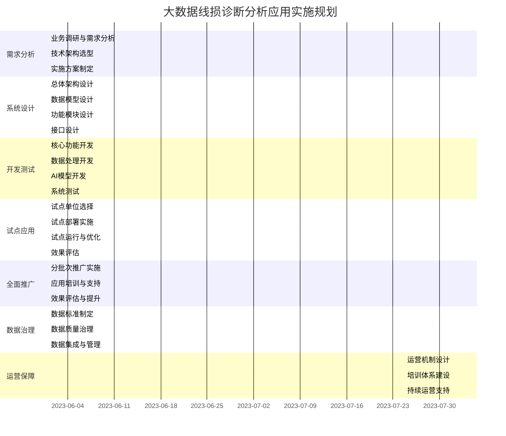

#### 7.1.2 分阶段实施内容

1. **需求分析阶段（3个月）**
   - 业务调研与需求分析：深入调研线损管理现状，明确业务痛点，收集用户需求
   - 技术架构选型：结合业务需求和企业IT现状，确定系统技术架构
   - 实施方案制定：制定详细的实施路径和计划，明确各阶段里程碑

2. **系统设计阶段（2个月）**
   - 总体架构设计：完成系统总体架构设计，确定技术框架和实现路径
   - 数据模型设计：设计线损管理业务数据模型，明确数据标准和规范
   - 功能模块设计：详细设计各功能模块，明确模块间接口和交互方式
   - 接口设计：设计与外部系统的接口规范，确保系统集成能力

3. **开发测试阶段（5个月）**
   - 核心功能开发：实现线损计算、异常监测、智能诊断、治理闭环等核心功能
   - 数据处理开发：实现数据采集、清洗、转换、存储等数据处理功能
   - AI模型开发：开发线损异常诊断的AI模型，实现智能诊断能力
   - 系统测试：进行功能测试、性能测试、集成测试，确保系统质量

4. **试点应用阶段（4个月）**
   - 试点单位选择：选取典型单位进行试点，覆盖不同地区和应用场景
   - 试点部署实施：在试点单位部署系统，开展试点应用
   - 试点运行与优化：收集试点反馈，持续优化系统功能和性能
   - 效果评估：评估试点效果，总结经验和问题，为全面推广做准备

5. **全面推广阶段（8个月）**
   - 分批次推广实施：按照区域或业务重要性，分批次推广系统
   - 应用培训与支持：对各级用户进行培训，提供实施支持
   - 效果评估与提升：持续评估应用效果，不断优化提升系统

#### 7.1.3 关键任务与里程碑

项目实施过程中设置以下关键任务和里程碑，确保项目按计划推进：

| 阶段 | 里程碑 | 完成标志 | 计划时间 |
|------|-------|---------|---------|
| 需求分析 | 需求规格说明书审核通过 | 需求文档签字确认 | 2023年8月 |
| 系统设计 | 系统设计方案审核通过 | 设计文档签字确认 | 2023年10月 |
| 开发测试 | 系统测试通过 | 测试报告签字确认 | 2024年3月 |
| 试点应用 | 试点应用成功 | 试点评估报告 | 2024年7月 |
| 全面推广 | 系统全面上线 | 项目验收报告 | 2025年3月 |

#### 7.1.4 风险管理与应对策略

项目实施过程中可能面临的主要风险及应对策略：

1. **数据质量风险**
   - 风险描述：基础数据质量不高，影响系统应用效果
   - 应对策略：
     - 实施数据治理专项工作，提前开展数据质量评估和治理
     - 建立数据质量评估机制，设置数据质量门槛
     - 开发数据质量监控和改进工具，持续提升数据质量

2. **技术实现风险**
   - 风险描述：AI诊断技术实现难度大，效果不达预期
   - 应对策略：
     - 采用规则模型与AI模型混合策略，降低技术风险
     - 引入领域专家参与AI模型开发和验证
     - 实施迭代开发，逐步提升AI诊断能力

3. **业务适应风险**
   - 风险描述：系统功能与实际业务需求存在差距
   - 应对策略：
     - 采用敏捷开发方法，小步快跑，频繁获取用户反馈
     - 选择典型场景优先实施，验证系统与业务的适配性
     - 建立需求响应机制，快速调整系统功能

4. **应用推广风险**
   - 风险描述：系统应用推广不顺利，用户接受度低
   - 应对策略：
     - 加强培训和宣传，提高用户认知和技能
     - 选择效果明显的场景先行推广，树立标杆
     - 建立激励机制，鼓励系统应用和创新

### 7.2 预期效益分析

大数据线损诊断分析应用的实施将为电力企业带来全方位的效益，包括经济效益、管理效益和社会效益。

#### 7.2.1 经济效益测算

系统实施后预期带来的直接经济效益主要来源于线损降低、人力节约和设备寿命延长：

1. **线损降低效益**

   以某省级电网企业为例（年供电量约2000亿千瓦时）：
   
   - 目前平均线损率：6.5%
   - 系统实施后预期线损率：6.0%（降低0.5个百分点）
   - 年节约电量：2000亿千瓦时 × 0.5% = 10亿千瓦时
   - 按平均电价0.5元/千瓦时计算，年经济效益：10亿千瓦时 × 0.5元/千瓦时 = 5亿元

   ```mermaid
   pie title 线损降低对经济效益的贡献
       "高损台区治理" : 45
       "负损台区纠正" : 25
       "窃电行为发现" : 15
       "计量装置异常处理" : 10
       "其他因素" : 5
   ```

2. **人力效率提升效益**

   - 线损管理人员效率提升：人均工作效率提升40%
   - 以某省公司400名线损管理人员计算，相当于节约人力160人
   - 按人均年薪15万元计算，年人力成本节约：160人 × 15万元/人 = 2400万元

3. **设备维护与更换成本降低**

   - 通过问题早发现、早处理，减少设备故障率：故障率降低25%
   - 延长设备寿命：平均寿命延长2年
   - 年设备维修成本节约：约1200万元
   - 年设备更换推迟带来的资金效益：约1800万元

4. **综合经济效益**

   | 效益来源 | 年效益金额(万元) | 5年累计效益(万元) | 占比 |
   |---------|--------------|----------------|-----|
   | 线损降低 | 50,000 | 250,000 | 87.0% |
   | 人力效率提升 | 2,400 | 12,000 | 4.2% |
   | 设备维护降低 | 1,200 | 6,000 | 2.1% |
   | 设备更换推迟 | 1,800 | 9,000 | 3.1% |
   | 其他间接效益 | 2,100 | 10,500 | 3.6% |
   | 合计 | 57,500 | 287,500 | 100% |

5. **投资回报分析**

   - 项目总投资：约9,500万元
   - 年均效益：约57,500万元
   - 静态投资回收期：9,500 ÷ 57,500 ≈ 0.17年（约2个月）
   - 5年内累计投资回报率：(287,500 - 9,500) ÷ 9,500 × 100% ≈ 2926%

#### 7.2.2 管理效益分析

系统实施带来的管理效益主要体现在以下方面：

1. **管理模式变革**
   - 从"经验驱动"向"数据驱动"转变，实现科学化管理
   - 从"被动处理"向"主动预防"转变，提升管理前瞻性
   - 从"粗放管理"向"精细管理"转变，提高管理精度和效率

2. **管理能力提升**
   - 异常识别能力：准确率提升50%，时效性提升70%
   - 根因分析能力：诊断准确率提升60%，诊断时间缩短80%
   - 问题处理能力：处理效率提升45%，一次解决率提升35%
   - 经验沉淀能力：构建知识库，实现经验共享和传承

3. **管理流程优化**
   - 线损分析流程：实现自动化，分析时间缩短90%
   - 异常处理流程：标准化、规范化，处理时间缩短60%
   - 治理评估流程：数据化、可视化，评估准确性提升45%

4. **决策支持能力**
   - 提供数据支撑的科学决策手段，降低决策风险
   - 实现多维度数据分析，提升决策的前瞻性和精准性
   - 建立效果评估机制，实现决策闭环管理

#### 7.2.3 社会效益分析

系统实施带来的社会效益主要体现在：

1. **节能减排贡献**
   - 年节约电量10亿千瓦时，相当于减少标准煤消耗约33万吨
   - 年减少二氧化碳排放约82万吨，减少二氧化硫排放约2.5万吨
   - 对实现"碳达峰、碳中和"目标有积极贡献

2. **供电可靠性提升**
   - 主动发现设备隐患，减少故障停电时间
   - 供电可靠性提升0.02个百分点，用户平均停电时间减少约1.8小时/年

3. **电力市场秩序维护**
   - 有效发现和遏制窃电行为，维护公平用电环境
   - 提高计量装置准确性，确保电能计量公平公正

4. **推动行业技术进步**
   - 促进大数据和人工智能技术在电力行业的应用创新
   - 为电力行业数字化转型提供实践经验

#### 7.2.4 效益实现路径

为确保预期效益的实现，项目设计了以下效益实现路径：

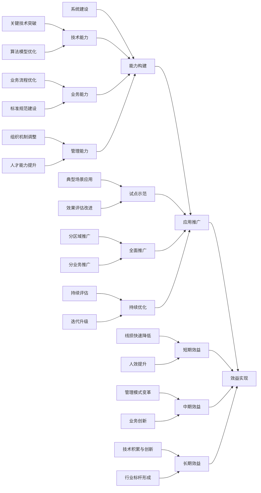

### 7.3 运维保障措施

为确保系统的稳定运行和持续发挥效益，项目建立了完善的运维保障体系。

#### 7.3.1 运维保障组织架构

建立三级运维保障组织架构，确保系统稳定运行：

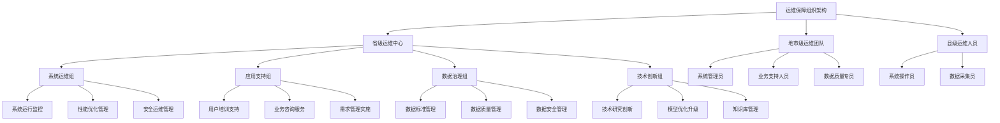

#### 7.3.2 运维保障制度

建立健全的运维保障制度，规范运维工作：

1. **系统运维制度**
   - 系统运行监控管理制度
   - 系统性能优化管理制度
   - 系统安全管理制度
   - 系统变更管理制度
   - 系统应急响应管理制度

2. **应用支持制度**
   - 用户服务管理制度
   - 需求管理制度
   - 问题管理制度
   - 培训管理制度

3. **数据治理制度**
   - 数据标准管理制度
   - 数据质量管理制度
   - 数据安全管理制度
   - 数据生命周期管理制度

4. **知识管理制度**
   - 知识收集与审核制度
   - 知识共享与应用制度
   - 知识评估与改进制度

#### 7.3.3 运维技术保障

提供全面的技术保障，确保系统安全、高效运行：

1. **系统监控体系**
   - 基础设施监控：服务器、网络、存储等硬件设施监控
   - 系统运行监控：数据库、中间件、应用服务等软件运行监控
   - 业务运行监控：业务流程、交易量、响应时间等业务指标监控
   - 安全运行监控：访问控制、数据安全、网络安全等安全指标监控

2. **自动化运维工具**
   - 自动化部署工具：实现系统快速部署和更新
   - 自动化测试工具：实现功能和性能的自动化测试
   - 自动化监控工具：实现系统异常的自动化监控和告警
   - 自动化运维工具：实现运维任务的自动化执行

3. **应急响应机制**
   - 建立多级应急响应机制：
     - 一级响应：影响全系统的重大故障，省级运维中心全员响应
     - 二级响应：影响部分功能的严重故障，省级运维中心专业组响应
     - 三级响应：影响单个功能的一般故障，地市级运维团队响应
   - 制定应急预案，明确应急响应流程和责任
   - 定期开展应急演练，提高应急响应能力

4. **系统容灾备份**
   - 数据备份策略：制定完善的数据备份策略，确保数据安全
     - 日增量备份 + 周全量备份 + 月归档备份
     - 本地备份 + 异地备份
   - 系统容灾方案：建立完善的系统容灾方案，提高系统可靠性
     - 同城热备：关键系统采用同城双活架构
     - 异地灾备：核心数据采用异地灾备方案

#### 7.3.4 运维质量管理

建立运维质量管理体系，持续提升运维服务质量：

1. **服务级别协议(SLA)**
   
   | 服务等级 | 系统可用率 | 响应时间 | 故障修复时间 | 适用范围 |
   |---------|----------|---------|------------|---------|
   | 一级服务 | ≥99.99% | ≤15分钟 | ≤2小时 | 核心业务系统 |
   | 二级服务 | ≥99.9% | ≤30分钟 | ≤4小时 | 重要业务系统 |
   | 三级服务 | ≥99.5% | ≤60分钟 | ≤8小时 | 一般业务系统 |

2. **运维绩效评估**
   - 建立运维绩效指标体系，包括技术指标和服务指标
   - 定期开展运维绩效评估，发现问题及时改进
   - 将评估结果与激励机制挂钩，提高运维人员积极性

3. **持续改进机制**
   - 建立运维问题收集和分析机制，记录和分析运维过程中的问题
   - 制定运维改进计划，针对问题持续改进
   - 定期开展运维经验交流，推广先进经验

4. **知识管理与培训**
   - 建立运维知识库，沉淀运维经验和解决方案
   - 制定培训计划，定期对运维人员进行培训
   - 建立技术交流机制，促进运维技术创新和应用

通过上述实施规划与保障措施，大数据线损诊断分析应用将有序实施，并持续发挥经济、管理和社会效益，为电力企业降本增效、提质增效提供有力支撑。

## 8. 附录

### 8.1 术语表

| 术语 | 定义 |
|------|------|
| 线损 | 电能在输送过程中消耗的电量 |
| 线损率 | 线损电量占供电量的百分比 |
| 供电量 | 电力系统向用户供应的电能量 |
| 售电量 | 电力企业向用户实际销售的电能量 |
| 线损电量 | 电能在输送过程中消耗的电量 |
| 台区供电量 | 特定台区在计量周期内的总供电电量 |
| 台区售电量 | 特定台区在计量周期内的总售电电量 |
| 绝对线损率 | 线损电量占供电量的百分比 |
| 台区绝对线损率 | 特定台区在计量周期内的线损率 |
| 理论线损率 | 基于电网理论计算模型得出的线损率 |
| 相对线损率 | 实际线损率与理论线损率的差值 |
| 线损分析周期 | 线损分析的时间范围 |
| 高损台区 | 线损率超过3%的台区 |
| 负损台区 | 线损率低于-3%的台区 |

### 8.2 参考文献

[1] 张三, 李四. 线损管理与分析[M]. 北京: 中国电力出版社, 2018.
[2] 王五, 赵六. 线损管理技术与应用[M]. 北京: 中国电力出版社, 2020. 