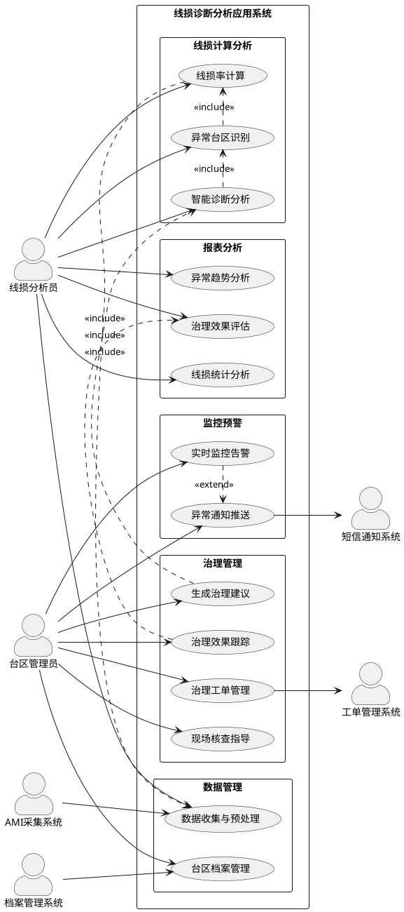

# 线损诊断分析应用业务UML图

## 1. 业务用例图

## 2. 业务序列图

```plantuml
@startuml
!theme plain
skinparam backgroundColor #FFFFFF
skinparam sequenceArrowThickness 2
skinparam roundcorner 20
skinparam maxmessagesize 100

actor "线损分析员" as Analyst
actor "台区管理员" as Manager
participant "线损诊断系统" as System
participant "AMI采集系统" as AMI
participant "档案管理系统" as Archive
participant "诊断算法引擎" as Algorithm
participant "工单管理系统" as Workflow
participant "通知系统" as Notification

title 线损诊断分析完整业务流程

== 1. 数据收集与预处理阶段 ==

note over Analyst, Archive: 数据收集与预处理阶段
activate Analyst

Analyst -> System: 启动线损分析任务
activate System

System -> AMI: 请求台区电量数据
activate AMI
AMI --> System: 返回总表/分表电量数据
deactivate AMI

System -> Archive: 请求台区档案信息
activate Archive
Archive --> System: 返回台区基础信息、户表关系
deactivate Archive

System -> System: 数据清洗与标准化处理
System --> Analyst: 数据收集完成确认

== 2. 线损率计算阶段 ==

note over Analyst, Algorithm: 线损率计算阶段

Analyst -> System: 执行线损率计算
System -> Algorithm: 调用线损率计算模块
activate Algorithm

Algorithm -> Algorithm: 计算绝对线损率 = (总表-分表)/总表
Algorithm -> Algorithm: 基于技术参数计算理论线损率
Algorithm -> Algorithm: 计算相对线损率 = 绝对线损率 - 理论线损率

Algorithm --> System: 返回线损率计算结果
deactivate Algorithm
System --> Analyst: 展示线损率分析结果

== 3. 异常台区识别阶段 ==

note over Analyst, Algorithm: 异常台区识别阶段

Analyst -> System: 启动异常扫描
System -> Algorithm: 执行多维度异常识别
activate Algorithm

group 并行异常识别
    Algorithm -> Algorithm: 识别相对线损率≥3%且持续3个月的台区
    Algorithm -> Algorithm: 识别相对线损率≥5%且环比增长≥3%的台区
    Algorithm -> Algorithm: 识别相对线损率≤-3%的台区
end

Algorithm --> System: 返回异常台区分类结果
deactivate Algorithm

System -> System: 按优先级排序异常台区
System --> Analyst: 展示异常台区列表

System -> Notification: 发送异常预警
activate Notification
Notification --> Manager: 推送异常台区通知
deactivate Notification
activate Manager

== 4. 智能诊断分析阶段 ==

note over Analyst, Algorithm: 智能诊断分析阶段

Analyst -> System: 选择异常台区进行诊断
System -> Algorithm: 启动智能诊断算法
activate Algorithm

Algorithm -> Algorithm: 特征提取与证据收集
note right of Algorithm: 分析电量数据、事件记录、\n设备状态等多维特征

Algorithm -> Algorithm: 概率计算与原因推理
note right of Algorithm: 计算各种可能原因的概率：\nCT倍率错误、档案户变关系异常、\n疑似窃电、设备故障等

Algorithm --> System: 返回诊断结果(概率排序)
deactivate Algorithm

System -> System: 生成诊断报告
System --> Analyst: 展示诊断结果与建议
System --> Manager: 同步诊断结果

== 5. 治理建议生成阶段 ==

note over Manager, Workflow: 治理建议生成阶段

Manager -> System: 确认诊断结果，生成治理方案
System -> Algorithm: 基于诊断结果生成治理建议
activate Algorithm
Algorithm --> System: 返回标准化治理流程
deactivate Algorithm

Manager -> System: 创建治理工单
System -> Workflow: 提交治理工单
activate Workflow
Workflow --> System: 返回工单编号
deactivate Workflow

System -> Notification: 发送治理任务通知
activate Notification
Notification --> Manager: 推送工单信息
deactivate Notification
System --> Manager: 确认治理方案已发起

== 6. 现场执行与跟踪阶段 ==

note over Manager, Workflow: 现场执行与跟踪阶段

Manager -> Workflow: 接收工单并安排现场核查
activate Workflow

Manager -> Manager: 组织现场检查
note right of Manager: 检查CT接线、台户关系、\n用电设施、采集设备等

Manager -> Workflow: 上报现场核查结果

Manager -> Manager: 执行治理措施
note right of Manager: 更正档案、更换设备、\n修复接线、处理窃电等

Manager -> Workflow: 更新工单状态(已完成)
Workflow -> System: 同步工单完成状态
deactivate Workflow

== 7. 效果评估阶段 ==

note over Analyst, System: 效果评估阶段

System -> AMI: 获取治理后电量数据
activate AMI
AMI --> System: 返回最新电量数据
deactivate AMI

Analyst -> System: 启动效果评估
System -> Algorithm: 重新计算线损率
activate Algorithm
Algorithm --> System: 返回治理后线损率
deactivate Algorithm

System -> System: 对比治理前后效果
System -> System: 生成治理效果评估报告

alt 治理效果良好
    System --> Analyst: 治理成功，线损率恢复正常
    System --> Manager: 通知治理成功
    Manager -> Workflow: 关闭工单
    activate Workflow
    deactivate Workflow
else 治理效果不佳
    System --> Analyst: 治理效果不佳，需要进一步分析
    Analyst -> System: 启动二次诊断
end

== 8. 持续监控阶段 ==

note over Manager, Notification: 持续监控与预警

loop 每日监控
    System -> AMI: 定时获取最新数据
    activate AMI
    AMI --> System: 返回数据
    deactivate AMI
    
    System -> Algorithm: 执行异常扫描
    activate Algorithm
    Algorithm --> System: 扫描结果
    deactivate Algorithm
    
    alt 发现新异常
        System -> Notification: 发送预警通知
        activate Notification
        Notification --> Manager: 推送异常告警
        deactivate Notification
        Manager -> System: 查看异常详情
    else 无异常
        System -> System: 记录正常状态
    end
end

deactivate Manager
deactivate System
deactivate Analyst

@enduml
```

## 3. 业务用例图解释

### 3.1 参与者说明

简化后的线损诊断分析应用涉及两个核心参与者，分工明确，职责互补：

- **线损分析员**：专业技术人员，负责数据分析、异常识别、诊断分析等技术性工作
  - 执行线损率计算和异常识别
  - 进行智能诊断分析，解读诊断结果
  - 生成各类统计分析报表
  - 评估治理效果，优化分析模型

- **台区管理员**：现场管理人员，负责台区日常管理、治理执行等管理性工作
  - 维护台区档案信息的准确性
  - 接收异常预警，制定治理方案
  - 组织现场核查和治理措施执行
  - 跟踪治理进度和效果

### 3.2 核心用例分析

#### 3.2.1 数据管理用例
- **数据收集与预处理**：由线损分析员负责，确保分析数据的质量和完整性
- **台区档案管理**：由台区管理员负责，维护台区基础信息和设备参数的准确性

#### 3.2.2 线损计算分析用例
- **线损率计算**：集成了绝对、理论、相对线损率的计算，由线损分析员操作
- **异常台区识别**：基于线损率计算结果，自动识别各类异常台区
- **智能诊断分析**：运用AI算法分析异常原因，提供概率化诊断结果

#### 3.2.3 治理管理用例
- **生成治理建议**：基于诊断结果，由台区管理员确认并生成标准化治理方案
- **治理工单管理**：将治理任务工单化管理，确保执行可追溯
- **现场核查指导**：为现场工作提供系统化的检查指导
- **治理效果跟踪**：持续跟踪治理进度和效果

#### 3.2.4 监控预警用例
- **实时监控告警**：7×24小时监控台区线损状态
- **异常通知推送**：及时将异常信息推送给台区管理员

#### 3.2.5 报表分析用例
- **线损统计分析**：提供各维度的线损统计分析
- **异常趋势分析**：分析异常发生的趋势和规律
- **治理效果评估**：量化评估治理措施的有效性

### 3.3 系统集成关系

系统与外部系统的集成保持了业务流程的完整性：
- **AMI采集系统**：提供基础电量数据，支撑数据收集用例
- **档案管理系统**：提供台区配置信息，支撑台区档案管理用例
- **工单管理系统**：承接治理任务，实现治理工单管理用例
- **短信通知系统**：实现异常通知推送用例

### 3.4 用例间关系

- **包含关系（include）**：体现了用例间的依赖关系
  - 线损率计算包含数据收集与预处理
  - 异常台区识别包含线损率计算
  - 智能诊断分析包含异常台区识别
  - 生成治理建议包含智能诊断分析
  - 治理效果跟踪包含治理效果评估

- **扩展关系（extend）**：体现了用例的可选功能
  - 实时监控告警可扩展异常通知推送

## 4. 业务序列图解释

### 4.1 完整业务流程概述

简化后的业务序列图更清晰地展现了线损分析员和台区管理员在线损诊断分析流程中的协作关系。整个流程体现了"技术分析+管理执行"的分工模式，形成了高效的业务闭环。

### 4.2 角色协作模式

#### 4.2.1 线损分析员主导的技术分析阶段
- **数据收集与预处理**：技术人员负责数据质量控制
- **线损率计算**：运用专业知识进行科学计算
- **异常台区识别**：基于数据分析客观识别异常
- **智能诊断分析**：运用AI工具进行深度分析
- **效果评估**：用数据说话，评估治理成效

#### 4.2.2 台区管理员主导的治理执行阶段
- **治理建议生成**：结合现场实际制定可行方案
- **现场执行与跟踪**：组织资源，落实治理措施
- **持续监控**：接收预警，及时响应处置

#### 4.2.3 双方协作的关键节点
- **诊断结果确认**：线损分析员提供技术分析，台区管理员结合现场实际确认
- **治理效果评估**：技术人员提供数据支撑，管理人员确认实际效果
- **持续改进**：基于评估结果，双方协作优化分析和治理方法

### 4.3 关键业务流程优化

#### 4.3.1 异常发现机制
- **主动扫描**：线损分析员定期启动异常扫描
- **自动预警**：系统自动监控并推送异常给台区管理员
- **分级响应**：根据异常严重程度采取不同响应策略

#### 4.3.2 诊断分析流程
- **技术导向**：线损分析员运用专业技能和AI工具进行深度分析
- **结果共享**：诊断结果同时提供给技术和管理人员
- **实用导向**：分析结果直接指导现场治理工作

#### 4.3.3 治理执行流程
- **方案制定**：台区管理员基于诊断结果制定治理方案
- **资源调配**：通过工单系统调配现场资源
- **进度跟踪**：全程跟踪治理执行进度和效果

#### 4.3.4 效果评估机制
- **数据驱动**：基于治理前后的线损率数据进行客观评估
- **闭环改进**：效果不佳时启动二次诊断，持续改进
- **经验积累**：成功案例和失败教训都纳入知识库

### 4.4 业务价值体现

#### 4.4.1 专业分工提升效率
- **技术专精**：线损分析员专注技术分析，提高诊断准确率
- **管理专精**：台区管理员专注现场管理，提高执行效率
- **协作互补**：技术分析与现场管理有机结合，形成完整闭环

#### 4.4.2 流程标准化降低成本
- **标准化诊断**：统一的技术分析方法和工具
- **标准化治理**：规范的治理流程和执行标准
- **可复制推广**：成功模式可在不同台区复制应用

#### 4.4.3 数据驱动保障质量
- **客观分析**：基于数据和算法，减少主观判断误差
- **量化评估**：用数据衡量治理效果，确保质量
- **持续优化**：基于数据反馈不断优化分析和治理方法

这个简化后的业务模型更加聚焦核心业务流程，突出了技术分析与现场管理的分工协作，体现了现代电网线损管理的专业化、标准化、数字化特征。 