# Big Data Line Loss Diagnostic Analysis Application Technology and Business Plan Report


# Big Data Line Loss Diagnostic Analysis Application

## Technology and Business Plan Report

Date of Preparation: June 2023

## Table of Contents

[TOC]

## Document Revision History

| Version | Revision Date | Reviser | Revision Description |
| ------- | ------------- | ------- | -------------------- |
| V1.0    | 2023-06-01    | Tech Team | Initial Draft Complete |

## 1. Overview

### 1.1 Business Overview

Power grid line loss management is a key indicator for measuring the operational efficiency and economic benefits of the power grid. A reasonable line loss rate reflects the efficiency of power grid asset utilization and the quality of power transmission. With the ongoing modernization efforts of Uzbekistan's power system and the accelerated development of power grid infrastructure, higher requirements have been placed on the refined management of power grid line loss.

This plan proposes the construction of a line loss diagnostic analysis application system based on big data and artificial intelligence technology to achieve intelligent monitoring, precise diagnosis, and efficient governance of power grid line loss, helping Uzbekistan's power companies reduce line loss rates, improve power supply reliability, and optimize asset management.

#### 1.1.1 Business Background

Currently, Uzbekistan's power companies mainly face the following challenges in line loss management:

1.  **Multi-source Heterogeneous Line Loss Data**: Line loss data comes from multiple business systems, with inconsistent data formats and quality.
2.  **Lagging Discovery of Line Loss Anomalies**: Traditional manual inspection methods cannot detect line loss anomalies in real-time.
3.  **Low Efficiency of Line Loss Diagnosis**: Expert experience is difficult to scale, and diagnostic processes are cumbersome and inconsistent.
4.  **High Line Loss Rates**: Current line loss rates in different regions of Uzbekistan vary significantly, from approximately 15% in better-performing regions to as high as 25% in areas with greater challenges.
5.  **Focus on Medium and Low Voltage Distribution Networks**: The client primarily manages medium and low voltage distribution network losses, which require specialized solutions.

This system integrates AMI (Advanced Metering Infrastructure) data and scattered archival information, combined with modern data science technology, to establish a full lifecycle management system for line loss, achieving timely discovery, scientific diagnosis, and efficient governance of line loss anomalies.

#### 1.1.2 Business Value

The construction of this system will bring significant business value to Uzbekistan's power companies:

1.  **Technical Loss Reduction**: By accurately identifying technical line loss anomalies, it is expected to help reduce the line loss rate progressively toward the long-term target of below 5% (as achieved in other countries after years of investment and implementation).
2.  **Management Loss Reduction**: By discovering and correcting management-related line loss issues, it is expected to reduce management-related loss of electricity by 5%-8%.
3.  **Economic Benefits**: Based on the current high line loss rates (15-25%), even a modest reduction of 1 percentage point can yield significant economic benefits - potentially millions of USD annually for the national grid.
4.  **Management Efficiency**: Reduce the average line loss anomaly handling time from 7 days to 2 days, increasing work efficiency by more than 200%.

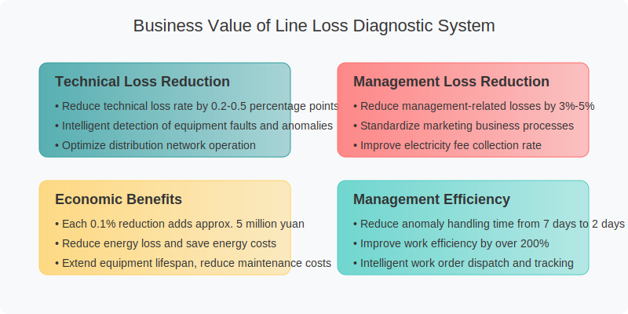

### 1.2 Analysis Process

This system uses a five-step method of "Data Collection - Line Loss Calculation - Anomaly Identification - Classification Diagnosis - Governance Recommendation" to build a complete line loss management analysis process:

#### 1.2.1 Overall Process

The line loss diagnostic analysis business process includes five key stages:

1.  **Data Collection and Preprocessing**: Integrate AMI meter data and available archival information, and perform data cleaning and standardization despite the limited data sources.
2.  **Line Loss Rate Calculation**: Calculate the absolute, theoretical, and relative line loss rates for distribution areas based on available data and standard methods.
3.  **Anomaly Area Identification**: Use data analysis to identify and classify anomalous distribution areas, maximizing insights from limited data sources.
4.  **Classification Diagnosis**: Perform cause analysis using different diagnostic algorithms based on the characteristics of line loss anomalies.
5.  **Governance Recommendation**: Generate data-driven line loss governance recommendations and track implementation effects.

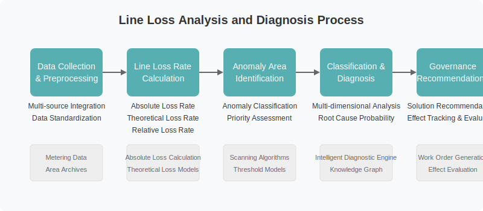

#### 1.2.2 Technical Approach

This system adopts a "Big Data + AI" technical approach, mainly including:

1.  **Data Layer**: Build a multi-dimensional data warehouse for line loss, achieving unified management and standardized processing of AMI data and available archival information.
2.  **Algorithm Layer**: Develop line loss calculation, anomaly identification, and diagnostic algorithms based on machine learning and expert rules, optimized to work with limited data sources.
3.  **Application Layer**: Provide visual analysis tools, anomaly monitoring and warning, intelligent diagnosis, and governance recommendation functions.
4.  **Service Layer**: Integrate with work order systems, mobile applications, etc., through API interfaces to form closed-loop management.

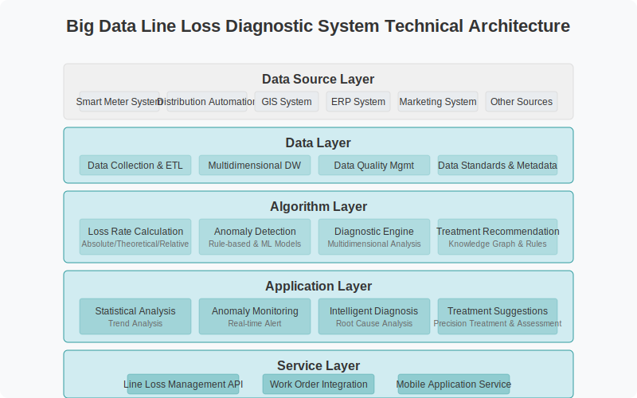

### 1.3 Application Scenarios

The system addresses four key directions recognized by Uzbekistan's power companies for recovering losses through data analysis:

1.  **Electricity Usage Analysis and Case Listing**: The system automatically analyzes meter data to identify suspicious electricity theft or abnormal usage cases, including meter tampering, irregular installations, distributed energy anomalies, and unusual consumption patterns (such as cryptocurrency mining).

2.  **AI-Assisted Communication Problem Resolution**: Provides diagnostic and repair solutions for communication failures to improve collection success rates, helping power companies recover electricity fees through G3 relay/module damage analysis, collection failure analysis, and intelligent recommendations for equipment replacement or network configuration adjustments.

3.  **Failure Analysis and Equipment Health Monitoring**: AI detection of equipment anomalies to improve power supply reliability, including CT/VT anomaly analysis for large users, transformer efficiency calculations to identify aging transformers, and equipment health assessment to identify high-risk devices.

4.  **Cable Topology Analysis and Optimization**: Analyzes three-phase power supply in distribution areas to optimize line structure, detect load imbalances between phases, identify high-loss line segments, and calculate potential energy-saving benefits after reconstruction based on topology.

Through these application scenarios, the system aims to directly address Uzbekistan's specific challenges in power grid line loss management and progressively move toward the target of reducing line loss rates to below 5%.

## 2. Calculation of Relative Line Loss Rate for Distribution Areas

### 2.1 Core Formula

Line loss rate calculation is a fundamental function of this system. Through scientific and reasonable calculation methods, it provides data support for anomaly identification and diagnosis. The core focus of this system is the relative line loss rate of distribution areas, which measures the difference between actual line loss and theoretical line loss, more accurately reflecting line loss anomalies.

#### 2.1.1 Definition of Line Loss Rate

Line loss rate refers to the ratio of energy loss due to various reasons during power transmission and distribution to the total power supplied. According to the calculation method, line loss rate can be divided into absolute line loss rate, theoretical line loss rate, and relative line loss rate.

The general definition of line loss rate is:

$ \text{Line Loss Rate} = \frac{\text{Line Loss Energy}}{\text{Supplied Energy}} \times 100\% $

#### 2.1.2 Calculation Formula for Relative Line Loss Rate

This system uses the relative line loss rate as the core indicator for identifying anomalies in distribution areas. Its calculation formula is:

$ \text{Relative Line Loss Rate} = \text{Absolute Line Loss Rate} - \text{Theoretical Line Loss Rate} $

Where:
-   Absolute Line Loss Rate: Line loss rate calculated based on actual metering data.
-   Theoretical Line Loss Rate: Estimated normal line loss rate based on distribution area parameters and load conditions.

A positive relative line loss rate indicates that actual line loss is higher than theoretical line loss, suggesting potential technical or management issues. A negative value indicates that actual line loss is lower than theoretical line loss, possibly due to metering or archival problems.

### 2.2 Calculation of Absolute (Synchronous) Line Loss Rate for Distribution Areas

The absolute line loss rate of a distribution area is the actual line loss rate calculated based on synchronous metering data, reflecting the line loss situation under the actual operating state of the distribution area.

#### 2.2.1 Calculation Formula

The formula for calculating the absolute line loss rate of a distribution area is:

$ \text{Absolute Line Loss Rate} = \frac{\text{Total Meter Purchased Energy} - \text{Total Sub-meter Sold Energy}}{\text{Total Meter Purchased Energy}} \times 100\% $

The specific calculation method is:

$ \text{Absolute Line Loss Rate} = \frac{Q_{\text{in}} - \sum_{i=1}^n Q_{\text{out},i}}{Q_{\text{in}}} \times 100\% $

Where:
-   $ Q_{\text{in}} $: Represents the purchased energy measured by the main meter of the distribution area.
-   $ Q_{\text{out},i} $: Represents the sold energy measured by the i-th sub-meter within the distribution area.
-   $ n $: Represents the total number of sub-meters within the distribution area.

#### 2.2.2 Data Collection Requirements

To ensure the accuracy of absolute line loss rate calculation, data collection must meet the following requirements:

1.  **Time Synchronization**: Main meter and sub-meter data must be collected within the same time period.
2.  **Data Integrity**: Data for the main meter and all sub-meters must be complete without missing values during the collection cycle.
3.  **Data Accuracy**: Metering devices must be regularly calibrated to ensure measurement accuracy.

This system supports the calculation of line loss rates over multiple cycles such as daily, weekly, monthly, and yearly to meet different analysis needs.

#### 2.2.3 Handling of Abnormal Data

During the calculation of the absolute line loss rate, the following measures are taken for abnormal data:

1.  **Missing Data**: Interpolation methods are used to repair short-term missing data; long-term missing data is estimated using historical data from the same period.
2.  **Outliers**: Identify and handle outliers based on the 3σ principle to avoid affecting calculation results.
3.  **Metering Point Changes**: Ensure data continuity during distribution area modifications or metering point changes.

### 2.3 Calculation of Theoretical Line Loss Rate for Distribution Areas

The theoretical line loss rate is the ideal line loss rate calculated based on the physical characteristics and operating parameters of the distribution area. This system supports multiple methods for calculating theoretical line loss rates, which can be flexibly selected based on the characteristics of the distribution area.

#### 2.3.1 Technical Line Loss Method

The technical line loss method calculates technical losses during transmission and distribution based on the physical parameters and load data of the distribution area.

**Applicable Scenario**: Conventional distribution areas with complete data.

**Calculation Formula**:

$ \text{Theoretical Line Loss Rate}_{\text{Technical}} = \frac{P_{\text{Transformer Loss}} + P_{\text{Line Loss}}}{P_{\text{Load}}} \times 100\% $

Where:
-   $ P_{\text{Transformer Loss}} $: Transformer loss, including no-load loss and load loss.
-   $ P_{\text{Line Loss}} $: Line loss, determined by resistance and current.
-   $ P_{\text{Load}} $: Total load of the distribution area.

**Specific Calculation**:

Transformer Loss Calculation:
$ P_{\text{Transformer Loss}} = P_0 + \beta^2 \times P_k $

Line Loss Calculation:
$ P_{\text{Line Loss}} = \sum_{i=1}^m I_i^2 \times R_i \times L_i $

Where:
-   $ P_0 $: Transformer no-load loss.
-   $ P_k $: Transformer load loss.
-   $ \beta $: Transformer load factor.
-   $ I_i $: Current of the i-th line.
-   $ R_i $: Resistance per unit length of the i-th line.
-   $ L_i $: Length of the i-th line.
-   $ m $: Total number of lines in the distribution area.

#### 2.3.2 Voltage Drop Method

The voltage drop method calculates theoretical line loss by analyzing the voltage differences between the transformer and end users, combined with load characteristics.

**Applicable Scenario**: Distribution areas with voltage measurement data from AMI meters but lacking complete parameter information for power flow analysis.

**Calculation Process**:

The voltage drop method follows three key steps:

1. **User-level Voltage Drop Analysis**:
   - Calculate time-based voltage drops between each user and the main meter:
   
   $ \Delta U_i(t) = U_T(t) - U_i(t) $
   
   - Compute instantaneous power loss for each user based on voltage drops:
   
   $ P_{loss,i}(t) = \frac{(\Delta U_i(t))^2 \times P_i(t)}{U_i(t)^2 \times R_i} $
   
   Where:
   - $ \Delta U_i(t) $: Voltage drop for user i at time t
   - $ U_T(t) $: Transformer voltage at time t
   - $ U_i(t) $: Voltage at user i at time t
   - $ P_i(t) $: Power consumption of user i at time t
   - $ R_i $: Estimated line resistance for user i

2. **Daily Loss Integration**:
   - Integrate time-based power losses to calculate daily line loss energy:
   
   $ E_{line\_loss} = \int_{0}^{24} \sum_{i=1}^n P_{loss,i}(t) \, dt $
   
   - Apply operational correction factors:
   
   $ E_{line\_loss\_corrected} = E_{line\_loss} \times k_{unbalance} \times k_{fluctuation} $
   
   Where:
   - $ k_{unbalance} $: Correction factor for three-phase imbalance (typically 1.05-1.2)
   - $ k_{fluctuation} $: Correction factor for load fluctuation (typically 1.02-1.1)

3. **Theoretical Line Loss Rate Calculation**:
   - Calculate the final theoretical line loss rate:
   
   $ \text{Theoretical Line Loss Rate}_{\text{Voltage Drop}} = \frac{E_{line\_loss\_corrected} + E_{meter\_loss}}{E_{total\_supply}} \times 100\% $
   
   Where:
   - $ E_{meter\_loss} $: Fixed energy loss by metering devices
   - $ E_{total\_supply} $: Total energy supplied to the distribution area

**Implementation Advantages**:

- Takes advantage of voltage measurement data from AMI meters
- Accounts for actual operating conditions including three-phase imbalance and load fluctuations
- Provides reasonably accurate results without requiring detailed network parameters
- Effectively captures temporal variations in line losses throughout the day

**Implementation Challenges**:

- Requires high-quality voltage measurement data with good time synchronization
- Accuracy depends on the estimation of line resistance values
- Correction factors need careful calibration based on distribution area characteristics

The system implements optimization algorithms to estimate missing parameters and automatically calibrates correction factors based on historical data and similar distribution areas.

#### 2.3.3 Regression Method

The regression method uses historical data to establish a statistical relationship model between the distribution area load and line loss.

**Applicable Scenario**: Distribution areas with sufficient historical data and stable operation.

**Calculation Formula**:

$ \text{Theoretical Line Loss Rate}_{\text{Regression}} = a + b \times P_{\text{Load}} + c \times P_{\text{Load}}^2 $

Where:
-   $ P_{\text{Load}} $: Distribution area load.
-   $ a, b, c $: Regression coefficients obtained by fitting historical data.

**Model Optimization**:
-   Consider seasonal factors and establish seasonal models.
-   Introduce environmental factors such as temperature and humidity to improve model accuracy.
-   Regularly update model parameters to maintain model validity.

#### 2.3.4 Assignment Method

The assignment method assigns a standard theoretical line loss rate value based on the distribution area type, capacity level, and load characteristics, referring to industry standards.

**Applicable Scenario**: Newly built distribution areas or those lacking detailed parameters.

**Calculation Method**:

$ \text{Theoretical Line Loss Rate}_{\text{Assignment}} = \eta_{\text{Baseline}} \times k_{\text{Capacity}} \times k_{\text{Load}} \times k_{\text{Season}} $

Where:
-   $ \eta_{\text{Baseline}} $: Baseline line loss rate corresponding to the distribution area type.
-   $ k_{\text{Capacity}} $: Capacity correction coefficient.
-   $ k_{\text{Load}} $: Load factor correction coefficient.
-   $ k_{\text{Season}} $: Seasonal correction coefficient.

**Assignment Reference Table**:

| Distribution Area Type | Baseline Line Loss Rate | Capacity Correction Coefficient | Load Factor Correction Coefficient | Seasonal Correction Coefficient |
| ---------------------- | ----------------------- | ------------------------------- | -------------------------------- | ----------------------------- |
| Urban Residential Area | 3.5%                    | 0.8-1.2                         | 0.9-1.1                          | 0.9-1.1                       |
| Industrial Area        | 5.0%                    | 0.9-1.1                         | 0.8-1.2                          | 0.95-1.05                     |
| Commercial Area        | 4.0%                    | 0.8-1.2                         | 0.9-1.1                          | 0.9-1.1                       |
| Rural Area             | 6.5%                    | 0.8-1.3                         | 0.7-1.3                          | 0.8-1.2                       |

### 2.4 Calculation of Relative Line Loss Rate for Distribution Areas

The relative line loss rate of a distribution area is the difference between the actual line loss rate and the theoretical line loss rate, used to assess whether the line loss situation of the distribution area is normal.

#### 2.4.1 Calculation Formula

$ \text{Relative Line Loss Rate} = \text{Absolute Line Loss Rate} - \text{Theoretical Line Loss Rate} $

#### 2.4.2 Comprehensive Theoretical Line Loss Calculation

In practical applications, a single theoretical line loss calculation method is difficult to adapt to all distribution area situations. This system adopts a comprehensive calculation method, selecting the appropriate calculation method based on the characteristics of the distribution area and data availability:

$ \text{Theoretical Line Loss Rate} = \sum_{j=1}^4 w_j \times \text{Theoretical Line Loss Rate}_j $

Where:
-   $ j $: Index of the theoretical line loss rate calculation method (1-Technical Line Loss Method, 2-Voltage Drop Method, 3-Regression Method, 4-Assignment Method).
-   $ w_j $: Weight of each method, $ \sum w_j = 1 $.

Weight allocation is based on data availability and reliability, determined by the following rules:
-   Completeness of technical parameters: Affects the weight of the Technical Line Loss Method.
-   Availability of voltage measurement data: Affects the weight of the Voltage Drop Method.
-   Sufficiency of historical data: Affects the weight of the Regression Method.
-   Clarity of distribution area characteristics: Affects the weight of the Assignment Method.

#### 2.4.3 Setting Anomaly Thresholds

Relative line loss rate anomaly thresholds are set based on distribution area type and historical statistical data:

| Distribution Area Type | Low Anomaly Threshold | High Anomaly Threshold |
| ---------------------- | --------------------- | ---------------------- |
| Urban Residential Area | -2.5%                 | +3.0%                  |
| Industrial Area        | -3.0%                 | +3.5%                  |
| Commercial Area        | -2.5%                 | +3.0%                  |
| Rural Area             | -3.5%                 | +4.0%                  |

The system supports dynamic threshold setting, automatically adjusting the anomaly determination criteria based on factors such as seasonal changes and load characteristics.

#### 2.4.4 Error Analysis and Correction

In the calculation of relative line loss rate, errors at each stage and their cumulative effects need to be considered:

1.  **Metering Error**: Inherent errors of main meter and sub-meter metering devices.
2.  **Collection Error**: Sampling errors generated during data collection.
3.  **Theoretical Model Error**: Inherent errors of various theoretical calculation methods.
4.  **Parameter Error**: Uncertainty of input data such as line parameters.

To address these errors, the system adopts the following correction methods:
-   Statistically analyze the error distribution of metering devices and apply correction factors.
-   Regularly calibrate theoretical models to maintain their predictive capabilities.
-   Apply Bayesian inference to correct anomaly indicators and reduce false positive rates.

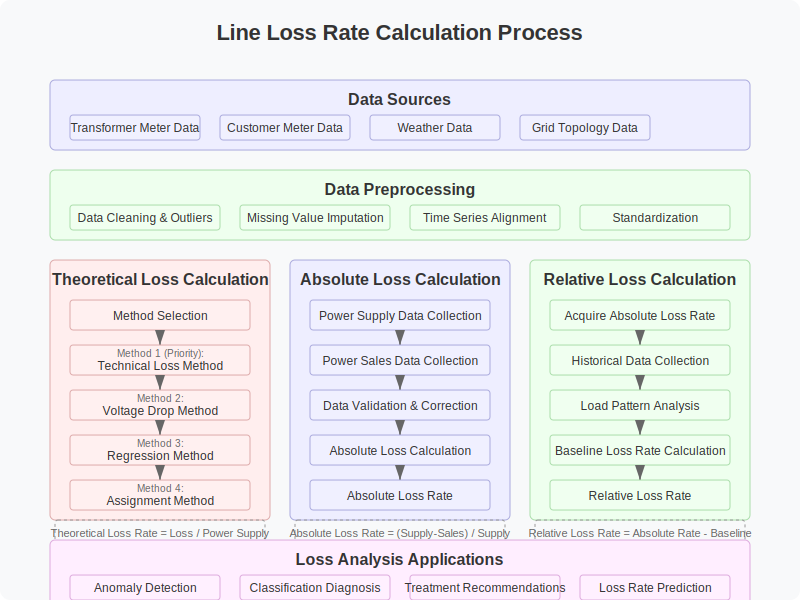

## 3. Periodic Scanning and Identification of Line Loss Anomalies in Distribution Areas

### 3.1 Classification of Anomaly Types in Distribution Areas

#### 3.1.1 Principles for Classifying Anomaly Types

The classification of line loss anomalies in distribution areas involves summarizing the characteristics of line loss anomalies to provide direction for subsequent precise diagnosis and governance. This system classifies line loss anomalies based on the following principles:

1.  **Range of Relative Line Loss Rate Values**: Differentiate based on the sign and magnitude of the relative line loss rate.
2.  **Duration of Anomaly**: Distinguish between long-term chronic anomalies and sudden anomalies.
3.  **Stability of Anomaly**: Distinguish between relatively stable anomalies and fluctuating anomalies.
4.  **Urgency of Governance**: Consider the impact of the anomaly on power grid operation and economic benefits.

Based on the above principles, the system divides distribution area line loss anomalies into six major types, forming a complete anomaly classification system.

#### 3.1.2 Anomaly Type Classification Table

The system classifies distribution area line loss anomalies as follows:

| Anomaly Type                | Defining Characteristics                     | Judgment Criteria                           | Main Cause Classification                                         | Governance Priority |
| --------------------------- | ------------------------------------------ | ------------------------------------------- | --------------------------------------------------------------- | ------------------- |
| Long-term Qualified Area    | Relative line loss rate within reasonable range long-term | Relative loss rate in [-2%, +2%] for recent 6 months | Normal state                                                    | -                   |
| Long-term High Loss Area    | Relative line loss rate consistently high    | Relative loss rate >+3% for 3 consecutive months | Metering device fault, archival error, line technical issues, electricity theft | High                |
| Sudden High Loss Area       | Relative line loss rate increases significantly in short term | Relative loss rate month-on-month increase >5 percentage points | Equipment fault, sudden load change, electrical accident      | Highest             |
| Long-term Negative Loss Area | Relative line loss rate negative and large long-term | Relative loss rate <-3% for 3 consecutive months | Metering device wiring error, archival area-user relationship error | High                |
| Small Negative Loss Area    | Relative line loss rate consistently small negative | Relative loss rate in [-3%, -1%] for 3 consecutive months | Theoretical model calculation deviation, metering device accuracy error | Medium              |
| Sudden Negative Loss Area   | Relative loss rate turns negative or negative value increases significantly | Relative loss rate month-on-month decrease >5 percentage points | Sudden metering device fault, parameter change not synchronized | High                |

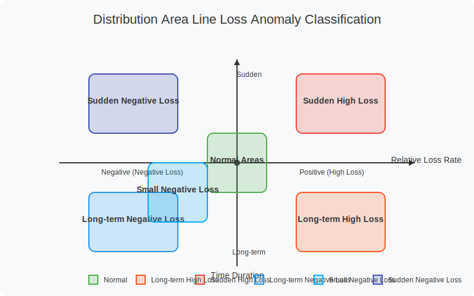

### 3.2 Long-term Qualified Area

#### 3.2.1 Definition

A long-term qualified area refers to a distribution area where the relative line loss rate has been stable within a reasonable range for a long time, characterized by:
-   Relative line loss rate fluctuates within the [-2%, +2%] range.
-   No abnormal fluctuations exceeding the threshold in the past 6 months.
-   The trend of line loss changes matches the trend of load changes.

#### 3.2.2 Identification Criteria

The identification of long-term qualified areas uses the following criteria:

1.  **Basic Condition**: The average relative line loss rate over the past 6 months is within the [-2%, +2%] range.
2.  **Stability Condition**: The standard deviation of the relative line loss rate over 6 months is <1%.
3.  **Trend Consistency**: The Pearson correlation coefficient between line loss rate changes and load changes is >0.6.

Calculation Formulas:
$ \bar{\eta}_{rel} = \frac{1}{6}\sum_{i=1}^{6} \eta_{rel,i} $
$ \sigma_{\eta} = \sqrt{\frac{1}{6}\sum_{i=1}^{6}(\eta_{rel,i} - \bar{\eta}_{rel})^2} $
$ \rho({\eta, P}) = \frac{Cov({\eta, P})}{\sigma_{\eta}\sigma_{P}} $

Where:
-   $ \bar{\eta}_{rel} $: Average relative line loss rate over the past 6 months.
-   $ \sigma_{\eta} $: Standard deviation of the relative line loss rate.
-   $ \rho({\eta, P}) $: Correlation coefficient between line loss rate and load.

#### 3.2.3 Scan Identification Priority

Long-term qualified areas, as normally operating areas, have a lower priority in routine inspections and primarily serve as baseline areas for line loss management. The system adopts the following monitoring strategy for such areas:

1.  Calculate indicators monthly to confirm the stability of their qualified status.
2.  Issue warnings when the relative line loss rate shows a trending change.
3.  Use as data samples to continuously optimize the theoretical line loss calculation model.

### 3.3 Long-term High Loss Area

#### 3.3.1 Definition

A long-term high loss area refers to a distribution area where the relative line loss rate is significantly higher than the theoretical value for a long period, characterized by:
-   Relative line loss rate exceeding +3% for more than 3 consecutive months.
-   The line loss anomaly is persistent and relatively stable.
-   Has a significant impact on loss reduction targets.

#### 3.3.2 Identification Criteria

The identification of long-term high loss areas uses the following criteria:

1.  **Basic Condition**: Relative line loss rate >+3% for 3 consecutive months.
2.  **Magnitude Condition**: The 3-month average relative line loss rate is >+5%, or the single month maximum is >+8%.
3.  **Stability Condition**: The standard deviation of the relative line loss rate over the past 3 months is <2%.

In addition to statistical conditions, the system also makes a comprehensive judgment based on the following factors:

-   Comparison with historical data from the same period to exclude seasonal factors.
-   Comparison with surrounding similar types of distribution areas to exclude regional common factors.
-   Consideration of special circumstances such as area modifications and load changes.

#### 3.3.3 Scan Identification Priority

Long-term high loss areas are key targets for line loss governance. The system adopts the following scanning strategy for such areas:

1.  **Scanning Frequency**: Scan areas with a relative line loss rate exceeding +3% daily.
2.  **Sorting Method**: Sort by the magnitude of the relative line loss rate and area capacity to determine governance priority.
3.  **Area Scale Consideration**: Pay higher attention to high loss situations in large-capacity areas (>400kVA).
4.  **Historical Governance Records**: Increase the priority of areas that have undergone multiple governance attempts with little effect.

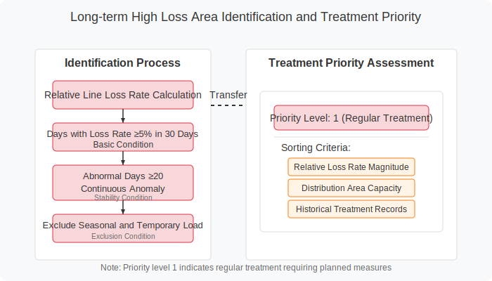

### 3.4 Sudden High Loss Area

#### 3.4.1 Definition

A sudden high loss area refers to a distribution area where the relative line loss rate shows a significant increase in a short period (usually within 1 month), characterized by:
-   Month-on-month increase in relative line loss rate >5 percentage points.
-   The anomaly is sudden and temporary.
-   May indicate urgent issues such as equipment failure or sudden load changes.

#### 3.4.2 Identification Criteria

The identification of sudden high loss areas uses the following criteria:

1.  **Basic Condition**: Month-on-month increase in relative line loss rate >5 percentage points.
2.  **Comparison Condition**: Current relative line loss rate >+5%, and the average of the previous 3 months is <+3%.
3.  **Exclusion Condition**: Exclude normal fluctuations caused by seasonal load changes.

Calculation Formulas:
$ \Delta\eta_{rel} = \eta_{rel,t} - \eta_{rel,t-1} $
$ \bar{\eta}_{rel,past} = \frac{1}{3}\sum_{i=1}^{3} \eta_{rel,t-i} $

Judgment Condition:
$ \Delta\eta_{rel} > 5\% \text{ AND } \eta_{rel,t} > 5\% \text{ AND } \bar{\eta}_{rel,past} < 3\% $

Where:
-   $ \Delta\eta_{rel} $: Month-on-month increase in relative line loss rate.
-   $ \eta_{rel,t} $: Current month's relative line loss rate.
-   $ \bar{\eta}_{rel,past} $: Average relative line loss rate of the previous 3 months.

#### 3.4.3 Scan Identification Priority

Due to their sudden nature and potential safety hazards, sudden high loss areas have the highest handling priority:

1.  **Scanning Frequency**: The system automatically scans for sudden high loss areas daily.
2.  **Alarm Method**: Send emergency alerts to relevant personnel via SMS, APP push notifications, etc.
3.  **Priority Determination**:
    -   The larger the increase, the higher the priority.
    -   The larger the area capacity, the higher the priority.
    -   The longer the duration, the higher the priority.
4.  **Rapid Response**: Upon discovering a sudden high loss area, the system automatically generates an emergency response procedure.

### 3.5 Long-term Negative Loss Area

#### 3.5.1 Definition

A long-term negative loss area refers to a distribution area where the relative line loss rate is consistently negative and large, characterized by:
-   Relative line loss rate <-3% for more than 3 consecutive months.
-   The negative loss phenomenon is persistent and stable.
-   Usually reflects metering device issues or inconsistencies in the area-user relationship.

#### 3.5.2 Identification Criteria

The identification of long-term negative loss areas uses the following criteria:

1.  **Basic Condition**: Relative line loss rate <-3% for 3 consecutive months.
2.  **Magnitude Condition**: The 3-month average relative line loss rate is <-5%, or the single month minimum is <-8%.
3.  **Stability Condition**: The standard deviation of the relative line loss rate over the past 3 months is <2%.

In addition to statistical conditions, the system also makes a comprehensive judgment based on the following factors:

-   Check if distributed power sources are connected within the area.
-   Check the collection success rate of the main meter and sub-meters in the area.
-   Check the records of technical parameter changes in the area.

#### 3.5.3 Scan Identification Priority

Although long-term negative loss areas do not directly affect economic benefits, they can impact metering accuracy and data quality, thus having a relatively high priority:

1.  **Scanning Frequency**: Scan areas with a relative line loss rate <-3% weekly.
2.  **Sorting Method**: Sort by the absolute value of the relative line loss rate and area capacity.
3.  **Special Case Consideration**: Prioritize negative loss areas containing important customers or large users.
4.  **Error Impact Analysis**: Assess the impact of negative loss on line loss management indicators.

### 3.6 Small Negative Loss Area

#### 3.6.1 Definition

A small negative loss area refers to a distribution area where the relative line loss rate is consistently slightly negative, characterized by:
-   Relative line loss rate in the [-3%, -1%] range for more than 3 consecutive months.
-   The negative loss magnitude is small and relatively stable.
-   Usually reflects deviations in theoretical model parameters or metering accuracy issues.

#### 3.6.2 Identification Criteria

The identification of small negative loss areas uses the following criteria:

1.  **Basic Condition**: Relative line loss rate in the [-3%, -1%] range for 3 consecutive months.
2.  **Stability Condition**: The 3-month standard deviation of the relative line loss rate is <1%.
3.  **Model Evaluation**: The applicability evaluation score of the theoretical line loss calculation model is <75 points.

Applicability Evaluation Score Calculation:
$ \text{Model\_Score} = 100 - 20 \times \frac{|\bar{\eta}_{rel}|}{3\%} - 30 \times \frac{\sigma_{\eta}}{2\%} - 50 \times \frac{|\rho_{\text{anomaly}}|}{0.8} $

Where:
-   $ \bar{\eta}_{rel} $: Average relative line loss rate.
-   $ \sigma_{\eta} $: Standard deviation of the relative line loss rate.
-   $ \rho_{\text{anomaly}} $: Correlation coefficient with known anomaly patterns.

#### 3.6.3 Scan Identification Priority

The governance priority for small negative loss areas is medium, mainly used for optimizing theoretical models and improving metering accuracy:

1.  **Scanning Frequency**: Scan and statistically analyze small negative loss areas monthly.
2.  **Categorized Handling**:
    -   Small negative loss areas concentrated in a certain region: May indicate regional parameter deviations.
    -   Small negative loss areas with common characteristics: May indicate model parameter deviations.
    -   Randomly distributed small negative loss areas: May indicate individual metering deviations.
3.  **Optimization Strategy**: Periodically optimize the theoretical line loss calculation model based on scanning results.

### 3.7 Sudden Negative Loss Area

#### 3.7.1 Definition

A sudden negative loss area refers to a distribution area where the relative line loss rate turns negative or the negative value increases significantly in a short period, characterized by:
-   Month-on-month decrease in relative line loss rate >5 percentage points.
-   Current relative line loss rate <-3%.
-   The change is sudden and abnormal.

#### 3.7.2 Identification Criteria

The identification of sudden negative loss areas uses the following criteria:

1.  **Basic Condition**: Month-on-month decrease in relative line loss rate >5 percentage points.
2.  **Comparison Condition**: Current relative line loss rate <-3%, and the average of the previous 3 months is >-2%.
3.  **Exclusion Condition**: Exclude normal fluctuations caused by seasonal load changes.

Calculation Formulas:
$ \Delta\eta_{rel} = \eta_{rel,t} - \eta_{rel,t-1} $
$ \bar{\eta}_{rel,past} = \frac{1}{3}\sum_{i=1}^{3} \eta_{rel,t-i} $

Judgment Condition:
$ \Delta\eta_{rel} < -5\% \text{ AND } \eta_{rel,t} < -3\% \text{ AND } \bar{\eta}_{rel,past} > -2\% $

#### 3.7.3 Scan Identification Priority

Sudden negative loss areas usually reflect sudden equipment or system failures and have a high handling priority:

1.  **Scanning Frequency**: The system automatically scans for sudden negative loss areas daily.
2.  **Alarm Method**: Alert relevant personnel for timely handling through system alarms.
3.  **Priority Determination**:
    -   The larger the change magnitude, the higher the priority.
    -   The larger the difference between the main meter and sub-meter energy, the higher the priority.
    -   Prioritize areas involving important customers.
4.  **Response Mechanism**: The system generates a standardized inspection process to guide on-site verification.

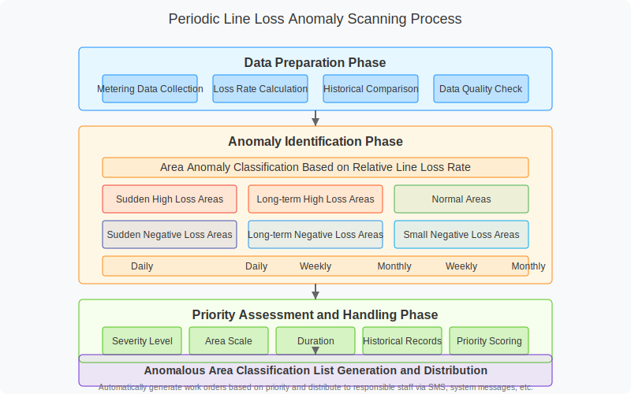

## 4. Classification Diagnosis of Anomalous Distribution Areas

### 4.1 Overview of Diagnostic Methods

Line loss anomaly diagnosis is the process of further analyzing the cause of the anomaly after identifying an anomalous distribution area. Different types of line loss anomalies have different characteristics and causes, requiring targeted diagnostic methods. This system adopts an intelligent diagnostic method of "Feature Extraction - Probability Analysis - Multi-dimensional Diagnosis," combining an expert knowledge base and machine learning algorithms to achieve efficient and accurate diagnosis of line loss anomalies.

#### 4.1.1 Diagnostic Method System

The anomaly diagnostic method system of this system is as follows:

1.  **Probability-based Multi-factor Diagnosis**: Perform probability analysis on the possible causes of each anomaly type. Determine the most likely root cause through multi-dimensional data feature extraction and evidence weight calculation.
2.  **Evidence-based Stepwise Diagnosis**: Gradually narrow down the scope of possible causes based on existing evidence, reducing diagnostic complexity.
3.  **Knowledge Graph-based Associative Diagnosis**: Utilize the line loss anomaly knowledge graph to analyze the correlation between anomaly causes, forming a complete anomaly diagnosis chain.
4.  **Historical Case-based Similarity Diagnosis**: Quickly locate possible causes by comparing with similar historical cases.

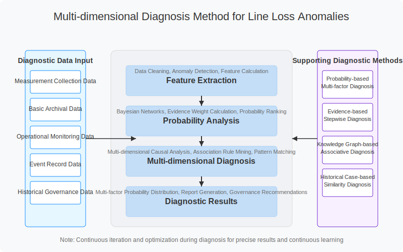

#### 4.1.2 Diagnostic Data Sources

Line loss anomaly diagnosis requires comprehensive utilization of multiple data sources, mainly including:

1.  **Measurement Collection Data**: Including main meter, sub-meter energy data, and power quality data.
2.  **Basic Archival Data**: Including basic information of the distribution area, area-user relationships, equipment ledgers, etc.
3.  **Operational Monitoring Data**: Including load curves, three-phase current/voltage, power factor, etc.
4.  **Event Record Data**: Including equipment events, operation records, abnormal alarms, etc.
5.  **Historical Governance Data**: Including historical governance measures and effect evaluation data.

#### 4.1.3 Representation of Diagnostic Results

Diagnostic results are represented using a "multi-factor probability distribution," assigning a probability value to each possible anomaly cause, thereby forming a comprehensive diagnostic conclusion:

$ P(C_i|E) = \frac{P(E|C_i) \times P(C_i)}{\sum_{j=1}^n P(E|C_j) \times P(C_j)} $

Where:
-   $ P(C_i|E) $: Posterior probability of cause $ C_i $ given the observed evidence E.
-   $ P(E|C_i) $: Conditional probability of observing evidence E given cause $ C_i $.
-   $ P(C_i) $: Prior probability of cause $ C_i $.

Diagnostic results are sorted by probability from high to low, and provide the evidence support level and credibility score for each possible cause, facilitating quick judgment and handling by staff.

### 4.2 Diagnosis of Long-term High Loss

Long-term high loss areas are key focus objects in line loss management, usually reflecting technical or management issues in the distribution area. This system has designed a specialized diagnostic method for long-term high loss areas, covering multiple possible causes and diagnostic strategies.

#### 4.2.1 CT Transformer Ratio Error

##### 4.2.1.1 Description

CT transformer ratio error refers to the incorrect setting of the current transformer's primary to secondary current ratio in the system for a metering device, causing a discrepancy between measured energy and actual energy. It is one of the common causes of long-term high loss.

##### 4.2.1.2 Common Causes

1.  **System Parameter Entry Error**: Incorrect ratio parameter entry during CT replacement or system migration.
2.  **Improper CT Ratio Selection**: The selected CT ratio does not match the actual load.
3.  **Inconsistent Archival Information**: The actual parameters of the on-site CT do not match the system records.
4.  **Unclear CT Identification**: Blurred or incorrect identification on the CT body leads to incorrect parameter entry.

##### 4.2.1.3 Probability Calculation Method

The probability calculation for CT transformer ratio error is based on the following features:

$ P_{CT} = w_1 \times f_{\text{Energy Ratio}} + w_2 \times f_{\text{Power Ratio}} + w_3 \times f_{\text{Ratio Change}} + w_4 \times f_{\text{Capacity Match}} $

Where:
-   $ f_{\text{Energy Ratio}} $: Feature of the ratio between total meter measured energy and the sum of sub-meter energy.
-   $ f_{\text{Power Ratio}} $: Feature of the ratio between measured power and load capacity.
-   $ f_{\text{Ratio Change}} $: Feature indicating whether a ratio change has occurred recently.
-   $ f_{\text{Capacity Match}} $: Feature of the match between CT ratio and transformer capacity.
-   $ w_1, w_2, w_3, w_4 $: Weights of each feature.

##### 4.2.1.4 Data Analysis - Main Meter

###### Archival Information

-   CT model specifications and ratio.
-   Installation date and last inspection date.
-   Recent replacement records.
-   History of ratio parameter changes.

###### Collected Data

The system analyzes the following data features of the main meter:

1.  **Current Characteristics**: Whether the CT secondary current is consistently in the low range (less than 10% of rated current) or high range (greater than 120% of rated current).
2.  **Power Characteristics**: Whether the active power significantly mismatches the load capacity.
3.  **Phase Relationship**: Whether the phase relationship between current and voltage is normal.
4.  **Data Step Change**: Whether there are data step changes related to the ratio.

###### Event Records

-   Metering device parameter change records.
-   System abnormal alarm records.
-   Equipment inspection records.

##### 4.2.1.5 Diagnostic Conclusion Determination

The diagnostic conclusion for CT transformer ratio error is based on the following judgment rules:

1.  **Highly Probable**: The ratio of main meter energy / total sub-meter energy is close to a certain ratio factor (e.g., 2, 5, 10), and the ratio of power to load capacity is consistent with the energy ratio.
2.  **Moderately Probable**: The main meter energy does not match expectations, but there is no clear evidence of a ratio relationship.
3.  **Low Probability**: There are some signs of ratio anomalies, but other data is normal.

#### 4.2.2 Abnormal User-Transformer Relationship in Archives

##### 4.2.2.1 Description

Abnormal user-transformer relationship in archives refers to errors in recording the affiliation relationship between users and transformers within the distribution area in the system. This leads to incorrect correspondence between the main meter and sub-meters, causing deviations in line loss calculation.

##### 4.2.2.2 Common Causes

1.  **System Migration Error**: Incorrect mapping of area-user relationships during system upgrades or data migration.
2.  **User Consolidation/Splitting**: System not updated promptly after user consolidation or splitting.
3.  **Unsynchronized Line Modifications**: Area-user relationships not adjusted timely after distribution line modifications.
4.  **Permanentization of Temporary Connections**: Relationship not updated after temporary power usage becomes permanent.

##### 4.2.2.3 Probability Calculation Method

The probability calculation for abnormal user-transformer relationship is based on the following features:

$ P_{\text{Relationship}} = w_1 \times f_{\text{User Change}} + w_2 \times f_{\text{Geo Location}} + w_3 \times f_{\text{Line Topology}} + w_4 \times f_{\text{Usage Pattern}} $

Where:
-   $ f_{\text{User Change}} $: Feature of recent user additions/reductions.
-   $ f_{\text{Geo Location}} $: Feature of the match between user geographical location and area supply range.
-   $ f_{\text{Line Topology}} $: Feature of the match between line topology structure and area-user relationship.
-   $ f_{\text{Usage Pattern}} $: Feature of the correlation between sub-meter usage patterns and area characteristics.
-   $ w_1, w_2, w_3, w_4 $: Weights of each feature.

##### 4.2.2.4 Data Analysis

###### Archival Information

-   History of changes in the number of users in the area.
-   User geographical location information.
-   Maintenance records of area-user relationships.
-   Information on surrounding distribution areas.

###### Collected Data

1.  **Load Correlation**: Analyze the correlation between user load and total area load.
2.  **Usage Patterns**: Analyze the match between user usage patterns and the overall usage pattern of the area.
3.  **Power Outage Impact**: Analyze the user-area affiliation relationship through power outage events.
4.  **Geographical Distribution**: Relationship between user geographical location and area supply radius.

##### 4.2.2.5 Diagnostic Conclusion Determination

The diagnostic conclusion for abnormal user-transformer relationship is based on the following judgment rules:

1.  **Highly Probable**: Clear evidence indicates that some users do not belong to the area or users who should belong are missing.
2.  **Moderately Probable**: User load characteristics in the area do not match the main meter, or geographical distribution is abnormal.
3.  **Low Probability**: Slight indications suggest possible area-user relationship issues, but evidence is insufficient.

Additionally, the system can diagnose other causes of long-term high loss, including "suspected low-voltage electricity theft," "collection equipment failure," "energy meter operating beyond capacity," "high three-phase imbalance," etc. Due to space limitations, these are not detailed further. A complete diagnostic list for long-term high loss and diagnostic methods for various causes are built into the system, providing comprehensive diagnostic support for operation and maintenance personnel.

### 4.3 Diagnosis of Sudden High Loss

Sudden high loss areas exhibit a sharp increase in relative line loss rate over a short period, usually reflecting a sudden change in the operating state of the distribution area. This system has established specific diagnostic logic for sudden high loss areas, focusing on potential faults or abnormal situations that may occur in the short term.

#### 4.3.1 Sudden Increase in Electricity Load

##### 4.3.1.1 Description

A sudden increase in electricity load refers to a significant increase in the load within the distribution area in a short period, causing a temporary rise in the line loss rate. This situation often occurs during specific seasons or special periods and might be normal load fluctuations or reflect the connection of unmetered electrical equipment.

##### 4.3.1.2 Common Causes

1.  **Seasonal Load Changes**: Concentrated use of air conditioners in summer and heating equipment in winter.
2.  **Temporary High-Power Equipment Usage**: Construction, temporary events, etc.
3.  **Sudden Increase in Production Load**: Temporary expansion of production scale by industrial users.
4.  **Connection of Unmetered Equipment**: Illegal tapping of electricity, temporary equipment used without proper procedures.

##### 4.3.1.3 Diagnostic Method

The diagnosis of a sudden increase in electricity load is primarily based on load characteristic analysis:

1.  **Load Change Curve**: Analyze the difference between the load change of the main meter and the load change of the sub-meters.
2.  **Load Correlation**: Analyze the correlation with environmental factors such as temperature and humidity.
3.  **Time Period Characteristics**: Characteristics of the time period when the load increases (day/night, weekday/weekend).
4.  **Phase Load**: Distribution of three-phase load and balance analysis.

Diagnostic Judgment Rules:
-   Significant increase in main meter load, but sub-meter load increase is not obvious.
-   Load increase is highly correlated with weather changes.
-   Load changes are concentrated in specific time periods.
-   Similar changes occur simultaneously in multiple distribution areas within the region.

### 4.4 Diagnosis of Long-term Negative Loss

Long-term negative loss areas exhibit a consistently negative and large relative line loss rate, usually reflecting metering device issues or errors in the area-user relationship. This system has designed a specialized diagnostic method for long-term negative loss areas.

#### 4.4.1 Metering Device Wiring Error

##### 4.4.1.1 Description

Metering device wiring error refers to incorrect wiring of the energy meter or transformer during installation or maintenance, leading to abnormal metering data. It is one of the main causes of long-term negative loss.

##### 4.4.1.2 Common Causes

1.  **Reversed CT Polarity**: Reversed polarity of the primary or secondary wiring of the current transformer.
2.  **Incorrect Voltage Wiring**: Incorrect wiring method for the voltage circuit.
3.  **Incorrect Metering Point Definition**: The metering method defined in the system does not match the actual setup.
4.  **Unrecorded Wiring Changes**: Wiring changes made during maintenance are not updated in the system.

##### 4.4.1.3 Diagnostic Method

The diagnosis of metering device wiring errors is primarily based on the analysis of the following features:

1.  **Abnormal Power Factor**: Consistently abnormal power factor values.
2.  **Four-Quadrant Energy Distribution**: Reactive power distribution across the four quadrants does not match usage characteristics.
3.  **Negative Phase Sequence Energy**: Presence of unexpected negative phase sequence energy.
4.  **Inspection Record Analysis**: Data changes after the last inspection of the metering device.

### 4.5 Diagnosis of Small Negative Loss

#### 4.5.1 Characteristics Analysis of Small Negative Loss

Small negative loss refers to distribution areas with negative line loss rates but small absolute values, typically between -1% and 0%. Although less obvious than large negative losses, these situations still reflect issues in metering or management. The main characteristics of small negative loss are:

1. **Small Fluctuation and Stability**: The line loss rate fluctuates slightly around zero without significant changes.
2. **No Obvious Seasonality**: Does not significantly change with seasons, relatively stable throughout the year.
3. **Long Duration**: May remain in a slightly negative state for an extended period, not easily noticed.

#### 4.5.2 Cause Analysis of Small Negative Loss

Small negative loss phenomena are typically caused by the following factors:

1. **Theoretical Model Calculation Deviation**
   - Inaccurate line parameter settings, resulting in higher theoretical calculation values
   - Deviations in load distribution estimation, not matching actual operating conditions
   - Reduced model precision under low load conditions
   - Systematic bias between actual line loss and theoretical models

2. **Data Collection Deviation**
   - Unsynchronized data collection timestamps causing inconsistent calculation basis
   - Time misalignment due to collection cycle boundary issues
   - Systematic bias formed by accumulated rounding errors in large volumes of data
   - Reduced collection precision under low power conditions

3. **Metering Device Accuracy Issues**
   - Low secondary burden rate of transformers leading to reduced accuracy
   - Inappropriate transformer ratio configuration causing reduced precision under low load
   - Mismatch between meter accuracy class and actual requirements
   - Slight metering deviations caused by inaccurate phase compensation

4. **Clock Synchronization Issues**
   - Slight time differences between user meters and main meters
   - Clock drift causing unsynchronized data collection
   - Incorrect clock settings after power outages

5. **Excessive Supply Radius**
   - Long power supply lines in rural areas causing inaccurate theoretical model estimation
   - Multiple branches making load distribution difficult to calculate accurately
   - Imprecise measurement of line parameters leading to theoretical value calculation deviation

#### 4.5.3 Diagnostic Methods for Small Negative Loss

The diagnosis of small negative loss areas is primarily based on the following methods:

1. **Model Accuracy Evaluation**
   - Compare systematic bias between theoretical line loss calculation model and actual line loss values
   - Analyze model calculation accuracy under different load rates
   - Adjust theoretical calculation model parameters to reduce systematic bias

2. **Load Characteristic Analysis**
   - Analyze the relationship between area load changes and line loss rate
   - Focus on line loss anomalies during low load periods
   - Evaluate metering characteristics of transformers under different loads

3. **Data Quality Analysis**
   - Evaluate collection success rate and data completeness
   - Analyze data timestamp consistency
   - Detect abnormal data jumps and boundary processing issues

4. **Transformer Parameter Analysis**
   - Analyze the relationship between transformer secondary burden rate and line loss rate
   - Evaluate whether transformer accuracy class meets low-load metering requirements
   - Check if transformer ratio matches actual load

#### 4.5.4 Treatment Strategies for Small Negative Loss

For small negative loss areas, a standardized treatment process has been established:

1. **Model Evaluation Stage**
   - Evaluate the applicability of theoretical line loss calculation models
   - Check the match between model parameters and actual area parameters
   - Analyze systemic causes of small negative loss

2. **Detailed Inspection Stage**
   - Check the rationality of transformer configuration
   - Verify meter clock synchronization status
   - Evaluate the impact of supply radius on line loss calculation
   - Check data collection quality

3. **Optimization and Adjustment Stage**
   - Optimize theoretical line loss calculation model parameters
   - Adjust transformer configuration to improve metering accuracy
   - Implement meter clock synchronization
   - Improve data collection quality

4. **Model Verification Stage**
   - Apply the optimized model to recalculate theoretical line loss
   - Verify if the line loss rate returns to a reasonable range
   - Develop treatment experience for small negative loss areas

Effect evaluation should focus on the following indicators:

1. **Line Loss Rate Recovery**: Whether the line loss rate returns to a theoretical range (typically 0~3%) after treatment
2. **Data Quality Improvement**: Improvement in collection success rate and data quality score
3. **Model Accuracy Improvement**: Improved fit between theoretical model and actual values

### 4.6 Diagnosis of Sudden Negative Loss

#### 4.6.1 Characteristics Analysis of Sudden Negative Loss

Sudden negative loss refers to a significant negative shift in line loss rate within a short period. The main characteristics are:

1. **Short Duration**: Line loss rate rapidly turns negative within a short period (typically 1-7 days)
2. **Significance**: The negative value is usually substantial, generally exceeding -3%
3. **Abruptness**: Cliff-like drop compared to previous line loss rates
4. **Recoverability**: Line loss rate can quickly return to normal after the problem is resolved

#### 4.6.2 Cause Analysis of Sudden Negative Loss

Sudden negative loss is typically caused by the following factors:

1. **Energy Meter Measurement Fault**
   - Sudden failure of internal components in the energy meter
   - Measurement chip failure
   - Abnormal voltage or current sampling circuit
   - Energy meter software calculation error

2. **Power Factor Compensation Equipment Anomaly**
   - Abnormal switching of power factor compensation equipment
   - Capacitor failure
   - Controller malfunction causing over-compensation
   - Mismatch between compensation equipment and actual load

3. **Main Meter Fault**
   - Abnormal current or voltage signal in one phase of the main meter
   - Poor contact in one phase
   - Incorrect phase sequence causing metering errors
   - Sudden voltage transformer failure

4. **Ratio Change Not Synchronized**
   - System records not promptly updated after transformer replacement
   - System parameters not synchronized after ratio changes
   - Data jumps after equipment replacement not processed

5. **Wiring Anomalies**
   - Poor contact or internal failure in terminal boxes
   - Loose terminal screws causing secondary circuit anomalies
   - Secondary circuit short circuit
   - Grounding system anomalies

#### 4.6.3 Diagnostic Methods for Sudden Negative Loss

The diagnosis of sudden negative loss is primarily based on the following methods:

1. **Time Correlation Analysis**
   - Analyze the exact time point of negative loss occurrence
   - Compare with time points of equipment changes and maintenance records
   - Analyze time correlation between meter event records and negative loss occurrence

2. **Meter Operating Status Analysis**
   - Analyze meter status words and fault codes
   - Check for anomalies in meter event records
   - Analyze voltage and current fluctuations in each phase of the meter

3. **Power Factor Change Analysis**
   - Analyze sudden changes in power factor
   - Check the operating status of reactive power compensation equipment
   - Analyze the relationship between active power and reactive power changes

4. **Three-Phase Imbalance Analysis**
   - Analyze trends in three-phase imbalance
   - Check phase sequence change events
   - Analyze load changes in each phase

5. **Equipment Change Record Analysis**
   - Search for equipment replacement or maintenance work orders
   - Verify transformer change information
   - Check system parameter update records

#### 4.6.4 Treatment Strategies for Sudden Negative Loss

For sudden negative loss areas, a rapid response process has been established:

1. **Emergency Diagnostic Stage**
   - Respond within 12 hours after the monitoring system issues a sudden negative loss alert
   - Conduct remote diagnosis to determine possible causes
   - Arrange on-site inspection plans

2. **Rapid Inspection Stage**
   - Focus on checking meter measurement status
   - Check for transformer faults
   - Verify if ratio changes were not synchronized
   - Check operating status of power factor compensation equipment

3. **Rapid Correction Stage**
   - Replace faulty metering equipment
   - Fix wiring errors
   - Update system records
   - Adjust power factor compensation equipment parameters

4. **Follow-up Tracking Stage**
   - Continuously monitor for 48 hours after treatment
   - Confirm whether the problem has been completely resolved
   - Analyze the root cause of sudden negative loss
   - Develop preventive measures to avoid recurrence

Effect evaluation mainly focuses on the following indicators:

1. **Response Speed**: Time from alert to completion of treatment
2. **Recovery Effect**: Whether the line loss rate returns to normal levels
3. **Sustained Stability**: Stability of the line loss rate after treatment
4. **Root Cause Identification Rate**: Whether the root cause was accurately identified and resolved

### 4.7 Intelligent Implementation of Anomaly Diagnosis

#### 4.7.1 Intelligent Diagnostic Engine

This system builds an intelligent diagnostic engine based on machine learning and an expert knowledge base to achieve automatic diagnosis of line loss anomalies. The intelligent diagnostic engine consists of the following core components:

1.  **Feature Engineering Module**: Extracts diagnosis-related features from multi-source data.
2.  **Knowledge Graph Engine**: Establishes an association network between line loss anomalies and causes.
3.  **Probabilistic Reasoning Module**: Implements evidence reasoning and cause probability calculation based on Bayesian networks.
4.  **Case Matching Module**: Implements similarity matching based on the historical case library.
5.  **Diagnostic Fusion Module**: Integrates results from multiple diagnostic methods to generate the final diagnostic conclusion.

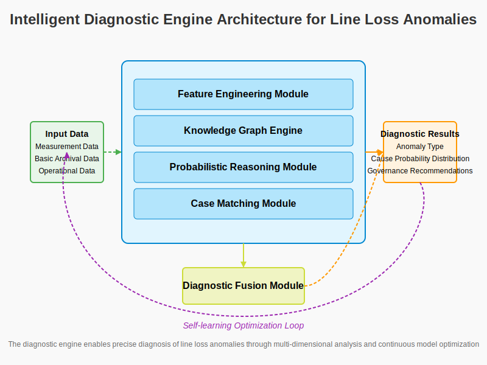

#### 4.7.2 Self-Learning Optimization Mechanism

To improve diagnostic accuracy and adaptability, the system implements a self-learning optimization mechanism:

1.  **Diagnostic Effect Feedback**: Records the actual governance effect of each diagnostic result.
2.  **Adaptive Parameter Adjustment**: Automatically adjusts diagnostic model parameters based on feedback results.
3.  **Dynamic Knowledge Base Update**: Continuously enriches the anomaly pattern library and case library.
4.  **Regional Feature Adaptation**: Adjusts diagnostic strategies based on the characteristics of different regions.

The self-learning optimization loop is as follows:

$ \text{Diagnostic Model} \rightarrow \text{Diagnostic Result} \rightarrow \text{Governance Validation} \rightarrow \text{Effect Feedback} \rightarrow \text{Model Optimization} \rightarrow \text{Diagnostic Model}' $

#### 4.7.3 Multi-dimensional Correlation Analysis

The intelligent diagnostic engine improves diagnostic accuracy through multi-dimensional correlation analysis:

1.  **Temporal Dimension Correlation**: Analyze the time evolution pattern of anomaly indicators.
2.  **Spatial Dimension Correlation**: Analyze the common characteristics of similar distribution areas within a region.
3.  **Equipment Dimension Correlation**: Analyze the correlation between equipment parameters and anomaly phenomena.
4.  **Business Dimension Correlation**: Analyze the correlation between business processes and anomaly phenomena.

Through multi-dimensional correlation analysis, the system can more accurately locate the cause of anomalies and reduce the misdiagnosis rate.

#### 4.7.4 Data Feature Indicator System

The line loss diagnostic system builds a complete data feature indicator system based on multi-source heterogeneous data to provide a data foundation for anomaly diagnosis:

1. **Basic Information Features**
   - **Meter Basic Information**: Including meter number (MeterNo), electricity usage type (ConsumeType), electricity usage nature (ConsumeCategory)
   - **Distribution Area Basic Data**: Area ID (AreaId), actual loaded area phase (LoadPhaseActual), main meter identifier (IsGM)
   - **Spatial Location Data**: Measuring point longitude (LONGITUDE), latitude (LATITUDE), distance from main meter (Distance)

2. **Electricity Usage Data Features**
   - **Energy Basic Indicators**: Daily import active cumulative usage (ImportACumulative), daily export active cumulative usage (ExportACumulative)
   - **Area Energy Indicators**: Area supplied energy (Supplied), area consumed energy (Consumed), area line loss energy (LossUsage), area line loss rate (LossRate)
   - **Metering Statistical Indicators**: Regular meter count (MeterQty), regular meter collection count (MeterQtyColled), main meter count (GMMeterQty)

3. **Load Characteristic Features**
   - **Voltage Statistical Features**: Statistical features of daily minimum/maximum voltage, including maximum value (MinVolMax/MaxVolMax), minimum value (MinVolMin/MaxVolMin), average (MinVolAvg/MaxVolAvg), median (MinVolMid/MaxVolMid), variance (MinVolVar/MaxVolVar), standard deviation (MinVolStd/MaxVolStd)
   - **Load Statistical Features**: Daily load maximum (PowerMax), minimum (PowerMin), average (PowerAvg), median (PowerMid), variance (PowerVar), standard deviation (PowerStd)

4. **Phase Recognition Features**
   - **Correlation Indicators**: L1 average correlation (L1VolRal), L2 average correlation (L2VolRal), L3 average correlation (L3VolRal)
   - **Voltage Drop Indicators**: L1/L2/L3 average voltage drop (L1/L2/L3VolDecreaseRate)
   - **Phase Prediction**: Maximum correlation value (VolRalMax), most likely phase (LoadPhasePredict)

5. **Event Record Features**
   - **Current Anomaly Events**: Current reversal (Event-257/259/261), CT short circuit/bypass (Event-269), current imbalance (Event-279)
   - **Equipment Anomaly Events**: Meter cover opening (Event-287), terminal cover opening (Event-289), communication module anomaly (Event-293)
   - **Operation Anomaly Events**: Phase sequence reversal (Event-299), no voltage with current (Event-307/309/311), power imbalance (Event-281)

The system also implements strict data quality control mechanisms to ensure the accuracy of feature indicators:

1. **Data Integrity Check**
   - Enforce checks on fields marked as "Required Field = Yes"
   - Check time series continuity to ensure continuous completeness of the date (FreezeDay) field
   - Perform data value range checks based on defined "Data Range" restrictions

2. **Feature Engineering and Transformation**
   - Calculate higher-order statistical features based on raw voltage data
   - Extract typical pattern features from load curves
   - Extract combination features from various event records

3. **Missing Value Handling Strategy**
   - Use adjacent time point data for temporal dimension interpolation
   - Use data from geographically close measuring points for spatial dimension estimation
   - Apply machine learning models to predict missing values

4. **Outlier Identification and Handling**
   - Identify statistical outliers based on the 3σ rule
   - Use LOF algorithm to identify local density anomaly points
   - Identify anomaly patterns in time series

The importance ranking of feature indicators in different types of line loss anomaly diagnosis is as follows:

| Anomaly Type | Rank 1 Feature | Rank 2 Feature | Rank 3 Feature | Rank 4 Feature | Rank 5 Feature |
|--------------|----------------|----------------|----------------|----------------|----------------|
| Long-term High Loss | Loss Rate Persistence | Load-Loss Correlation | Current Anomaly Events | Voltage Characteristic Changes | Geographic Location Correlation |
| Sudden High Loss | Loss Rate Change Gradient | Load Surge Magnitude | Equipment Anomaly Events | Temperature Change Correlation | Electricity Usage Nature Type |
| Long-term Negative Loss | Phase Characteristic Anomaly | User-Transformer Distance Anomaly | Metering Device Events | Reverse Energy Flow | Negative Loss Rate Magnitude |
| Small Negative Loss | Theoretical Model Deviation | Transformer Burden Rate | Meter Clock Synchronization | Load Rate Level | Data Collection Quality |
| Sudden Negative Loss | Meter Fault Events | Time Correlation | Equipment Change Records | Power Factor Changes | Three-phase Imbalance |

This comprehensive data feature indicator system provides comprehensive data support for multi-dimensional diagnosis of line loss anomalies, enabling the system to accurately identify different types of line loss anomalies and assist staff in efficiently conducting line loss governance work.

## 5. Diagnostic Results

### 5.1 Diagnostic Results Written to Work Order System via AI Agent

#### 5.1.1 AI Agent Architecture

This system develops a line loss diagnosis AI Agent to achieve intelligent processing of diagnostic results and work order generation. The core architecture of the AI Agent includes:

1.  **Knowledge Layer**: Contains line loss professional knowledge base, work order processing rule base.
2.  **Reasoning Layer**: Performs governance plan reasoning based on diagnostic results.
3.  **Decision Layer**: Generates work order processing decisions based on reasoning results.
4.  **Execution Layer**: Executes work order generation, dispatch, and tracking.

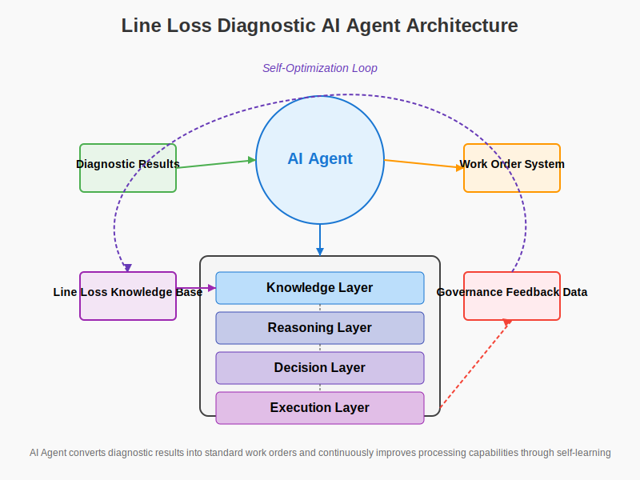

#### 5.1.2 Automatic Work Order Generation Process

The process for the AI Agent to automatically generate work orders based on diagnostic results is as follows:

1.  **Diagnostic Result Parsing**: Parse the anomaly type and cause probability distribution output by the diagnostic engine.
2.  **Governance Plan Selection**: Select the optimal governance plan based on the diagnostic results.
3.  **Work Order Content Generation**: Generate work order content including anomaly description, cause analysis, and disposal suggestions.
4.  **Work Order Priority Determination**: Determine priority based on anomaly type and impact degree.
5.  **Work Order Dispatch Strategy**: Determine dispatch strategy based on disposal unit and personnel capabilities.
6.  **Tracking and Closed-Loop Mechanism**: Establish work order execution tracking and closed-loop confirmation mechanism.

Work Order Content Example:

```
Work Order ID: TL202305120023
Anomaly Type: Long-term High Loss
Area Information: Hexi Substation 1324 Area
Anomaly Description: This area has had a relative line loss rate exceeding 8% for 5 consecutive months, classified as a long-term high loss area.
Diagnostic Results:
  - CT Transformer Ratio Error (Probability: 82%)
  - Abnormal User-Transformer Relationship in Archives (Probability: 12%)
  - Other Factors (Probability: 6%)
Disposal Suggestions:
  1. Verify the CT ratio setting of the main meter, focusing on whether the CT ratio is 200/5.
  2. Verify if the system parameters are consistent with the actual on-site parameters.
  3. Correct system parameters and back-test the line loss rate change.
Disposal Priority: High
Estimated Completion Time: 3 working days
```

#### 5.1.3 Work Order System Integration

The AI Agent integrates with the existing work order system to achieve seamless conversion from diagnostic results to work orders:

1.  **Standard Interface Adaptation**: Supports interface connection with mainstream work order systems.
2.  **Two-way Data Synchronization**: Push diagnostic results to the work order system, and feedback work order processing status to the line loss system.
3.  **Unified Authentication and Authorization**: Integrate with the enterprise's unified identity authentication system.
4.  **Mobile Terminal Support**: Support viewing and processing line loss work orders via mobile terminals.

### 5.2 Standardized Governance Process

For different types of line loss anomalies, the system establishes standardized governance processes to provide standardized handling guidelines for staff.

#### 5.2.1 Long-term High Loss Governance Process

For long-term high loss areas, a "Four-Step Governance Method" is established:

1.  **Cause Confirmation**: On-site review of diagnostic results to confirm the cause of the anomaly.
    -   CT Ratio Error: Check CT ratio against system settings.
    -   User-Transformer Relationship Error: Check area user list against actual connections.
    -   Electricity Theft Situation: Arrange specialized inspection.

2.  **Plan Formulation**: Formulate targeted governance plans based on the confirmed cause.
    -   Metering Device Issues: Calibrate or replace metering equipment.
    -   Archival Errors: Correct system archive data.
    -   Electricity Theft Governance: Collect evidence and handle according to law.

3.  **Implementation Tracking**: Execute the governance plan and record the handling process.
    -   Record parameter changes before and after correction.
    -   Archive photos of the implementation process.
    -   Fill in standardized governance record forms.

4.  **Effect Evaluation**: Continuously monitor line loss indicator changes after governance.
    -   Line loss rate trend over three consecutive months.
    -   Before-and-after comparison analysis.
    -   Summarize and share governance experience.

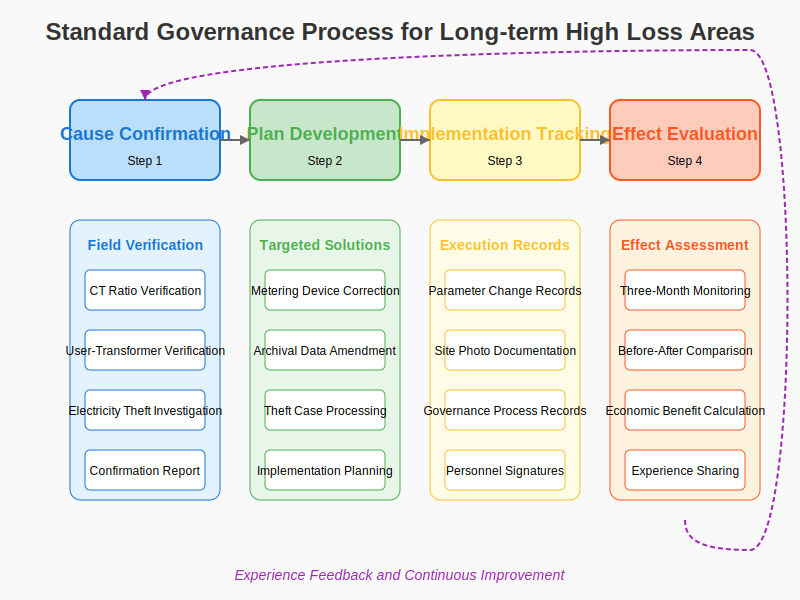

#### 5.2.2 Sudden High Loss Governance Process

For sudden high loss areas, a "Rapid Response" governance process is adopted:

1.  **Emergency Assessment**: Quickly analyze load changes and the time of anomaly occurrence.
    -   Analyze the time period of the anomaly.
    -   Correlate with environmental factors (weather, social activities, etc.).
    -   Compare with historical data from the same period.

2.  **On-site Inspection**: Arrange professional personnel for on-site inspection.
    -   Check for new load additions.
    -   Investigate temporary electrical equipment.
    -   Check if metering devices are abnormal.

3.  **Temporary Measures**: Take temporary control measures for emergencies.
    -   Regulate illegal electricity use.
    -   Arrange special metering for temporary electricity use.
    -   Temporarily replace faulty equipment.

4.  **Continuous Monitoring**: Intensively monitor data changes after governance.
    -   Real-time monitoring of load recovery.
    -   Analyze line loss rate trends.
    -   Evaluate governance effectiveness.

#### 5.2.3 Long-term Negative Loss Governance Process

For long-term negative loss areas, a systematic governance process has been established:

1. **Systematic Analysis Stage**
   - Collect comprehensive area data, including metering device parameters and wiring methods
   - Run specialized negative loss diagnostic algorithms to identify possible causes
   - Analyze systemic issues causing negative loss

2. **Key Inspection Stage**
   - Prioritize inspections based on diagnostic tag probability:
     - Energy meter wiring correctness
     - Transformer polarity and wiring correctness
     - System area-user relationship completeness
     - Photovoltaic power generation user configuration correctness
     - Whether unmetered equipment exists before the main meter

3. **System Correction Stage**
   - Correct metering device wiring issues
   - Update system archival information
   - Adjust unreasonable metering point configurations
   - Standardize grid-connected metering methods for photovoltaic power generation users

4. **Long-term Monitoring Stage**
   - Establish a specialized monitoring mechanism for negative loss areas
   - Conduct monthly data consistency checks
   - Develop a knowledge base of long-term negative loss governance experience

The key to long-term negative loss governance is precise identification of metering issues, especially wiring errors and polarity reversals causing measurement deviations. Through systematic analysis and standardized inspection, negative loss issues can be efficiently resolved.

#### 5.2.4 Small Negative Loss Governance Process

For small negative loss areas, a refined governance process has been established:

1. **Model Evaluation Stage**
   - Evaluate the applicability of theoretical line loss calculation models
   - Check the match between model parameters and actual area parameters
   - Analyze systemic causes of small negative loss

2. **Detailed Inspection Stage**
   - Check the rationality of transformer configuration
   - Verify meter clock synchronization status
   - Evaluate the impact of supply radius on line loss calculation
   - Check data collection quality

3. **Optimization Adjustment Stage**
   - Optimize theoretical line loss calculation model parameters
   - Adjust transformer configuration to improve metering accuracy
   - Implement meter clock synchronization
   - Improve data collection quality

4. **Model Verification Stage**
   - Apply the optimized model to recalculate theoretical line loss
   - Verify if the line loss rate returns to a reasonable range
   - Develop treatment experience for small negative loss areas

The key to small negative loss governance is improving metering precision and optimizing theoretical models. Through refined adjustments and data quality improvement, small negative loss issues can be effectively resolved, enhancing line loss management quality.

#### 5.2.5 Sudden Negative Loss Governance Process

For sudden negative loss areas, a rapid response process has been established:

1. **Emergency Diagnostic Stage**
   - Respond within 12 hours after the monitoring system issues a sudden negative loss alert
   - Conduct remote diagnosis to determine possible causes
   - Arrange on-site inspection plans

2. **Rapid Inspection Stage**
   - Focus on checking meter measurement status
   - Check for transformer faults
   - Verify if ratio changes were not synchronized
   - Check operating status of power factor compensation equipment

3. **Rapid Correction Stage**
   - Replace faulty metering equipment
   - Fix wiring errors
   - Update system records
   - Adjust power factor compensation equipment parameters

4. **Follow-up Tracking Stage**
   - Continuously monitor for 48 hours after treatment
   - Confirm whether the problem has been completely resolved
   - Analyze the root cause of sudden negative loss
   - Develop preventive measures to avoid recurrence

The focus of sudden negative loss governance is rapid response and precise correction, particularly addressing sudden meter faults and unsynchronized ratio changes. Through standardized processes, sudden negative loss issues can be efficiently resolved, reducing power grid losses.

### 5.3 Governance Effect Evaluation Method

#### 5.3.1 Quantitative Evaluation Indicators

The system establishes a complete set of quantitative evaluation indicators for governance effects:

1.  **Direct Benefit Indicators**
    -   Line Loss Rate Improvement Value: Absolute change in line loss rate before and after governance.
    -   Line Loss Energy Savings: Reduction in line loss energy brought about by governance.
    -   Economic Benefits: Economic value converted from line loss energy savings.

2.  **Sustainability Indicators**
    -   Line Loss Rate Stability: Standard deviation of line loss rate after governance.
    -   Rebound Situation: Whether the line loss rate increases again after governance.
    -   Duration: Time for which the governance effect is maintained.

3.  **Comprehensive Benefit Indicators**
    -   Input-Output Ratio: Ratio of governance cost to economic benefits.
    -   Area Quality Improvement Degree: Comprehensive improvement degree of area operational quality.
    -   Management Efficiency Improvement: Improvement degree of line loss management capability.

#### 5.3.2 Effect Evaluation Methods

The system adopts multi-angle evaluation methods to comprehensively assess governance effects:

1.  **Historical Comparison Method**: Compare with historical data before governance.
    $ \text{Improvement Rate} = \frac{\text{Pre-Governance Loss Rate} - \text{Post-Governance Loss Rate}}{\text{Pre-Governance Loss Rate}} \times 100\% $

2.  **Peer Comparison Method**: Compare with the average level of similar distribution areas.
    $ \text{Relative Level} = \frac{\text{Post-Governance Area Loss Rate}}{\text{Average Loss Rate of Similar Areas}} \times 100\% $

3.  **Theoretical Value Comparison Method**: Compare with the theoretical line loss rate.
    $ \text{Proximity} = \frac{\text{Post-Governance Loss Rate}}{\text{Theoretical Loss Rate}} \times 100\% $

4.  **Comprehensive Scoring Method**: Multi-dimensional comprehensive evaluation.
    $ \text{Overall Score} = w_1 \times \text{Improvement Rate} + w_2 \times \text{Relative Level} + w_3 \times \text{Proximity} + w_4 \times \text{Sustainability} $
    Where $ w_1, w_2, w_3, w_4 $ are weight coefficients set according to management priorities.

#### 5.3.3 Visualization of Governance Effectiveness

The system provides multiple visualization methods to display governance effectiveness:

1.  **Trend Chart**: Show the trend of line loss rate changes before and after governance.
2.  **Comparison Chart**: Intuitive comparison of key indicators before and after governance.
3.  **Radar Chart**: Multi-dimensional display of area quality improvement.
4.  **Map Heatmap**: Spatial distribution of regional governance effects.
5.  **Effectiveness Report**: Automatically generate standardized governance effectiveness reports.

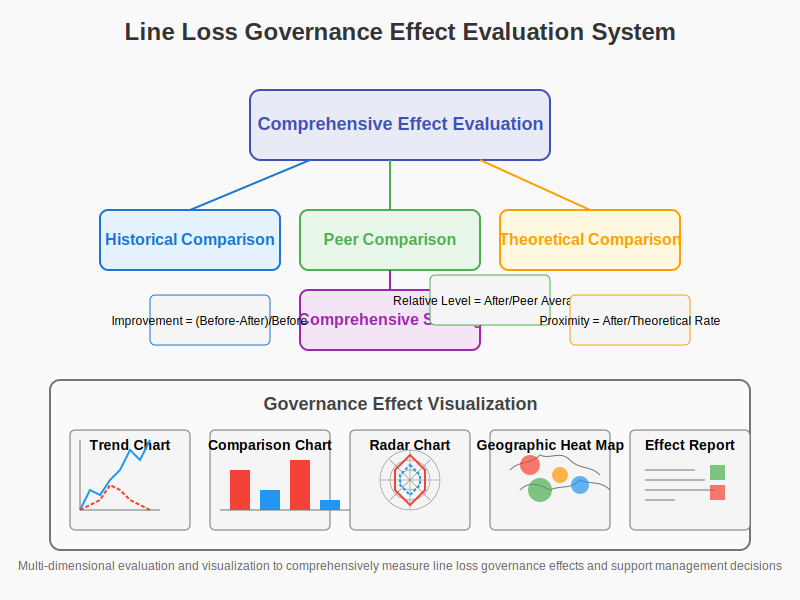

### 5.4 Experience Accumulation and Knowledge Precipitation

#### 5.4.1 Construction of Typical Case Library

The system builds a typical case library for line loss governance to achieve experience precipitation and knowledge sharing:

1.  **Standardized Case Collection**: Formulate unified case collection standards.
    -   Description of problem characteristics.
    -   Record of diagnostic process.
    -   Detailed explanation of governance methods.
    -   Effect evaluation data.
    -   Summary of key experiences.

2.  **Case Classification System**: Establish a multi-dimensional case classification system.
    -   Classification by anomaly type.
    -   Classification by cause type.
    -   Classification by governance method.
    -   Classification by effect degree.
    -   Classification by regional characteristics.

3.  **Case Quality Evaluation**: Case quality evaluation and screening mechanism.
    -   Evaluation of case completeness.
    -   Evaluation of case typicality.
    -   Evaluation of case replicability.
    -   User evaluation feedback.

#### 5.4.2 Knowledge Graph Construction

The system constructs a line loss management knowledge graph to support intelligent diagnosis and governance:

1.  **Knowledge Element Extraction**: Extract structured knowledge elements from cases.
    -   Characteristics of anomaly manifestation.
    -   Key points of cause diagnosis.
    -   Steps of governance methods.
    -   Causal relationships.

2.  **Knowledge Association Network**: Establish an association network between knowledge elements.
    -   Anomaly-Cause association.
    -   Cause-Method association.
    -   Method-Effect association.
    -   Regional feature association.

3.  **Knowledge Reasoning Rules**: Establish reasoning rules based on the knowledge graph.
    -   Cause inference based on features.
    -   Method recommendation based on cause.
    -   Effect prediction based on method.
    -   Feature adjustment based on region.

Knowledge Graph Structure Example:

```
(Anomaly Feature: Long-term High Loss) -[Manifests as]-> (Manifestation: Continuously above baseline)
(Anomaly Feature: Long-term High Loss) -[Possible Cause]-> (Cause: CT Ratio Error)
(Cause: CT Ratio Error) -[Diagnostic Method]-> (Method: Metering Device Inspection)
(Cause: CT Ratio Error) -[Governance Method]-> (Method: Parameter Calibration)
(Method: Parameter Calibration) -[Expected Effect]-> (Effect: Immediate reduction in line loss rate)
(Region: Rural Area) -[Common Issue]-> (Cause: User-Transformer Relationship Error)
