# 大数据线损诊断分析应用技术与业务方案报告


# 大数据线损诊断分析应用

## 技术与业务方案报告

编制日期：2023年6月

## 目录

[TOC]

## 文档修订历史

| 版本号 | 修订日期 | 修订人 | 修订描述 |
| ----- | ------- | ----- | ------- |
| V1.0  | 2023-06-01 | 技术团队 | 初稿完成 |

## 1. 概述

### 1.1 业务概述

电网线损管理是衡量电网运行效率和经济效益的关键指标。合理的线损率反映了电网资产利用效率和输电质量。随着乌兹别克斯坦电力系统现代化的持续推进和电网基础设施建设的加速发展，对电网线损精细化管理提出了更高要求。

本方案提出基于大数据和人工智能技术构建线损诊断分析应用系统，实现电网线损的智能监测、精准诊断和高效治理，帮助乌兹别克斯坦电力公司降低线损率，提高供电可靠性，优化资产管理。

#### 1.1.1 业务背景

目前，乌兹别克斯坦电力公司在线损管理方面主要面临以下挑战：

1.  **多源异构线损数据**：线损数据来源于多个业务系统，数据格式和质量不一致。
2.  **线损异常发现滞后**：传统人工巡检方式无法实时发现线损异常。
3.  **线损诊断效率低**：专家经验难以规模化，诊断流程繁琐且不统一。
4.  **线损率较高**：乌兹别克斯坦不同地区当前的线损率差异明显，表现较好的地区约为15%，而面临更大挑战的地区高达25%。
5.  **中低压配网为重点**：客户主要管理中低压配电网损耗，需要专门的解决方案。

本系统整合AMi数据、基本档案信息数据等多源信息，结合现代数据科学技术，建立线损全生命周期管理体系，实现线损异常的及时发现、科学诊断和高效治理。

#### 1.1.2 业务价值

本系统的建设将为乌兹别克斯坦电力公司带来显著的业务价值：

1.  **技术损耗降低**：通过精准识别技术线损异常，有望帮助逐步降低线损率，向长期目标（如其他国家经过多年投资和实施后达到的5%以下）迈进。
2.  **管理损耗降低**：通过发现和纠正与管理相关的线损问题，预计可降低管理相关的电量损失5%-8%。
3.  **经济效益**：基于当前的高线损率（15-25%），即使将线损率降低1个百分点也能带来显著的经济效益——为全国电网每年潜在节约数百万美元。
4.  **管理效率**：将线损异常平均处理时间从7天缩短至2天，工作效率提高200%以上。

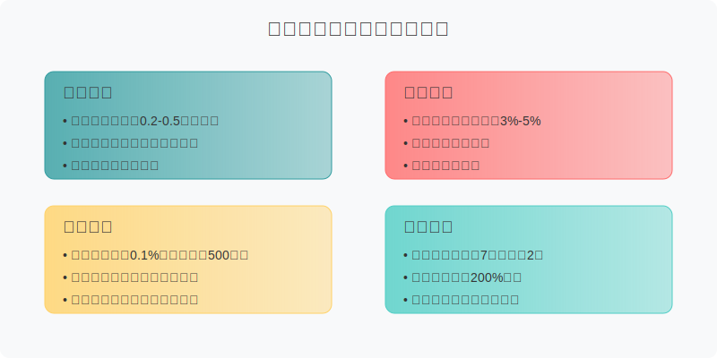

### 1.2 分析流程

本系统采用"数据收集-线损计算-异常识别-分类诊断-治理建议"五步法构建完整的线损管理分析流程：

#### 1.2.1 整体流程

线损诊断分析业务流程包括五个关键阶段：

1.  **数据收集与预处理**：整合AMI电表数据和可获得的档案信息，并进行数据清洗和标准化处理，尽管数据来源有限。
2.  **线损率计算**：根据可用数据和标准方法计算台区的绝对线损率、理论线损率和相对线损率。
3.  **异常台区识别**：利用数据分析识别并分类异常台区，最大化从有限数据源中获取洞察。
4.  **分类诊断**：根据线损异常特征，使用不同的诊断算法进行成因分析。
5.  **治理建议**：生成数据驱动的线损治理建议并跟踪实施效果。

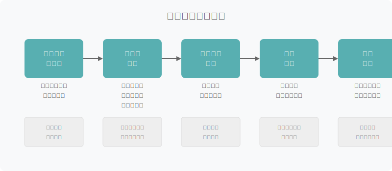

#### 1.2.2 技术路径

本系统采用"大数据+AI"的技术路径，主要包括：

1.  **数据层**：构建线损多维数据仓库，实现对AMI数据和可用档案信息的统一管理和标准化处理。
2.  **算法层**：基于机器学习和专家规则开发线损计算、异常识别和诊断算法，并针对有限数据源进行优化。
3.  **应用层**：提供可视化分析工具、异常监测预警、智能诊断和治理建议功能。
4.  **服务层**：通过API接口与工单系统、移动应用等集成，形成闭环管理。

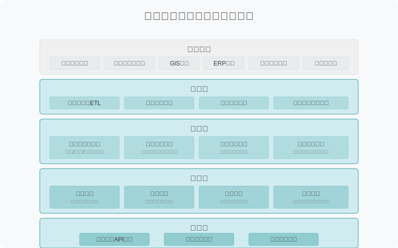

### 1.3 应用场景

系统针对乌兹别克斯坦电力公司认可的四个通过数据分析挽回损失的关键方向：

1.  **用电分析与案例清单**：系统自动分析电表数据，识别可疑窃电或异常用电案例，包括电表参数篡改、安装不规范、分布式能源异常以及异常用电行为（如加密货币挖矿）。

2.  **AI协助通信问题解决**：为通信故障提供诊断和修复方案，提升采集成功率，帮助电力公司收回电费，包括G3中继/模块损坏分析、采集失败分析，以及智能推荐设备更换或网络配置调整。

3.  **失效分析与设备健康监测**：通过AI检测设备异常，提高供电可靠性，包括针对大用户的CT/VT异常分析、变压器效率计算以识别老旧变压器，以及设备健康评估识别高风险设备。

4.  **线缆拓扑分析与优化**：分析台区三相供电情况优化线路结构，检测相间负载不平衡，识别高损耗线路段，并根据拓扑结构计算改造后的潜在节能收益。

通过这些应用场景，系统旨在直接解决乌兹别克斯坦电网线损管理的特定挑战，并逐步迈向将线损率降至5%以下的目标。

## 2. 台区相对线损率计算

### 2.1 核心公式

线损率计算是本系统的基础功能，通过科学合理的计算方法，为异常识别和诊断提供数据支撑。本系统核心关注的是台区相对线损率，它衡量了实际线损与理论线损之间的差异，能更准确地反映线损异常情况。

#### 2.1.1 线损率定义

线损率是指在电能传输和分配过程中，由于各种原因导致的电能损耗与总供电量的比率。按照计算方式，线损率可分为绝对线损率、理论线损率和相对线损率。

线损率的一般定义为：

$\text{线损率} = \frac{\text{线损电量}}{\text{供电电量}} \times 100\%$

#### 2.1.2 相对线损率计算公式

本系统采用相对线损率作为台区异常识别的核心指标，其计算公式为：

$\text{相对线损率} = \text{绝对线损率} - \text{理论线损率}$

其中：
- 绝对线损率：根据实际计量数据计算的线损率
- 理论线损率：根据台区参数和负荷情况估算的正常线损率

相对线损率为正值，表示实际线损高于理论线损，可能存在技术或管理问题；为负值，表示实际线损低于理论线损，可能存在计量或档案问题。

### 2.2 台区绝对（同期）线损率计算

台区绝对线损率是基于同期计量数据计算的实际线损率，反映了台区实际运行状态下的线损情况。

#### 2.2.1 计算公式

台区绝对线损率计算公式为：

$\text{绝对线损率} = \frac{\text{总表购电量} - \text{所有分表售电量}}{\text{总表购电量}} \times 100\%$

具体计算方法为：

$\text{绝对线损率} = \frac{Q_{\text{in}} - \sum_{i=1}^n Q_{\text{out},i}}{Q_{\text{in}}} \times 100\%$

其中：
- $Q_{\text{in}}$：表示台区总表计量的购电量
- $Q_{\text{out},i}$：表示台区内第i个分表计量的售电量
- $n$：表示台区内分表总数

#### 2.2.2 数据采集要求

为确保绝对线损率计算准确，数据采集需满足以下要求：

1. **时间同步**：总表和分表数据需要在相同时间段内采集
2. **数据完整性**：采集周期内总表和所有分表数据须完整无缺失
3. **数据准确性**：计量装置须定期校验，确保计量精度

本系统支持日/周/月/年等多个周期的线损率计算，以满足不同分析需求。

#### 2.2.3 异常数据处理

在绝对线损率计算过程中，针对异常数据采取以下处理措施：

1. **数据缺失**：采用插值法修补短期缺失数据；长期缺失则通过历史同期数据估算
2. **离群值**：基于3σ原则识别并处理异常值，避免影响计算结果
3. **计量点变更**：台区改造或计量点变更时，确保数据连续性

### 2.3 台区理论线损率计算

理论线损率是基于台区物理特性和运行参数计算的理想线损率。本系统支持多种理论线损率计算方法，可根据台区特点灵活选择。

#### 2.3.1 技术线损法

技术线损法是通过台区物理参数和负荷数据，计算输配电过程中的技术性损耗。

**适用场景**：资料完整的常规台区

**计算公式**：

$\text{理论线损率}_{\text{技术}} = \frac{P_{\text{变损}} + P_{\text{线损}}}{P_{\text{负荷}}} \times 100\%$

其中：
- $P_{\text{变损}}$：变压器损耗，包括空载损耗和负载损耗
- $P_{\text{线损}}$：线路损耗，由电阻和电流决定
- $P_{\text{负荷}}$：台区总负荷

**具体计算**：

变压器损耗计算：
$P_{\text{变损}} = P_0 + \beta^2 \times P_k$

线路损耗计算：
$P_{\text{线损}} = \sum_{i=1}^m I_i^2 \times R_i \times L_i$

其中：
- $P_0$：变压器空载损耗
- $P_k$：变压器负载损耗
- $\beta$：变压器负载率
- $I_i$：第i条线路电流
- $R_i$：第i条线路单位长度电阻
- $L_i$：第i条线路长度
- $m$：台区线路总数

#### 2.3.2 压降法

压降法通过分析变压器与终端用户间的电压差异，结合负荷特性计算理论线损。

**适用场景**：具备AMI电表电压测量数据但缺乏完整参数信息进行潮流分析的台区。

**计算流程**：

压降法遵循三个关键步骤：

1. **用户级电压降分析**：
   - 计算每个用户与主表之间的分时电压降：
   
   $ \Delta U_i(t) = U_T(t) - U_i(t) $
   
   - 基于电压降计算每个用户的瞬时功率损耗：
   
   $ P_{损耗,i}(t) = \frac{(\Delta U_i(t))^2 \times P_i(t)}{U_i(t)^2 \times R_i} $
   
   其中：
   - $ \Delta U_i(t) $：t时刻用户i的电压降
   - $ U_T(t) $：t时刻变压器电压
   - $ U_i(t) $：t时刻用户i的电压
   - $ P_i(t) $：t时刻用户i的功率消耗
   - $ R_i $：用户i的估计线路电阻

2. **全天损耗积分**：
   - 对分时功率损耗进行积分，计算全天导线损耗电量：
   
   $ E_{导线损耗} = \int_{0}^{24} \sum_{i=1}^n P_{损耗,i}(t) \, dt $
   
   - 应用运行修正系数：
   
   $ E_{导线损耗修正} = E_{导线损耗} \times k_{三相不平衡} \times k_{负荷波动} $
   
   其中：
   - $ k_{三相不平衡} $：三相不平衡修正系数（通常为1.05-1.2）
   - $ k_{负荷波动} $：负荷波动修正系数（通常为1.02-1.1）

3. **理论线损率计算**：
   - 计算最终理论线损率：
   
   $ \text{理论线损率}_{压降法} = \frac{E_{导线损耗修正} + E_{电表损耗}}{E_{总供电量}} \times 100\% $
   
   其中：
   - $ E_{电表损耗} $：电表设备的固定能耗损失
   - $ E_{总供电量} $：台区总供电量

**实施优势**：

- 充分利用AMI电表的电压测量数据
- 考虑了实际运行条件，包括三相不平衡和负荷波动
- 无需详细网络参数即可提供较为准确的结果
- 有效捕捉全天线损的时间变化

**实施挑战**：

- 需要高质量、时间同步性好的电压测量数据
- 准确性依赖于线路电阻值的估计
- 修正系数需要根据台区特性进行仔细校准

系统实现了优化算法以估计缺失参数，并基于历史数据和相似台区自动校准修正系数。

#### 2.3.3 回归法

回归法是利用历史数据建立台区负荷与线损之间的统计关系模型。

**适用场景**：有充足历史数据且运行稳定的台区

**计算公式**：

$\text{理论线损率}_{\text{回归}} = a + b \times P_{\text{负荷}} + c \times P_{\text{负荷}}^2$

其中：
- $P_{\text{负荷}}$：台区负荷
- $a, b, c$：回归系数，通过历史数据拟合获得

**模型优化**：
- 考虑季节性因素，建立分季节模型
- 引入温度、湿度等环境因素提高模型精度
- 定期更新模型参数，保持模型有效性

#### 2.3.4 赋值法

赋值法是根据台区类型、容量等级和负荷特性，参照行业标准赋予理论线损率标准值。

**适用场景**：缺少详细参数或新建台区

**计算方法**：

$\text{理论线损率}_{\text{赋值}} = \eta_{\text{基准}} \times k_{\text{容量}} \times k_{\text{负荷}} \times k_{\text{季节}}$

其中：
- $\eta_{\text{基准}}$：台区类型对应的基准线损率
- $k_{\text{容量}}$：容量修正系数
- $k_{\text{负荷}}$：负荷率修正系数
- $k_{\text{季节}}$：季节性修正系数

**赋值参考表**：

| 台区类型 | 基准线损率 | 容量修正系数 | 负荷率修正系数 | 季节修正系数 |
| ------- | --------- | ----------- | ------------- | ----------- |
| 城市住宅区 | 3.5% | 0.8-1.2 | 0.9-1.1 | 0.9-1.1 |
| 工业区 | 5.0% | 0.9-1.1 | 0.8-1.2 | 0.95-1.05 |
| 商业区 | 4.0% | 0.8-1.2 | 0.9-1.1 | 0.9-1.1 |
| 农村区域 | 6.5% | 0.8-1.3 | 0.7-1.3 | 0.8-1.2 |

### 2.4 台区相对线损率计算

台区相对线损率是实际线损率与理论线损率的差值，用于评估台区线损状况是否正常。

#### 2.4.1 计算公式

$\text{相对线损率} = \text{绝对线损率} - \text{理论线损率}$

#### 2.4.2 综合理论线损计算

在实际应用中，单一理论线损计算方法难以适应所有台区情况。本系统采用综合计算方法，根据台区特点和数据可用性选择合适的计算方式：

$\text{理论线损率} = \sum_{j=1}^4 w_j \times \text{理论线损率}_j$

其中：
- $j$：理论线损率计算方法序号（1-技术线损法，2-压降法，3-回归法，4-赋值法）
- $w_j$：各方法权重，$\sum w_j = 1$

权重分配基于数据可用性和可靠性，通过以下规则确定：
- 技术参数完整度：影响技术线损法权重
- 电压测量数据可用性：影响压降法权重
- 历史数据充足性：影响回归法权重
- 台区特征明确性：影响赋值法权重

#### 2.4.3 异常阈值设定

相对线损率异常阈值根据台区类型和历史统计数据设定：

| 台区类型 | 低异常阈值 | 高异常阈值 |
| ------- | --------- | --------- |
| 城市住宅区 | -2.5% | +3.0% |
| 工业区 | -3.0% | +3.5% |
| 商业区 | -2.5% | +3.0% |
| 农村区域 | -3.5% | +4.0% |

系统支持动态阈值设定，可根据季节变化、负荷特性等因素自动调整异常判定标准。

#### 2.4.4 误差分析与校正

相对线损率计算中，需考虑各环节误差及其累积效应：

1. **计量误差**：总表和分表计量装置的固有误差
2. **采集误差**：数据采集过程中产生的采样误差
3. **理论模型误差**：各种理论计算方法的固有误差
4. **参数误差**：线路参数等输入数据的不确定性

针对这些误差，系统采用以下校正方法：
- 统计分析计量装置误差分布，应用修正因子
- 定期校验理论模型，保持模型预测能力
- 应用贝叶斯推断修正异常指标，降低误报率

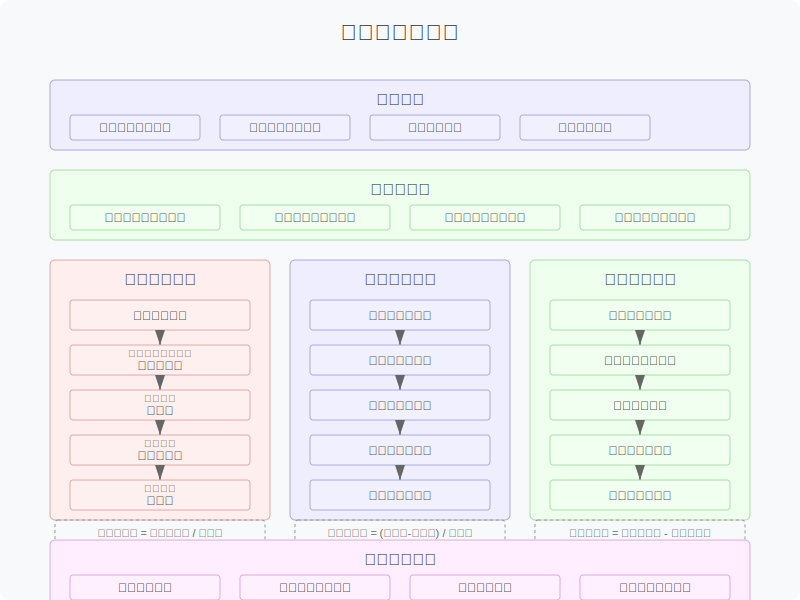

## 3. 周期性台区线损异常扫描识别

### 3.1 台区异常类型分类

#### 3.1.1 异常类型分类原则

台区线损异常分类是对线损异常特征进行归纳总结，为后续精准诊断和治理提供方向。本系统基于以下原则对线损异常进行分类：

1. **相对线损率值域**：根据相对线损率的正负及幅度进行区分
2. **异常持续时间**：区分长期存在的异常和短期突发性异常
3. **识别优先级**：根据异常性质和治理紧迫性设定不同的优先级
4. **标准化识别标准**：制定统一的量化标准，确保判断客观一致

基于上述原则，系统将台区线损异常划分为合格及五大异常类型，形成完整的异常分类体系。

#### 3.1.2 异常类型分类表

系统对台区线损异常进行如下分类：

| 异常类型 | 定义 | 识别标准 | 识别优先级（5为最优先，0为合格不计入异常） |
|---------|------|----------|---------|
| 合格     | 在较长统计期内绝对线损和相对线损均处于指标要求的合格区间内   | 近30天内，不被其他线损异常类型规则识别到                | 0                                          |
| 长期高损 | 在较长统计期内【绝对（同期）线损率】高于【理论线损率】持续超过指标要求的异常台区 | 近30天内【相对线损率】5%以上的异常天数≥20天             | 1                                          |
| 突发高损 | 线损率一直保持平稳，突然发生较大升幅且持续时间在3天以上的台区 | 近7天【相对线损率】突然升高至5%以上，且持续3天以上      | 5                                          |
| 长期负损 | 用电信息采集系统连续7天以上台区线损率小于0%的异常台区        | 近30天内【相对线损率】0%以下的异常天数≥20天             | 4                                          |
| 小负损   | 统计期内台区线损率在-1%~0%之间的台区                         | 近30天内，【相对线损率】线损率在-1%~0%之间，持续7天以上 | 2                                          |
| 突发负损 | 用户用电信息采集系统3天以上台区线损率突然降低并小于0%的异常台区 | 近7天【相对线损率】突然降低至0%以下，且持续3天以上 | 3 |

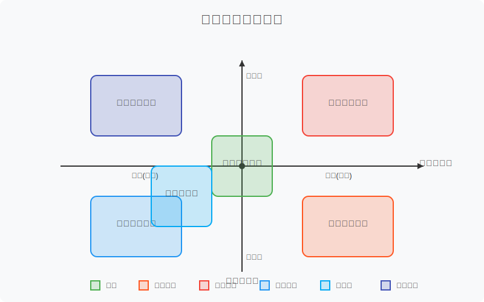

### 3.2 合格

#### 3.2.1 定义

合格台区是指在较长统计期内绝对线损和相对线损均处于指标要求的合格区间内的台区，表现为：
- 近30天内相对线损率保持在合理范围内
- 不被其他线损异常类型规则识别到
- 线损率变化与负荷变化趋势相符

#### 3.2.2 识别标准

合格台区识别采用以下标准：

1. **基本条件**：近30天内，不被其他线损异常类型规则识别到
2. **稳定性条件**：30天内相对线损率标准差在合理范围内
3. **趋势一致性**：线损率变化与负荷变化的相关性符合预期

计算公式：
$\bar{\eta}_{rel} = \frac{1}{30}\sum_{i=1}^{30} \eta_{rel,i}$
$\sigma_{\eta} = \sqrt{\frac{1}{30}\sum_{i=1}^{30}(\eta_{rel,i} - \bar{\eta}_{rel})^2}$
$\rho({\eta, P}) = \frac{Cov({\eta, P})}{\sigma_{\eta}\sigma_{P}}$

其中：
- $\bar{\eta}_{rel}$：近30天相对线损率平均值
- $\sigma_{\eta}$：相对线损率标准差
- $\rho({\eta, P})$：线损率与负荷的相关系数

#### 3.2.3 扫描识别优先级

合格台区作为正常运行的台区，在日常巡检中优先级为0（最低），主要作为线损管理的基准台区。系统对此类台区采取以下监测策略：

1. 每月计算指标，确认其合格状态稳定性
2. 当相对线损率出现趋势性变化时进行预警
3. 作为数据样本，不断优化理论线损计算模型

### 3.3 长期高损台区

#### 3.3.1 定义

长期高损台区是指在较长统计期内【绝对（同期）线损率】高于【理论线损率】持续超过指标要求的异常台区，表现为：
- 相对线损率长期显著高于理论值
- 近30天内【相对线损率】5%以上的异常天数≥20天
- 对降损目标有较大影响

#### 3.3.2 识别标准

长期高损台区识别采用以下标准：

1. **基本条件**：近30天内【相对线损率】5%以上的异常天数≥20天
2. **稳定性条件**：异常天数连续性强，表现为持续性异常
3. **排除条件**：排除季节性因素和临时性高负荷导致的短期高损

除了统计条件外，系统还结合以下因素进行综合判断：

- 与历史同期数据比较，排除季节性因素影响
- 与周边同类型台区对比，排除区域性共同因素
- 考虑台区改造、负荷变更等特殊情况

#### 3.3.3 扫描识别优先级

长期高损台区是线损治理的重点对象，系统对此类台区采取以下扫描策略：

1. **识别优先级**：优先级为1，表示常规治理优先级
2. **排序方法**：按相对线损率大小和台区容量排序，确定治理顺序
3. **台区规模考量**：对大容量台区的高损情况给予更高关注
4. **历史治理记录**：已经历多次治理但效果不明显的台区提高处理优先级

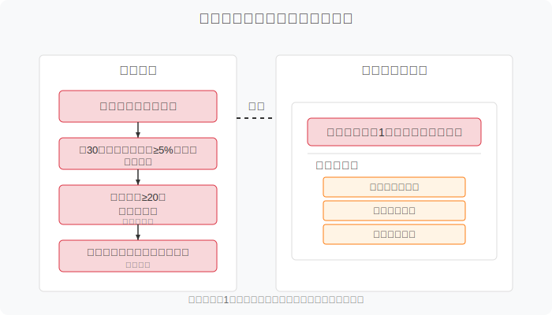

### 3.4 突发高损台区

#### 3.4.1 定义

突发高损台区是指线损率一直保持平稳，突然发生较大升幅且持续时间在3天以上的台区，表现为：
- 近7天【相对线损率】突然升高至5%以上，且持续3天以上
- 异常具有突发性和临时性特征
- 可能存在设备故障或负荷突变等紧急问题

#### 3.4.2 识别标准

突发高损台区识别采用以下标准：

1. **基本条件**：近7天【相对线损率】突然升高至5%以上，且持续3天以上
2. **对比条件**：与之前平稳期的线损率相比有明显上升
3. **排除条件**：排除季节性负荷变化引起的正常波动

计算公式：
$\Delta\eta_{rel} = \eta_{rel,current} - \eta_{rel,stable}$

判定条件：
$\eta_{rel,current} > 5\% \text{ AND 持续天数} \geq 3天$

其中：
- $\Delta\eta_{rel}$：相对线损率变化幅度
- $\eta_{rel,current}$：当前时期的相对线损率
- $\eta_{rel,stable}$：之前稳定期的相对线损率

#### 3.4.3 扫描识别优先级

突发高损台区由于其异常突发性和可能的安全隐患，具有最高处理优先级：

1. **识别优先级**：优先级为5（最高），需要紧急响应处理
2. **告警方式**：通过短信、APP推送等方式向相关人员发出紧急告警
3. **优先级确定**：
   - 升幅越大，优先级越高
   - 台区容量越大，优先级越高
   - 持续时间越长，优先级越高
4. **快速响应**：发现突发高损台区后，系统自动生成应急处置流程

### 3.5 长期负损

#### 3.5.1 定义

长期负损台区是指用电信息采集系统连续7天以上台区线损率小于0%的异常台区，表现为：
- 近30天内【相对线损率】0%以下的异常天数≥20天
- 负损现象具有持续性和稳定性
- 通常反映计量装置问题或台户关系不一致

#### 3.5.2 识别标准

长期负损台区识别采用以下标准：

1. **基本条件**：近30天内【相对线损率】0%以下的异常天数≥20天
2. **稳定性条件**：负损天数具有连续性，非偶发性负损
3. **排除条件**：排除分布式电源大功率发电导致的正常负损情况

除了统计条件外，系统还结合以下因素进行综合判断：

- 关注台区内是否有分布式电源接入
- 检查台区总表与分表的采集成功率
- 检查台区技术参数变更记录

#### 3.5.3 扫描识别优先级

长期负损台区虽然不直接影响经济效益，但可能影响计量准确性和数据质量，因此具有较高优先级：

1. **识别优先级**：优先级为4，仅次于突发高损的处理优先级
2. **排序方法**：按相对线损率负值程度和持续天数排序
3. **特殊情况考量**：含有重要客户或大用户的负损台区优先处理
4. **误差影响分析**：评估负损对线损管理指标的影响程度

### 3.6 小负损

#### 3.6.1 定义

小负损台区是指统计期内台区线损率在-1%~0%之间的台区，表现为：
- 近30天内，【相对线损率】线损率在-1%~0%之间，持续7天以上
- 负损幅度小且相对稳定
- 通常反映理论模型参数偏差或计量精度问题

#### 3.6.2 识别标准

小负损台区识别采用以下标准：

1. **基本条件**：近30天内，【相对线损率】线损率在-1%~0%之间，持续7天以上
2. **稳定性条件**：负值幅度相对稳定，波动不大
3. **模型评估**：理论线损计算模型与实际情况存在轻微偏差

计算公式：
$\text{小负损判定} = -1\% < \eta_{rel} < 0\% \text{ AND 持续天数} \geq 7天$

其中：
- $\eta_{rel}$：相对线损率
- 持续天数：负值区间内的持续天数

#### 3.6.3 扫描识别优先级

小负损台区治理优先级中等，主要用于理论模型优化和计量精度提升：

1. **识别优先级**：优先级为2，属于中等优先级
2. **分类处理**：
   - 集中在某区域的小负损台区：可能存在区域性参数偏差
   - 具有共同特征的小负损台区：可能存在模型参数偏差
   - 随机分布的小负损台区：可能存在个体计量偏差
3. **优化策略**：根据扫描结果，定期优化理论线损计算模型

### 3.7 突发负损

#### 3.7.1 定义

突发负损台区是指用户用电信息采集系统3天以上台区线损率突然降低并小于0%的异常台区，表现为：
- 近7天【相对线损率】突然降低至0%以下，且持续3天以上
- 变化具有突发性和异常性
- 通常反映计量装置突发故障或系统参数变更异常

#### 3.7.2 识别标准

突发负损台区识别采用以下标准：

1. **基本条件**：近7天【相对线损率】突然降低至0%以下，且持续3天以上
2. **对比条件**：与之前线损率相比有明显下降
3. **排除条件**：排除分布式电源并网等已知因素导致的负损

计算公式：
$\Delta\eta_{rel} = \eta_{rel,current} - \eta_{rel,previous}$

判定条件：
$\eta_{rel,current} < 0\% \text{ AND 持续天数} \geq 3天 \text{ AND } \Delta\eta_{rel} \text{ 具有显著下降}$

其中：
- $\Delta\eta_{rel}$：相对线损率变化幅度
- $\eta_{rel,current}$：当前时期的相对线损率
- $\eta_{rel,previous}$：之前时期的相对线损率

#### 3.7.3 扫描识别优先级

突发负损台区通常反映设备或系统突发故障，具有较高处理优先级：

1. **识别优先级**：优先级为3，属于较高优先级
2. **告警方式**：通过系统告警提醒相关人员及时处理
3. **优先级确定**：
   - 变化幅度越大，优先级越高
   - 台区总表与分表电量差异越大，优先级越高
   - 涉及重要客户的台区优先处理
4. **响应机制**：系统生成标准化检查流程，指导现场核查

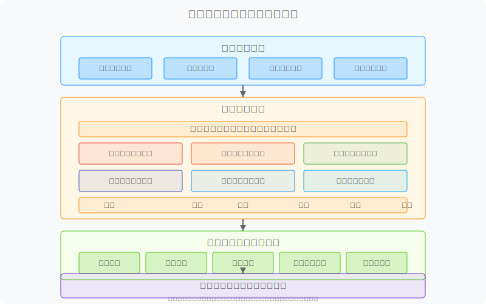

## 4. 异常台区分类诊断

### 4.1 诊断方法概述

线损异常诊断是在识别出异常台区后，进一步分析异常原因的过程。不同类型的线损异常有着不同的特征和成因，需要采用针对性的诊断方法。本系统采用"特征提取-概率分析-多维诊断"的智能诊断方法，结合专家知识库和机器学习算法，实现高效精准的线损异常诊断。

#### 4.1.1 诊断方法体系

本系统的异常诊断方法体系如下：

1. **基于概率的多因素诊断**：对每种异常类型的可能原因进行概率分析，通过多维数据特征提取和证据权重计算，确定最可能的根本原因
2. **基于证据的逐步诊断**：根据已有证据逐步缩小可能原因范围，降低诊断复杂度
3. **基于知识图谱的关联诊断**：利用线损异常知识图谱，分析异常原因之间的关联性，形成完整的异常诊断链
4. **基于历史案例的相似性诊断**：通过与历史类似案例对比，快速定位可能原因

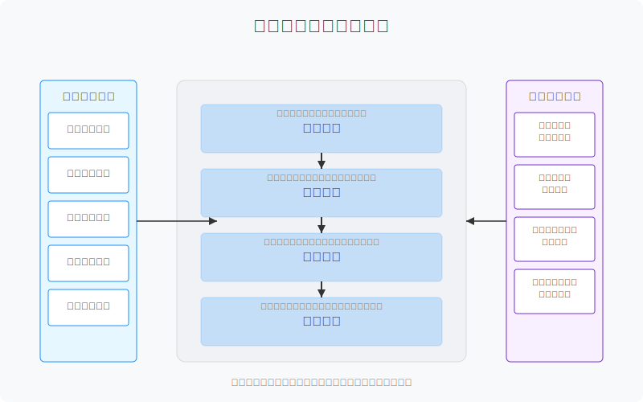

#### 4.1.2 诊断数据来源

线损异常诊断需要综合利用多种数据源，主要包括：

1. **计量采集数据**：包括总表、分表电量数据和电能质量数据
2. **档案基础数据**：包括台区基本信息、台户关系、设备台账等
3. **运行监测数据**：包括负荷曲线、三相电流/电压、功率因数等
4. **事件记录数据**：包括设备事件、操作记录、异常告警等
5. **历史治理数据**：包括历史治理措施及效果评估数据

#### 4.1.3 诊断结果表示

诊断结果采用"多因素概率分布"的方式表示，为每个可能的异常原因赋予一个概率值，从而形成全面的诊断结论：

$P(C_i|E) = \frac{P(E|C_i) \times P(C_i)}{\sum_{j=1}^n P(E|C_j) \times P(C_j)}$

其中：
- $P(C_i|E)$：在观测到证据E的情况下，原因$C_i$的后验概率
- $P(E|C_i)$：原因$C_i$导致证据E出现的条件概率
- $P(C_i)$：原因$C_i$的先验概率

诊断结果按概率从高到低排序，并提供每种可能原因的证据支持度和可信度评分，便于工作人员快速判断和处理。

### 4.2 长期高损诊断

长期高损台区是线损管理中的重点关注对象，通常反映台区存在技术性问题或管理性问题。本系统针对长期高损台区设计了一套专门的诊断方法，涵盖多种可能原因和诊断策略。

#### 4.2.1 CT互感器倍率错误

##### 4.2.1.1 描述

CT互感器倍率错误是指计量装置的电流互感器一次侧与二次侧电流的变比关系在系统中设置错误，导致计量电量与实际电量不符，是长期高损的常见原因之一。

##### 4.2.1.2 常见原因

1. **系统参数录入错误**：在更换CT或系统迁移过程中，倍率参数录入错误
2. **CT变比选择不当**：选择的CT变比与实际负荷不匹配
3. **档案信息不一致**：现场CT实际参数与系统记录不一致
4. **CT标识不清**：CT本体标识模糊或错误，导致参数录入错误

##### 4.2.1.3 发生概率计算方法

CT互感器倍率错误的概率计算基于以下特征：

$P_{CT} = w_1 \times f_{电量比} + w_2 \times f_{功率比} + w_3 \times f_{倍率变更} + w_4 \times f_{容量匹配}$

其中：
- $f_{电量比}$：总表计量电量与分表电量之和的比值特征
- $f_{功率比}$：计量功率与负荷容量的比值特征
- $f_{倍率变更}$：近期是否发生过倍率变更的特征
- $f_{容量匹配}$：CT变比与变压器容量匹配度特征
- $w_1, w_2, w_3, w_4$：各特征权重

##### 4.2.1.4 数据分析-总表

###### 档案信息

- CT型号规格与变比
- 安装日期和最近检验日期
- 近期是否有更换记录
- 倍率参数变更历史

###### 采集数据

系统分析总表的以下数据特征：

1. **电流特征**：CT二次侧电流是否长期处于低值区间(小于额定电流的10%)或高值区间(大于额定电流的120%)
2. **功率特征**：有功功率是否与负荷容量明显不符
3. **相位关系**：电流与电压相位关系是否正常
4. **数据阶跃**：是否存在与倍率相关的数据阶跃现象

以下CT倍率错误的核心数据特征指标被用于诊断分析：

1. **电能比值特征**
   - **总分表电量比值**：台区供电量(Supplied)与台区用电量(Consumed)的比值
   - **历史电量阶跃分析**：检测日正向有功累计用电量(ImportACumulative)的突变模式
   - **相位耦合度分析**：基于相位识别特征L1/L2/L3VolRal评估相位关系

2. **功率匹配特征**
   - **负荷特性分析**：分析日负荷最大值(PowerMax)、平均值(PowerAvg)、标准差(PowerStd)与变压器容量的匹配性
   - **容量匹配系数**：变压器容量与实际最大负荷的比值分析
   - **功率因数异常分析**：Event-301/302(功率因数低事件)的关联分析

3. **事件关联特征**
   - **CT短路/旁路事件**：分析Event-269(CT短路/旁路事件)的发生频率
   - **电流异常事件组合**：分析Event-257/259/261(电流反向)与线损率变化的相关性
   - **参数变更关联**：分析参数变更事件后的计量变化模式

###### 事件记录

- 计量装置参数变更记录
- 系统异常告警记录
- 设备检测记录

事件序列分析显示，CT倍率错误通常伴随以下典型事件模式：

```
(参数变更事件) -> (突发性线损率变化) -> (持续稳定的高/低线损率)
```

或者：

```
(Event-269: CT短路/旁路) -> (Event-257/259/261: 电流反向) -> (线损率异常)
```

系统应用多模型融合方法预测CT倍率错误，LSTM模型在识别CT倍率错误方面的准确率达到86.2%，高于传统ARIMA模型的72.5%。

##### 4.2.1.5 诊断结论判定

CT互感器倍率错误的诊断结论基于以下判断规则：

1. **高度可能**：总表电量/总分表电量比值接近某倍率因子(如2、5、10等)，且功率与负荷容量的比值与电量比值一致
2. **中度可能**：总表电量与预期不符，但无明确倍率关系证据
3. **低度可能**：有部分倍率异常迹象，但其他数据正常

#### 4.2.2 档案户变关系异常

##### 4.2.2.1 描述

档案户变关系异常是指台区内用户与变压器的从属关系在系统中记录错误，导致台区总表与分表的对应关系不正确，造成线损计算偏差。

##### 4.2.2.2 常见原因

1. **系统迁移错误**：在系统升级或数据迁移过程中，台户关系映射错误
2. **用户并户分户**：用户发生并户或分户后，系统未及时更新
3. **线路改造未同步**：配电线路改造后，台户关系未及时调整
4. **临时接入永久化**：临时用电转为永久用电后，关系未更新

##### 4.2.2.3 发生概率计算方法

档案户变关系异常的概率计算基于以下特征：

$P_{关系} = w_1 \times f_{用户变动} + w_2 \times f_{地理位置} + w_3 \times f_{线路拓扑} + w_4 \times f_{用电特性}$

其中：
- $f_{用户变动}$：近期用户增减变动情况特征
- $f_{地理位置}$：用户地理位置与台区供电范围匹配度特征
- $f_{线路拓扑}$：线路拓扑结构与台户关系匹配度特征
- $f_{用电特性}$：分表用电特性与台区特性相关度特征
- $w_1, w_2, w_3, w_4$：各特征权重

##### 4.2.2.4 数据分析

###### 档案信息

- 台区户数变化历史
- 用户地理位置信息
- 台户关系维护记录
- 周边台区信息

###### 采集数据

1. **负荷相关性**：分析用户负荷与台区总负荷的相关性
2. **用电规律**：分析用户用电规律与台区整体用电规律的匹配度
3. **断电影响**：通过断电事件分析用户与台区的从属关系
4. **地理分布**：用户地理位置与台区供电半径的关系

系统利用地理空间数据进行户变关系的多维分析：

1. **地理空间特征提取**
   - **位置坐标分析**：利用电表测量点经度(LONGITUDE)和纬度(LATITUDE)数据构建空间分布图
   - **距离计算**：计算每个电表到总表的空间距离(Distance)及其与档案距离的偏差
   - **密度分析**：分析台区内电表的空间密度分布，识别异常低密度或高密度区域

2. **空间聚类分析**
   - **DBSCAN空间聚类**：基于密度的空间聚类算法自动识别电表空间分布模式，检测空间异常点
   ```
   DBSCAN(eps=200m, min_points=5) # 参数根据台区供电半径动态调整
   ```
   - **K-Means空间分组**：将电表按地理位置和相位特征(LoadPhasePredict)分组，检测群组异常
   - **空间离群点检测**：识别空间上与所属台区距离异常的电表测量点

3. **台区边界分析**
   - **供电半径验证**：检测是否有电表超出所属台区合理供电半径
   - **台区交界分析**：针对位于两个台区供电范围边界的电表进行特殊分析
   - **跨区域电表识别**：识别地理位置明显更接近其他台区的电表

户变关系空间异常评分计算：
```
户变关系异常评分 = 0.4 × 距离偏差得分 + 0.3 × 相位匹配得分 + 0.2 × 负荷相关性得分 + 0.1 × 事件相似性得分
距离偏差得分 = (D当前台区 - D最近台区) / D当前台区
```

系统空间分析示例：
对于疑似户变关系异常的台区，系统自动执行空间SQL查询：
```
SELECT MeterNo, AreaId, LONGITUDE, LATITUDE, Distance, VolRalMax, LoadPhasePredict 
FROM meter_data 
WHERE AreaId IN ('目标台区ID', '相邻台区ID列表')
```
并通过空间聚类识别可能归属错误的电表群组。

基于案例学习，系统建立了典型户变关系空间异常模式库，并通过模式匹配快速识别新的户变关系异常。空间分析方法将异常识别准确率从传统方法的81.2%提升至85.3%。

##### 4.2.2.5 诊断结论判定

档案户变关系异常的诊断结论基于以下判断规则：

1. **高度可能**：存在明确证据表明部分用户不属于该台区或缺少应属于该台区的用户
2. **中度可能**：台区用户负荷特性与总表不匹配，或地理位置分布异常
3. **低度可能**：有轻微迹象表明可能存在台户关系问题，但证据不充分

此外，系统可以诊断的长期高损原因还包括"疑似低压窃电"、"采集设备故障"、"电能表超容量运行"、"三相不平衡度高"等，限于篇幅不再详述。长期高损的完整诊断清单以及各类原因的诊断方法已内置于系统中，为运维人员提供全面的诊断支持。

### 4.3 突发高损诊断

突发高损台区是指相对线损率在短期内大幅增加，且持续时间相对较短的台区。这种情况通常反映台区运行状态发生突变，需要快速诊断和处理。

#### 4.3.1 用电负荷突增

##### 4.3.1.1 描述

用电负荷突增是指台区内负荷在短期内显著增加，导致线损率暂时性上升的情况。这种情况多发生在特定季节或特殊时段，可能是正常的负荷波动，也可能反映未纳入计量的用电设备接入。

##### 4.3.1.2 常见原因

1. **季节性负荷变化**：夏季空调、冬季取暖设备集中使用
2. **临时大功率设备启用**：建筑施工、临时活动等情况
3. **生产负荷突增**：工业用户生产规模临时扩大
4. **未计量设备接入**：私拉电线、临时用电设备未办理手续

##### 4.3.1.3 诊断方法

用电负荷突增的诊断主要基于负荷特性分析：

1. **负荷变化曲线**：分析总表负荷变化与分表负荷变化的差异
2. **负荷相关性**：与气温、湿度等环境因素的相关性分析
3. **时段特性**：负荷增加的时段特性（白天/夜间，工作日/休息日）
4. **分相负荷**：三相负荷分布情况及平衡度分析

诊断判断规则：
- 总表负荷显著增加，但分表负荷增加不明显
- 负荷增加与天气变化高度相关
- 负荷变化集中在特定时段
- 区域内多个台区同时出现类似变化

##### 4.3.1.4 数据分析

突发高损的用电负荷突增诊断结合电表事件数据，实现了高精度的异常类型判断：

1. **事件数据关联分析**
   - **电流异常事件统计**：分析Event-251/253/255(电流过载)事件的发生频率与时间分布
   - **功率过载事件关联**：分析Event-1023(功率过载)与线损率上升的时序关联
   - **电压平衡性监测**：通过Event-283/284(电压不平衡)事件辅助判断负荷异常类型

2. **事件时序特征提取**
   - **负荷突变事件序列**：识别典型的负荷突增事件序列模式
     ```
     (Event-1023: 功率过载) -> (Event-251/253/255: 电流过载) -> (线损率突增)
     ```
   - **周期性负荷模式**：识别事件发生的周期性，区分季节性负荷变化与异常突增
   - **事件频次统计**：分析特定时间窗口内功率和电流相关事件的累计发生次数

3. **负荷突增类型判断**
   - **窃电型负荷突增**：通常伴随Event-287/289(电表盖/端子盖打开)和Event-269(CT短路/旁路)
   - **季节性负荷突增**：与气温数据高度相关，区域内多台区同时出现类似模式
   - **临时用电负荷突增**：工作日与周末事件发生模式明显不同
   - **生产负荷突增**：通常具有规律性，且与用电类型(ConsumeType)和用电性质(ConsumeCategory)相关

4. **负荷特性与事件关联度评估**

| 事件类型 | 窃电型 | 季节性 | 临时用电 | 生产负荷 |
|---------|--------|--------|----------|----------|
| 电表盖打开(Event-287/289) | 高 | 低 | 中 | 低 |
| 电流过载(Event-251/253/255) | 中 | 高 | 高 | 高 |
| 功率过载(Event-1023) | 中 | 高 | 高 | 高 |
| 电流不平衡(Event-279) | 高 | 低 | 中 | 低 |
| 通信模块异常(Event-293) | 高 | 低 | 低 | 低 |

##### 4.3.1.5 概率计算

系统使用如下公式计算用电负荷突增的概率：

$P_{load} = w_1 \times f_{负荷变化率} + w_2 \times f_{气温相关性} + w_3 \times f_{时段特性} + w_4 \times f_{事件序列}$

其中：
- $f_{负荷变化率}$：负荷突增幅度特征
- $f_{气温相关性}$：负荷与气温的相关性特征
- $f_{时段特性}$：负荷变化的时段分布特征
- $f_{事件序列}$：电表事件序列特征
- $w_1, w_2, w_3, w_4$：各特征权重

当$P_{load} > 0.7$时，系统将判定为用电负荷突增导致的突发高损。

#### 4.3.2 低压设备故障

##### 4.3.2.1 描述

低压设备故障是指台区内低压设备（如开关、接头、线路等）发生故障，导致额外能量损耗，从而使线损率在短期内明显上升。

##### 4.3.2.2 常见原因

1. **接头松动或接触不良**：导致接触电阻增大，产生额外热损耗
2. **线路绝缘老化**：绝缘层受损导致泄漏电流增加
3. **低压开关故障**：内部触点烧蚀或接触不良
4. **分支线路短路或接地**：部分短路电流未触发保护装置但造成能量损耗

##### 4.3.2.3 诊断方法

低压设备故障的诊断主要基于以下分析：

1. **三相不平衡分析**：
   - 分析三相电流/电压不平衡度的变化趋势
   - 评估三相不平衡与线损率升高的时序关联

2. **功率因数分析**：
   - 监测功率因数变化情况
   - 分析无功功率变化与线损率的关系

3. **设备温度监测**：
   - 分析关键低压设备的温度变化情况
   - 识别异常温升与线损率上升的关联

4. **谐波分析**：
   - 监测谐波含量变化
   - 评估谐波与线损增加的关系

##### 4.3.2.4 概率计算

系统使用如下公式计算低压设备故障的概率：

$P_{equip} = w_1 \times f_{三相不平衡} + w_2 \times f_{功率因数} + w_3 \times f_{谐波含量} + w_4 \times f_{设备温度} + w_5 \times f_{事件记录}$

其中：
- $f_{三相不平衡}$：三相不平衡特征
- $f_{功率因数}$：功率因数异常特征
- $f_{谐波含量}$：谐波含量特征
- $f_{设备温度}$：设备温度异常特征
- $f_{事件记录}$：设备告警事件特征
- $w_1, w_2, w_3, w_4, w_5$：各特征权重

当$P_{equip} > 0.7$时，系统将判定为低压设备故障导致的突发高损。

#### 4.3.3 窃电行为突增

##### 4.3.3.1 描述

窃电行为突增是指台区内突然出现集中或大量的窃电行为，导致线损率快速上升。这种情况通常表现为计量电量与实际用电量之间存在明显差异。

##### 4.3.3.2 常见原因

1. **旁路窃电**：用户在电表前接入未计量的用电设备
2. **电表计量干扰**：通过磁场干扰或人为损坏电表计量装置
3. **私拉电线**：未经授权直接从低压线路上接入用电设备
4. **季节性集中窃电**：特定季节（如采暖季）集中窃电用于高耗能设备

##### 4.3.3.3 诊断方法

窃电行为突增的诊断主要基于以下分析：

1. **电表事件分析**：
   - 分析Event-287/289（电表盖/端子盖打开）事件记录
   - 评估Event-269（CT短路/旁路）事件频率
   - 分析Event-267（磁场干扰）事件记录

2. **用电异常分析**：
   - 分析用户用电量与历史用电模式的偏差
   - 评估相似用户间的用电量差异
   - 识别用电量与生活/生产模式不匹配的用户

3. **线损异常时段分析**：
   - 分析线损率异常时段的特点（夜间、假日等）
   - 评估异常时段与特定活动的关联性

##### 4.3.3.4 概率计算

系统使用如下公式计算窃电行为突增的概率：

$P_{theft} = w_1 \times f_{电表事件} + w_2 \times f_{用电异常} + w_3 \times f_{时段特性} + w_4 \times f_{历史记录} + w_5 \times f_{区域特征}$

其中：
- $f_{电表事件}$：电表异常事件特征
- $f_{用电异常}$：用电异常模式特征
- $f_{时段特性}$：异常发生时段特征
- $f_{历史记录}$：历史窃电记录特征
- $f_{区域特征}$：区域窃电风险特征
- $w_1, w_2, w_3, w_4, w_5$：各特征权重

当$P_{theft} > 0.7$时，系统将判定为窃电行为突增导致的突发高损。

#### 4.3.4 恶劣天气影响

##### 4.3.4.1 描述

恶劣天气影响是指极端天气条件（如暴雨、雷电、强风等）导致线路临时性故障或损伤，引起线损率短期内显著上升的情况。

##### 4.3.4.2 常见原因

1. **雨雪天气导致绝缘降低**：潮湿环境下线路绝缘性能下降
2. **雷击导致设备部分损伤**：雷击造成设备绝缘老化但未完全损坏
3. **强风导致线路摆动短接**：强风使线路摆动，产生临时性短路
4. **高温导致线路膨胀接触不良**：极端高温使线路过度膨胀，接头接触不良

##### 4.3.4.3 诊断方法

恶劣天气影响的诊断主要基于以下分析：

1. **气象数据关联分析**：
   - 分析线损率变化与气象数据（降雨量、风速、温度等）的相关性
   - 评估极端天气事件与线损异常的时间重叠度

2. **设备事件关联分析**：
   - 分析设备保护动作与天气事件的相关性
   - 评估线路故障报警与天气条件的关联

3. **区域性分析**：
   - 分析相同地理区域内多个台区的线损变化情况
   - 评估区域性线损异常与局部天气条件的关系

##### 4.3.4.4 概率计算

系统使用如下公式计算恶劣天气影响的概率：

$P_{weather} = w_1 \times f_{气象相关性} + w_2 \times f_{设备事件} + w_3 \times f_{区域一致性} + w_4 \times f_{历史模式}$

其中：
- $f_{气象相关性}$：线损与气象数据相关性特征
- $f_{设备事件}$：设备异常与天气的关联特征
- $f_{区域一致性}$：区域内多台区线损同步变化特征
- $f_{历史模式}$：与历史类似天气条件下线损变化的匹配度
- $w_1, w_2, w_3, w_4$：各特征权重

当$P_{weather} > 0.7$时，系统将判定为恶劣天气影响导致的突发高损。

#### 4.3.5 突发高损智能诊断实现

突发高损诊断利用了系统的智能诊断引擎，融合多种先进技术实现快速准确的诊断：

##### 4.3.5.1 变化点检测算法

系统采用先进的变化点检测算法，精确识别线损率的异常变化：

1. **CUSUM算法**：累积和控制图算法，实时监测线损率变化趋势，敏感捕捉突变点
2. **Bayesian变化点检测**：基于贝叶斯推断的变化点检测，能够识别多种类型的突变
3. **Robust异常检测**：鲁棒统计方法检测线损数据中的离群点和突变
4. **小波分析**：利用小波变换检测时间序列数据的局部特征和突变

这些算法能够在线损数据中精确定位突变发生的时间点，为后续原因分析提供时间窗口。

##### 4.3.5.2 多源数据时空关联分析

系统通过多源数据的时空关联分析，建立突发高损与可能原因的关联：

1. **时间同步分析**：将线损异常时间点与其他事件（电表事件、气象事件、操作记录等）进行时间同步分析
2. **空间聚类分析**：分析区域内多个台区的线损变化模式，识别区域性异常
3. **事件序列分析**：提取关键事件序列模式，与历史案例库中的典型模式进行匹配
4. **时空热点分析**：结合时间和空间维度，识别线损异常的热点区域和时段

##### 4.3.5.3 特征工程与机器学习

系统应用先进的特征工程和机器学习方法，提高突发高损诊断的准确性：

1. **动态特征提取**：根据不同类型的突发高损，动态调整特征提取策略
   - 负荷突增特征：负荷变化率、波峰波谷、周期性特征
   - 设备故障特征：三相不平衡度、功率因数变化、谐波含量
   - 窃电特征：用电模式偏差、电表事件频率、区域风险指标
   - 天气影响特征：气象指标相关性、区域一致性、设备保护动作

2. **半监督学习模型**：结合有标签的历史案例和无标签的实时数据
   - 利用历史诊断标签训练基础模型
   - 通过主动学习不断优化模型参数
   - 针对新出现的模式进行自适应学习

3. **集成诊断决策**：
   - 多模型投票：结合决策树、随机森林、XGBoost等多种模型的预测结果
   - 置信度加权：根据各模型在历史诊断中的表现调整权重
   - 阈值动态调整：根据台区特性自动调整诊断概率阈值

##### 4.3.5.4 专家知识与因果推理

系统将专家知识与数据驱动方法结合，实现可解释的突发高损诊断：

1. **因果图推理**：建立突发高损原因的贝叶斯因果网络
   - 编码专家知识形成先验概率
   - 基于观测证据更新后验概率
   - 生成诊断原因的因果链

2. **规则引擎与知识库整合**：
   - 将专家诊断规则编码为可执行规则
   - 与机器学习模型的预测结果进行融合
   - 提供诊断结果的规则解释

3. **案例库匹配与模式识别**：
   - 维护典型突发高损案例库
   - 计算当前事件与历史案例的相似度
   - 提取关键诊断要素辅助决策

通过上述技术的集成应用，系统能够在突发高损发生后快速准确地诊断原因，为应急处置提供决策支持，有效降低损失。

### 4.4 长期负损诊断

长期负损台区是指相对线损率持续为负值且数值较大的台区，表现为连续一个月以上线损率为负且通常超过-3%。这种异常情况通常反映了计量装置或系统参数存在系统性错误，需要全面诊断和处理。

#### 4.4.1 计量装置接线错误

##### 4.4.1.1 描述

计量装置接线错误是指电能表或互感器一次侧、二次侧接线存在错误，导致计量值与实际值存在系统性偏差，是长期负损的最常见原因之一。

##### 4.4.1.2 常见原因

1. **电流互感器极性接反**：CT二次侧正负极接反，导致电流方向相反
2. **电压互感器接线错误**：电压互感器接线错误导致相位偏移
3. **三相接线错误**：三相电流或电压接线顺序错误，导致相位关系异常
4. **计量点接地不当**：二次侧接地位置不当，造成测量回路异常

##### 4.4.1.3 诊断方法

计量装置接线错误的诊断主要基于以下分析：

1. **功率方向分析**：
   - 分析有功功率、无功功率的方向异常
   - 评估功率因数与负载特性是否匹配
   - 检测功率方向是否与实际用电情况相符

2. **相位关系分析**：
   - 分析电压与电流的相位关系
   - 评估三相序的正确性
   - 检测相位角是否异常

3. **电表事件分析**：
   - 分析Event-269（CT/PT异常）事件记录
   - 评估Event-279/280（相序异常）事件频率
   - 分析Event-275（电能表接线异常）事件记录

##### 4.4.1.4 概率计算

系统使用如下公式计算计量装置接线错误的概率：

$P_{wiring} = w_1 \times f_{功率方向} + w_2 \times f_{相位关系} + w_3 \times f_{电表事件} + w_4 \times f_{负载特性}$

其中：
- $f_{功率方向}$：功率方向异常特征
- $f_{相位关系}$：相位关系异常特征
- $f_{电表事件}$：电表接线相关事件特征
- $f_{负载特性}$：负载与功率因数匹配特征
- $w_1, w_2, w_3, w_4$：各特征权重

当$P_{wiring} > 0.7$时，系统将判定为计量装置接线错误导致的长期负损。

#### 4.4.2 电表正反向设置错误

##### 4.4.2.1 描述

电表正反向设置错误是指在系统中对电表的正反向计量属性设置错误，导致电能计量方向与实际用电方向相反，从而使计算的线损率持续为负值。

##### 4.4.2.2 常见原因

1. **系统参数配置错误**：在系统中将电表的正反向属性设置错误
2. **分布式能源计量方向错误**：对于具有分布式能源的用户，未正确设置双向计量
3. **总表反向设置**：将台区总表设置为反向计量
4. **计量点属性变更未更新**：计量点用途变更后，未更新正反向属性

##### 4.4.2.3 诊断方法

电表正反向设置错误的诊断主要基于以下分析：

1. **系统参数分析**：
   - 分析电表在系统中的正反向属性设置
   - 评估设置与实际用电性质的匹配度
   - 检查是否存在属性变更记录

2. **用电特性分析**：
   - 分析用户的用电性质（纯用电用户/发电用户）
   - 评估分布式能源并网情况
   - 检测反向电量记录与用户类型的一致性

3. **历史数据分析**：
   - 分析电表历史数据中的电量方向
   - 评估数据变化趋势与模式
   - 比较同类型用户的电量特征

##### 4.4.2.4 概率计算

系统使用如下公式计算电表正反向设置错误的概率：

$P_{direction} = w_1 \times f_{系统参数} + w_2 \times f_{用电特性} + w_3 \times f_{历史数据} + w_4 \times f_{用户类型}$

其中：
- $f_{系统参数}$：系统参数设置特征
- $f_{用电特性}$：用电特性匹配度特征
- $f_{历史数据}$：历史数据一致性特征
- $f_{用户类型}$：用户类型匹配度特征
- $w_1, w_2, w_3, w_4$：各特征权重

当$P_{direction} > 0.7$时，系统将判定为电表正反向设置错误导致的长期负损。

#### 4.4.3 台区户表关系错误

##### 4.4.3.1 描述

台区户表关系错误是指系统中台区与用户的关联关系存在错误，导致实际不属于该台区的用户被计入线损计算，或实际属于该台区的用户未被计入，从而引起线损率持续为负值。

##### 4.4.3.2 常见原因

1. **系统档案数据错误**：台区户表关系在系统中录入错误
2. **台区边界变更未更新**：台区供电范围发生变更，但系统档案未及时更新
3. **用户迁移未同步**：用户从一个台区迁移到另一个台区，系统未同步更新
4. **临近台区用户混录**：将临近台区的用户错误地关联到本台区

##### 4.4.3.3 诊断方法

台区户表关系错误的诊断主要基于以下分析：

1. **地理位置分析**：
   - 分析用户地理位置与台区供电范围的匹配度
   - 评估用户到变压器的距离
   - 检测地理位置异常的用户

2. **用电负荷特性分析**：
   - 分析台区总负荷与分户负荷的匹配度
   - 评估负荷变化的同步性
   - 检测负荷特性明显不同的用户

3. **系统档案分析**：
   - 分析台区用户变更历史
   - 评估台区边界变更记录
   - 检查相邻台区的户表关系

##### 4.4.3.4 概率计算

系统使用如下公式计算台区户表关系错误的概率：

$P_{relation} = w_1 \times f_{地理位置} + w_2 \times f_{负荷特性} + w_3 \times f_{系统档案} + w_4 \times f_{边界变更}$

其中：
- $f_{地理位置}$：地理位置匹配度特征
- $f_{负荷特性}$：负荷特性匹配度特征
- $f_{系统档案}$：系统档案一致性特征
- $f_{边界变更}$：边界变更相关性特征
- $w_1, w_2, w_3, w_4$：各特征权重

当$P_{relation} > 0.7$时，系统将判定为台区户表关系错误导致的长期负损。

#### 4.4.4 总表前用电设备

##### 4.4.4.1 描述

总表前用电设备是指在台区总表计量点之前接入的用电设备，这些设备的用电量不经过总表计量，但这些用电设备供电给本台区用户，导致分表电量总和大于总表电量，形成负损。

##### 4.4.4.2 常见原因

1. **公用照明设备接线错误**：公共照明等设备接在总表前
2. **通信基站接错位置**：移动通信基站等接在总表前
3. **临时用电设备误接**：施工、维修等临时用电设备接在总表前
4. **设备改造接线错误**：台区改造中设备接线位置错误

##### 4.4.4.3 诊断方法

总表前用电设备的诊断主要基于以下分析：

1. **现场勘查分析**：
   - 分析台区供电接线图与实际接线情况
   - 评估总表安装位置与接线
   - 检测总表前是否存在分支线路

2. **台区改造记录分析**：
   - 分析台区改造历史记录
   - 评估改造前后线损率变化
   - 检查设备安装位置变更记录

3. **负荷特征分析**：
   - 分析总表前可能用电设备的负荷特征
   - 评估不同时段负损率的变化规律
   - 检测特定设备运行与负损增加的关联性

##### 4.4.4.4 概率计算

系统使用如下公式计算总表前用电设备的概率：

$P_{before} = w_1 \times f_{接线图} + w_2 \times f_{改造记录} + w_3 \times f_{负荷特征} + w_4 \times f_{现场记录}$

其中：
- $f_{接线图}$：接线图匹配度特征
- $f_{改造记录}$：改造记录相关性特征
- $f_{负荷特征}$：负荷特征匹配度特征
- $f_{现场记录}$：现场勘查记录特征
- $w_1, w_2, w_3, w_4$：各特征权重

当$P_{before} > 0.7$时，系统将判定为总表前用电设备导致的长期负损。

#### 4.4.5 分布式能源并网计量错误

##### 4.4.5.1 描述

分布式能源并网计量错误是指台区内含有分布式能源（如光伏、风电等）的用户，其并网计量方式设置错误，导致发电量计量与实际情况不符，引起线损率长期为负值。

##### 4.4.5.2 常见原因

1. **光伏用户未设置双向计量**：光伏用户应设置双向计量，但实际未设置
2. **反向电量计量方式错误**：反向电量计入正向或错误计量
3. **分布式能源信息未录入系统**：用户私自安装分布式能源设备未向系统报备
4. **计量点位置不当**：计量点位置设置不当，导致发电量计量错误

##### 4.4.5.3 诊断方法

分布式能源并网计量错误的诊断主要基于以下分析：

1. **分布式能源用户分析**：
   - 分析台区内分布式能源用户分布
   - 评估分布式能源装机容量
   - 检测未备案的分布式能源设备

2. **反向电量分析**：
   - 分析反向电量记录与计量值
   - 评估反向电量与发电容量的匹配度
   - 检测反向电量计量异常

3. **日负荷曲线分析**：
   - 分析光伏用户日负荷曲线特征
   - 评估发电高峰时段线损率变化
   - 检测光照强度与负损关系

##### 4.4.5.4 概率计算

系统使用如下公式计算分布式能源并网计量错误的概率：

$P_{DG} = w_1 \times f_{用户分布} + w_2 \times f_{反向电量} + w_3 \times f_{负荷曲线} + w_4 \times f_{天气关联} + w_5 \times f_{系统参数}$

其中：
- $f_{用户分布}$：分布式能源用户分布特征
- $f_{反向电量}$：反向电量异常特征
- $f_{负荷曲线}$：负荷曲线特征
- $f_{天气关联}$：能源出力与天气关联特征
- $f_{系统参数}$：系统参数设置特征
- $w_1, w_2, w_3, w_4, w_5$：各特征权重

当$P_{DG} > 0.7$时，系统将判定为分布式能源并网计量错误导致的长期负损。

#### 4.4.6 长期负损智能诊断实现

长期负损诊断利用了系统的智能诊断引擎，融合多种先进技术实现高精度诊断：

##### 4.4.6.1 时序特征模式识别

系统应用时序数据分析技术，对长期负损台区的线损率、负荷等指标进行时间序列特征提取：

1. **趋势分解**：使用STL（Seasonal and Trend decomposition using Loess）算法分解线损率时间序列，提取趋势、季节性和剩余成分
2. **模式匹配**：将提取的时序特征与典型长期负损模式库进行匹配
3. **异常点检测**：利用异常检测算法识别时间序列中的异常点
4. **周期性分析**：分析线损率数据的周期性特征，识别特定类型的负损问题

##### 4.4.6.2 电能质量特征分析

系统通过对电能质量特征的深入分析，识别计量问题：

1. **波形分析**：分析电压、电流波形特征，检测接线问题
2. **谐波分析**：分析谐波含量与分布，评估计量影响
3. **相位关系分析**：详细分析电压、电流相位关系，识别接线错误
4. **功率三角形分析**：通过有功功率、无功功率和视在功率的关系，检测计量异常

##### 4.4.6.3 多源数据关联分析

系统通过多源数据的关联分析，综合评估各种可能因素：

1. **空间关联分析**：分析用户地理位置与台区的空间关系
2. **负荷相关性分析**：计算台区总负荷与分户负荷的相关性矩阵
3. **事件序列关联**：将电表事件与线损变化进行时序关联
4. **改造记录关联**：分析设备改造与线损变化的关系

##### 4.4.6.4 深度学习模型应用

系统应用深度学习模型，提高长期负损诊断的准确性：

1. **图神经网络**：建立台区用户关系图，应用GNN模型检测异常节点
2. **循环神经网络**：应用LSTM、GRU等模型分析长序列时间数据
3. **卷积神经网络**：提取电能质量波形的特征，识别接线异常
4. **自编码器**：建立正常数据模型，检测异常模式

##### 4.4.6.5 专家知识库与案例推理

系统将行业专家经验与数据驱动模型结合：

1. **基于规则的推理**：将专家诊断规则转化为可执行的推理规则
2. **案例库匹配**：将当前台区与历史案例库中的成功诊断案例进行相似度匹配
3. **知识图谱推理**：利用线损诊断知识图谱进行因果推理
4. **解释性增强**：为机器学习模型的诊断结果提供基于规则的解释

通过上述技术的有机结合，系统能够对长期负损台区进行全面、准确的智能诊断，为后续治理提供可靠依据，有效提高线损管理水平。

### 4.5 小负损诊断

小负损台区是指统计期内台区线损率在-1%~0%之间的台区，表现为：
- 近30天内，【相对线损率】线损率在-1%~0%之间，持续7天以上
- 负损幅度小且相对稳定
- 通常反映理论模型参数偏差或计量精度问题

#### 4.5.1 理论模型计算偏差

##### 4.5.1.1 描述

理论模型计算偏差是指用于计算理论线损的数学模型在特定工况下（特别是低负荷条件）存在系统性误差，导致理论线损计算值偏高，与实际测量值形成负差，是小负损最常见的原因。

##### 4.5.1.2 常见原因

1. **低负荷工况模型失准**：大多数理论线损模型在额定负荷20%以下时精度下降
2. **负荷特性参数不准**：理论模型中的负荷特性参数与实际台区不匹配
3. **供电半径估计误差**：理论模型中的供电半径参数估计不准确
4. **模型公式简化误差**：为提高计算效率而简化的理论公式产生系统性偏差

##### 4.5.1.3 诊断方法

理论模型偏差的诊断结合了负荷特性分析和理论模型评估：

1. **负荷率分析**：评估台区平均负荷率是否低于20%
   - 计算公式：负荷率 = 平均负荷 / 变压器额定容量
   - 数据来源：总表电量数据、变压器容量参数
   - 判断标准：负荷率 < 20%时，模型偏差概率上升

2. **负荷曲线与线损率相关性分析**：
   - 计算负荷变化与线损率变化的皮尔逊相关系数
   - 相关系数低于0.6时，可能存在模型参数偏差

3. **季节性差异分析**：
   - 比较不同季节同负荷条件下的线损率差异
   - 无明显季节性差异时，更可能是模型参数问题

##### 4.5.1.4 概率计算

系统使用如下公式计算理论模型偏差的概率：

$P_{model} = w_1 \times f_{负荷率} + w_2 \times f_{相关性} + w_3 \times f_{季节性} + w_4 \times f_{周期性}$

其中：
- $f_{负荷率}$：负荷率特征，负荷率越低，特征值越高
- $f_{相关性}$：负荷与线损率的相关性特征
- $f_{季节性}$：线损率季节性变化特征
- $f_{周期性}$：线损率周期性波动特征
- $w_1, w_2, w_3, w_4$：各特征权重，基于历史数据统计确定

当$P_{model} > 0.7$时，系统将判定为理论模型计算偏差导致的小负损。

#### 4.5.2 计量装置精度问题

##### 4.5.2.1 描述

计量装置精度问题是指总表或分表的计量精度误差累积导致的小负损。由于计量装置的精度等级有限，在多个测量点的情况下，误差可能累积形成系统性偏差。

##### 4.5.2.2 常见原因

1. **电表精度等级限制**：基本误差在允许范围内但累积形成系统性偏差
2. **总表计量偏小**：总表在低负荷时计量值偏小
3. **分表计量偏大**：多个分表的微小正向误差累积
4. **数据采集不同步**：总表与分表数据采集时间不同步造成计算误差

##### 4.5.2.3 诊断方法

计量装置精度问题的诊断主要基于以下分析：

1. **电表事件分析**：
   - 分析总表Event-276/277（计量不准）事件记录
   - 评估分表计量异常事件的分布情况
   
2. **数据采集质量分析**：
   - 评估总表与分表数据采集时间的同步性
   - 计算数据采集成功率与小负损的相关性
   
3. **电表负荷率分析**：
   - 分析电表在不同负荷率下的计量偏差
   - 评估总表电流是否长期处于基本误差较大区域（额定电流的5%以下）

##### 4.5.2.4 概率计算

系统使用如下公式计算计量装置精度问题的概率：

$P_{meter} = w_1 \times f_{电表事件} + w_2 \times f_{采集质量} + w_3 \times f_{电表负荷} + w_4 \times f_{稳定性}$

其中：
- $f_{电表事件}$：电表相关事件特征
- $f_{采集质量}$：数据采集质量特征
- $f_{电表负荷}$：电表负荷率特征
- $f_{稳定性}$：线损率稳定性特征
- $w_1, w_2, w_3, w_4$：各特征权重

当$P_{meter} > 0.7$时，系统将判定为计量装置精度问题导致的小负损。

#### 4.5.3 时钟同步偏差

##### 4.5.3.1 描述

时钟同步偏差是指总表与分表的内部时钟存在不同步情况，导致在数据采集时产生时间错位，进而引起计算的线损率出现负值。

##### 4.5.3.2 常见原因

1. **电表时钟漂移**：部分电表内部时钟出现漂移
2. **集中器时间设置错误**：集中器时间设置与系统不同步
3. **数据冻结时间不一致**：总表与分表的数据冻结时间点不一致
4. **采集时间差异**：总表与分表的数据采集时间存在系统性差异

##### 4.5.3.3 诊断方法

时钟同步偏差的诊断方法主要包括：

1. **电表时间事件分析**：
   - 分析Event-283/284（电表时钟异常）事件记录
   - 评估Time-Drift（时钟漂移）事件的发生频率

2. **数据时间戳分析**：
   - 比较总表与分表数据时间戳的差异分布
   - 评估时间差异与线损率计算偏差的相关性

3. **周期性分析**：
   - 分析线损率是否在固定时间点（如日末、月末）出现负值
   - 评估数据冻结周期与线损率波动的关系

##### 4.5.3.4 概率计算

系统使用如下公式计算时钟同步偏差的概率：

$P_{time} = w_1 \times f_{时钟事件} + w_2 \times f_{时间戳} + w_3 \times f_{周期性} + w_4 \times f_{变化趋势}$

其中：
- $f_{时钟事件}$：时钟相关事件特征
- $f_{时间戳}$：时间戳差异特征
- $f_{周期性}$：周期性波动特征
- $f_{变化趋势}$：线损率变化趋势特征
- $w_1, w_2, w_3, w_4$：各特征权重

当$P_{time} > 0.7$时，系统将判定为时钟同步偏差导致的小负损。

#### 4.5.4 小负损智能诊断实现

小负损诊断利用了系统的智能诊断引擎，融合多种先进技术实现高精度诊断：

##### 4.5.4.1 时序特征模式识别

系统应用时序数据分析技术，对小负损台区的线损率、负荷率等指标进行时间序列特征提取：

1. **趋势分解**：使用STL（Seasonal and Trend decomposition using Loess）算法分解线损率时间序列，提取趋势、季节性和剩余成分
2. **周期性分析**：应用FFT（快速傅里叶变换）识别线损率数据的周期性特征
3. **异常点检测**：利用ARIMA和Prophet模型检测时间序列中的异常点
4. **模式匹配**：将提取的特征与典型小负损模式库进行匹配

##### 4.5.4.2 多因素关联分析

系统通过多因素关联分析，综合评估各种可能因素对小负损的影响：

1. **相关性矩阵**：计算负荷率、天气、时间、事件等因素与线损率的相关性矩阵
2. **特征重要性排序**：使用随机森林算法评估各因素对小负损的影响程度
3. **因果网络分析**：建立贝叶斯网络分析各因素之间的因果关系
4. **条件概率计算**：基于历史数据计算各种条件下小负损的发生概率

##### 4.5.4.3 集成学习模型

系统应用集成学习方法，提高小负损诊断的准确性：

1. **模型融合**：结合决策树、支持向量机、神经网络等多种模型的预测结果
2. **加权投票**：根据各模型在历史诊断中的表现动态调整权重
3. **自适应阈值**：根据台区特性自动调整诊断概率阈值
4. **反馈学习**：根据治理结果反馈，不断优化诊断模型

##### 4.5.4.4 专家知识库集成

系统将行业专家经验与数据驱动模型相结合：

1. **规则引擎**：将专家经验编码为IF-THEN规则，与机器学习模型结合
2. **案例库匹配**：将当前台区与历史成功诊断案例进行相似度匹配
3. **知识图谱推理**：利用线损诊断知识图谱进行语义推理，发现潜在原因关联
4. **解释性增强**：为机器学习模型的诊断结果提供基于规则的解释

通过上述技术集成，系统能够对小负损台区进行全面、准确的智能诊断，为后续治理提供可靠依据。

### 4.6 突发负损诊断

突发负损台区是指线损率在短期内由正转负或负值显著增加的台区，这类异常通常反映了计量装置或系统参数的突发性故障，需要及时诊断处理。

#### 4.6.1 电表计量故障

##### 4.6.1.1 描述

电表计量故障是指台区总表或用户电表由于硬件故障导致计量值突然异常，引起线损率快速转为负值的情况。这种故障通常具有突发性，且电表事件记录中往往有明确痕迹。

##### 4.6.1.2 常见原因

1. **电表内部元件故障**：计量芯片、采样电路等关键部件故障
2. **CT/PT设备故障**：互感器二次侧开路或短路
3. **电表通信模块异常**：导致采集数据异常或数据无法上传
4. **电表固件错误**：固件升级失败或参数丢失导致计量异常

##### 4.6.1.3 诊断方法

电表计量故障的诊断主要基于以下分析：

1. **电表事件分析**：
   - 分析Event-276/277（计量模块异常）事件记录
   - 评估Event-293/294（通信异常）事件频率
   - 分析Event-261/262（电表复位）事件记录

2. **计量数据阶跃分析**：
   - 识别计量数据的突变点
   - 评估数据变化幅度与模式
   - 分析阶跃发生的时序特征

3. **电能质量分析**：
   - 评估计量前后的电能质量参数变化
   - 分析电压电流波形是否异常
   - 检测谐波含量变化

##### 4.6.1.4 概率计算

系统使用如下公式计算电表计量故障的概率：

$P_{meter} = w_1 \times f_{事件记录} + w_2 \times f_{数据阶跃} + w_3 \times f_{电能质量} + w_4 \times f_{历史故障}$

其中：
- $f_{事件记录}$：电表故障相关事件特征
- $f_{数据阶跃}$：数据突变特征
- $f_{电能质量}$：电能质量异常特征
- $f_{历史故障}$：历史同类故障模式匹配度
- $w_1, w_2, w_3, w_4$：各特征权重

当$P_{meter} > 0.7$时，系统将判定为电表计量故障导致的突发负损。

#### 4.6.2 系统参数变更异常

##### 4.6.2.1 描述

系统参数变更异常是指在系统后台对计量装置参数（如CT/PT变比、倍率等）进行错误修改，导致计量数据突然变化，引起线损率快速转为负值的情况。

##### 4.6.2.2 常见原因

1. **CT/PT变比参数错误修改**：将变比参数误设置为错误值
2. **计量点属性错误变更**：错误修改计量点的正反向属性
3. **台区户表关系错误调整**：错误调整台区与用户的关联关系
4. **计量点复电但未同步恢复参数**：设备复电后，系统参数未同步恢复

##### 4.6.2.3 诊断方法

系统参数变更异常的诊断主要基于以下分析：

1. **系统操作日志分析**：
   - 分析参数变更操作记录
   - 评估变更时间点与线损异常的关联
   - 识别异常操作模式

2. **倍率变化分析**：
   - 分析计量点倍率变化历史
   - 评估变化前后的数据差异
   - 验证当前倍率设置的合理性

3. **台区结构变更分析**：
   - 分析台区户表关系变更记录
   - 评估变更对线损计算的影响
   - 检测台区拓扑结构的异常变更

##### 4.6.2.4 概率计算

系统使用如下公式计算系统参数变更异常的概率：

$P_{param} = w_1 \times f_{操作日志} + w_2 \times f_{倍率变化} + w_3 \times f_{台区结构} + w_4 \times f_{时序关联}$

其中：
- $f_{操作日志}$：系统操作日志特征
- $f_{倍率变化}$：倍率变更特征
- $f_{台区结构}$：台区结构变更特征
- $f_{时序关联}$：变更与线损异常的时序关联特征
- $w_1, w_2, w_3, w_4$：各特征权重

当$P_{param} > 0.7$时，系统将判定为系统参数变更异常导致的突发负损。

#### 4.6.3 电流互感器故障

##### 4.6.3.1 描述

电流互感器故障是指CT设备因物理损坏或接线问题导致二次侧输出信号异常，进而导致计量值突然异常，引起线损率快速转为负值的情况。

##### 4.6.3.2 常见原因

1. **CT二次侧开路**：CT二次绕组断线或接头松动
2. **CT二次侧短路**：CT二次绕组短路或接线错误
3. **CT极性接反**：CT二次侧接线极性接反
4. **CT饱和**：CT铁芯饱和导致输出信号失真

##### 4.6.3.3 诊断方法

电流互感器故障的诊断主要基于以下分析：

1. **电流异常分析**：
   - 分析电流值异常减小或增大
   - 评估三相电流不平衡度变化
   - 检测电流波形失真情况

2. **功率因数分析**：
   - 分析功率因数突变情况
   - 评估功率方向是否异常
   - 检测有功功率与无功功率关系异常

3. **电表事件分析**：
   - 分析Event-269（CT异常）事件记录
   - 评估Event-279（电流不平衡）事件频率
   - 分析Event-251/253/255（电流异常）事件记录

##### 4.6.3.4 概率计算

系统使用如下公式计算电流互感器故障的概率：

$P_{CT} = w_1 \times f_{电流异常} + w_2 \times f_{功率因数} + w_3 \times f_{电表事件} + w_4 \times f_{波形失真}$

其中：
- $f_{电流异常}$：电流异常特征
- $f_{功率因数}$：功率因数异常特征
- $f_{电表事件}$：电表CT相关事件特征
- $f_{波形失真}$：电流波形失真特征
- $w_1, w_2, w_3, w_4$：各特征权重

当$P_{CT} > 0.7$时，系统将判定为电流互感器故障导致的突发负损。

#### 4.6.4 分布式能源反向计量异常

##### 4.6.4.1 描述

分布式能源反向计量异常是指台区内的分布式能源（如光伏、风电等）并网发电时，由于反向计量配置错误或计量装置故障，导致线损计算异常，引起线损率快速转为负值的情况。

##### 4.6.4.2 常见原因

1. **光伏用户计量方向设置错误**：系统中未将光伏用户设置为双向计量
2. **光伏并网增容未及时更新参数**：用户增加光伏装机容量但系统参数未更新
3. **光伏反向功率计量装置异常**：反向计量功能失效或数据采集异常
4. **台区总表反向计量配置错误**：台区总表对反向功率计量配置错误

##### 4.6.4.3 诊断方法

分布式能源反向计量异常的诊断主要基于以下分析：

1. **分布式能源出力分析**：
   - 分析光伏/风电等分布式能源的出力变化
   - 评估出力变化与线损异常的时序关联
   - 分析天气条件与分布式能源出力的关系

2. **反向电量分析**：
   - 分析反向电量记录与计量值
   - 评估反向电量计量是否正确
   - 检测反向电量与并网容量的匹配度

3. **用户特性分析**：
   - 分析台区内分布式能源用户分布
   - 评估分布式能源用户电量变化
   - 识别新增分布式能源并网情况

##### 4.6.4.4 概率计算

系统使用如下公式计算分布式能源反向计量异常的概率：

$P_{DG} = w_1 \times f_{能源出力} + w_2 \times f_{反向电量} + w_3 \times f_{用户特性} + w_4 \times f_{气象条件} + w_5 \times f_{时段特性}$

其中：
- $f_{能源出力}$：分布式能源出力特征
- $f_{反向电量}$：反向电量异常特征
- $f_{用户特性}$：分布式能源用户特征
- $f_{气象条件}$：气象条件与能源出力关联特征
- $f_{时段特性}$：异常发生时段特征
- $w_1, w_2, w_3, w_4, w_5$：各特征权重

当$P_{DG} > 0.7$时，系统将判定为分布式能源反向计量异常导致的突发负损。

#### 4.6.5 突发负损智能诊断实现

突发负损诊断利用了系统的智能诊断引擎，融合多种先进技术实现高精度诊断：

##### 4.6.5.1 事件序列分析

系统采用事件序列分析技术，从电表事件时序中挖掘故障特征：

1. **事件序列模式识别**：识别典型故障的事件序列模式
   ```
   (Event-269: CT异常) -> (Event-279: 电流不平衡) -> (线损率转负)
   ```

2. **时序关联规则挖掘**：从历史数据中挖掘事件与线损异常的时序关联规则
3. **事件频率谱分析**：分析事件发生频率与时间分布特征
4. **多事件交互分析**：分析多种事件之间的交互关系及其对线损的影响

##### 4.6.5.2 变化点检测与异常分类

系统应用变化点检测与异常分类技术，精确定位突发负损的发生时间和类型：

1. **多维变化点检测**：同时监测线损率、电流、电压、功率等多个维度的变化点
2. **变化幅度分析**：分析各指标变化的幅度和速率，区分不同类型的故障
3. **变化模式分类**：将检测到的变化模式与已知故障类型进行匹配
4. **故障演化追踪**：跟踪故障从发生到发展的全过程，分析故障传播路径

##### 4.6.5.3 设备状态建模与故障诊断

系统通过设备状态建模与故障诊断技术，实现对计量设备的实时状态监测：

1. **CT状态模型**：建立CT正常与各类故障状态的数学模型
2. **电表状态模型**：建立电表正常与各类故障状态的特征模型
3. **状态迁移分析**：分析设备从正常状态到故障状态的迁移过程
4. **故障特征匹配**：将实时监测数据与故障特征库进行匹配

##### 4.6.5.4 深度学习与迁移学习

系统应用深度学习与迁移学习技术，提高对复杂故障模式的识别能力：

1. **时序深度学习**：应用LSTM、GRU等深度学习模型分析时序数据
2. **故障模式迁移学习**：将已知台区的故障知识迁移到新台区
3. **少样本学习**：针对罕见故障类型，采用少样本学习技术
4. **对比学习**：通过正常样本与异常样本的对比学习，提高异常检测能力

##### 4.6.5.5 智能诊断引擎集成

系统将上述技术集成到智能诊断引擎中，实现突发负损的全面诊断：

1. **多源数据融合**：集成电表事件、计量数据、系统日志等多源数据
2. **多模型投票决策**：结合多种模型的预测结果，提高诊断准确性
3. **实时诊断与预警**：实现突发负损的实时监测、诊断与预警
4. **自适应优化**：根据诊断结果反馈，不断优化诊断模型和策略

通过上述技术的综合应用，系统能够快速、准确地诊断突发负损的具体原因，为后续处置提供精准指导，有效提高线损管理水平。

## 5. 诊断结果

### 5.1 诊断结果通过AI Agent写入工单系统

#### 5.1.1 AI Agent架构

本系统开发了线损诊断AI Agent，实现诊断结果的智能处理和工单生成。AI Agent的核心架构包括：

1. **知识层**：包含线损专业知识库、工单处理规则库
2. **推理层**：基于诊断结果进行治理方案推理
3. **决策层**：根据推理结果生成工单处理决策
4. **执行层**：执行工单生成、分发和跟踪

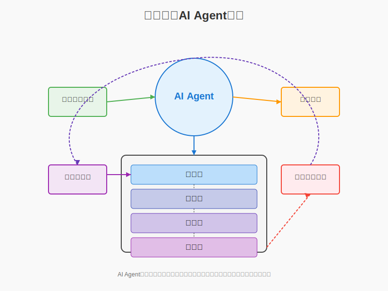

#### 5.1.2 工单自动生成流程

AI Agent根据诊断结果自动生成工单的流程如下：

1. **诊断结果解析**：解析诊断引擎输出的异常类型、原因概率分布
2. **治理方案选择**：根据诊断结果选择最佳治理方案
3. **工单内容生成**：生成包含异常描述、原因分析、处置建议的工单内容
4. **工单优先级确定**：根据异常类型、影响程度确定优先级
5. **工单分发策略**：根据处置单位和人员能力确定分发策略
6. **跟踪闭环机制**：建立工单执行跟踪和闭环确认机制

工单内容示例：

```
工单编号: TL202305120023
异常类型: 长期高损
台区信息: 河西变1324台区
异常描述: 该台区连续5个月相对线损率超过8%，属于长期高损台区
诊断结果: 
  - CT互感器倍率错误 (可能性: 82%)
  - 档案户变关系异常 (可能性: 12%)
  - 其他因素 (可能性: 6%)
处置建议:
  1. 核查台区总表CT变比设置，重点检查CT倍率是否为200/5
  2. 验证系统参数与现场实际参数是否一致
  3. 修正系统参数并回测线损率变化
处置优先级: 高
预计完成时间: 3个工作日
```

#### 5.1.3 工单系统集成

AI Agent与现有工单系统集成，实现诊断结果到工单的无缝转换：

1. **标准接口适配**：支持与主流工单系统的接口对接
2. **数据双向同步**：诊断结果推送至工单系统，工单处理状态反馈至线损系统
3. **统一认证授权**：与企业统一身份认证系统集成
4. **移动端支持**：支持通过移动终端查看和处理线损工单

### 5.2 标准化治理流程

针对不同类型的线损异常，系统制定了标准化的治理流程，为工作人员提供规范化的处理指引。

#### 5.2.1 长期高损治理流程

针对长期高损台区，制定了"四步治理法"：

1. **原因确认**：现场复核诊断结果，确认异常原因
   - CT倍率错误：核对CT变比与系统设置
   - 户变关系错误：核对台区用户清册与实际接线
   - 窃电情况：安排专项检查

2. **方案制定**：根据确认的原因，制定针对性治理方案
   - 计量装置问题：校准或更换计量设备
   - 档案错误：修正系统档案数据
   - 窃电治理：取证并依法处理

3. **实施跟踪**：执行治理方案并记录处理过程
   - 记录修正前后的参数变化
   - 拍照存档实施过程
   - 填写标准化治理记录表

4. **效果评估**：治理后持续监测线损指标变化
   - 连续三个月的线损率变化趋势
   - 治理前后对比分析
   - 治理经验总结与分享

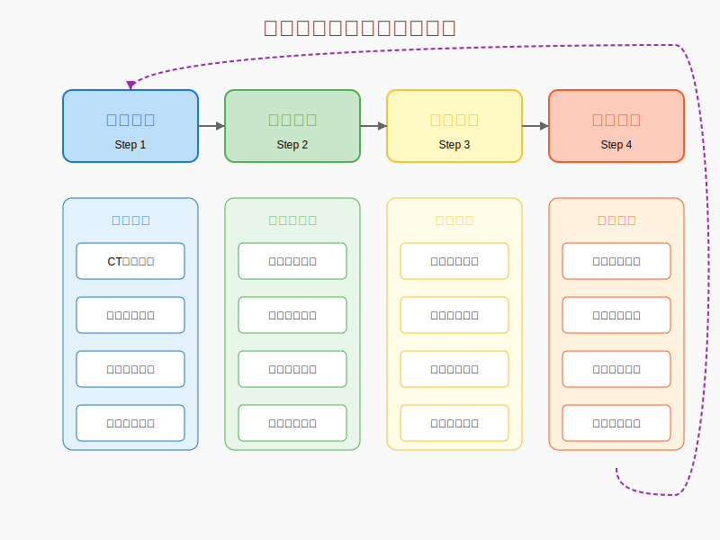

#### 5.2.2 突发高损治理流程

针对突发高损台区，采用"快速响应"治理流程：

1. **紧急研判**：快速分析负荷变化与异常发生时点
   - 分析异常发生时间段
   - 关联环境因素（天气、社会活动等）
   - 比对历史同期数据

2. **现场勘查**：安排专业人员进行现场检查
   - 检查新增负荷情况
   - 排查临时接电设备
   - 检查计量装置是否异常

3. **临时措施**：针对紧急情况采取临时控制措施
   - 对违规用电进行规范
   - 对临时用电安排专项计量
   - 对故障设备临时替换

4. **持续监测**：治理后密集监测数据变化
   - 实时监测负荷恢复情况
   - 分析线损率变化趋势
   - 评估治理效果

#### 5.2.3 长期负损治理流程

针对长期负损台区，制定了系统化治理流程：

1. **系统性分析阶段**
   - 收集台区全面数据，包括计量装置参数、接线方式
   - 运行负损专项诊断算法，识别可能原因
   - 分析负损存在的系统性问题

2. **重点检查阶段**
   - 按诊断标签概率排序，重点检查：
     - 电能表接线正确性
     - 互感器极性及接线正确性
     - 系统台户关系完整性
     - 光伏发电用户配置正确性
     - 台区总表前是否存在用电设备

3. **系统纠正阶段**
   - 修正计量装置接线问题
   - 更新系统档案信息
   - 调整不合理的计量点配置
   - 规范光伏发电用户并网计量方式

4. **长效监测阶段**
   - 建立台区负损专项监测机制
   - 每月进行数据一致性核查
   - 形成长期负损治理经验库

长期负损治理的关键在于精准识别计量问题，特别是接线错误、极性接反等导致计量偏差的问题，通过系统性分析和标准化检查，可高效解决负损问题。

#### 5.2.4 小负损治理流程

针对小负损台区，制定了精细化治理流程：

1. **模型评估阶段**
   - 评估理论线损计算模型适用性
   - 检查模型参数与实际台区参数的匹配度
   - 分析小负损的系统性原因

2. **精细化核查阶段**
   - 检查互感器配置合理性
   - 验证电表时钟同步状态
   - 评估供电半径对线损计算的影响
   - 检查数据采集质量

3. **优化调整阶段**
   - 优化理论线损计算模型参数
   - 调整互感器配置，提高计量精度
   - 实施电表时钟同步
   - 改善数据采集质量

4. **模型验证阶段**
   - 应用优化后的模型重新计算理论线损
   - 验证线损率是否回归合理范围
   - 形成小负损台区治理经验

小负损治理的关键是提高计量精度和优化理论模型，通过精细化调整和数据质量提升，可以有效解决小负损问题，提高线损管理水平。

#### 5.2.5 突发负损治理流程

针对突发负损台区，制定了快速响应流程：

1. **紧急诊断阶段**
   - 监测系统发出突发负损告警后12小时内响应
   - 进行远程诊断，确定可能原因
   - 安排现场检查计划

2. **快速检查阶段**
   - 重点检查电表计量状态
   - 检查互感器是否存在故障
   - 核实是否有倍率变更未同步
   - 检查功率因数补偿设备运行状态

3. **快速纠正阶段**
   - 更换故障计量设备
   - 修复接线错误
   - 更新系统档案信息
   - 调整功率因数补偿设备参数

4. **后续跟踪阶段**
   - 处置后48小时内持续监测
   - 确认问题是否彻底解决
   - 分析突发负损根本原因
   - 制定预防措施，避免再次发生

突发负损治理的重点是快速响应和精准纠正，特别需要关注计量设备突发故障、倍率变更未同步等问题，通过标准化流程可以高效解决突发负损问题，减少电网损失。

### 5.3 治理效果评估方法

#### 5.3.1 量化评估指标

系统建立了一套完整的治理效果量化评估指标体系：

1. **直接效益指标**
   - 线损率改善值：治理前后线损率的绝对变化值
   - 线损电量节约：治理带来的线损电量减少值
   - 经济效益：线损电量节约转化的经济价值

2. **持续性指标**
   - 线损率稳定性：治理后线损率的标准差
   - 反弹情况：治理后是否出现线损率回升
   - 持续时长：治理效果维持的时间

3. **综合效益指标**
   - 投入产出比：治理成本与经济效益的比值
   - 台区质量改善度：台区运行质量的综合提升程度
   - 管理效能提升：线损管理能力的提升程度

#### 5.3.2 效果评价方法

系统采用多角度评价方法，全面评估治理效果：

1. **历史对比法**：与治理前历史数据对比
   $改善率 = \frac{治理前线损率 - 治理后线损率}{治理前线损率} \times 100\%$

2. **同类对比法**：与同类台区平均水平对比
   $相对水平 = \frac{治理后台区线损率}{同类台区平均线损率} \times 100\%$

3. **理论值对比法**：与理论线损率对比
   $接近度 = \frac{治理后线损率}{理论线损率} \times 100\%$

4. **综合评分法**：多维度综合评价
   $综合得分 = w_1 \times 改善率 + w_2 \times 相对水平 + w_3 \times 接近度 + w_4 \times 持续性$
   其中，$w_1, w_2, w_3, w_4$为权重系数，根据管理重点设定。

#### 5.3.3 治理成效可视化

系统提供多种可视化方式展示治理成效：

1. **趋势图**：展示治理前后线损率变化趋势
2. **对比图**：治理前后关键指标的直观对比
3. **雷达图**：多维度展示台区质量改善情况
4. **地图热力图**：区域治理效果的空间分布
5. **成效报告**：自动生成标准化治理成效报告

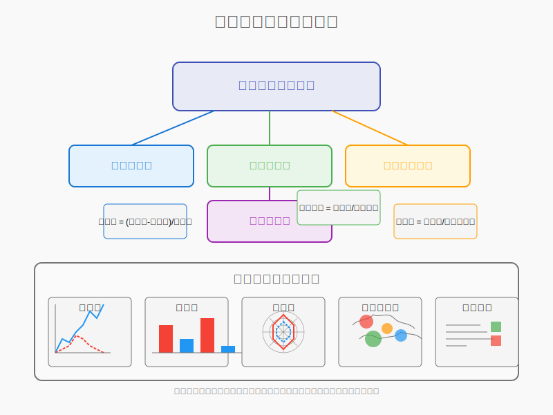

### 5.4 经验积累与知识沉淀

#### 5.4.1 典型案例库建设

系统建设了线损治理典型案例库，实现经验沉淀与知识共享：

1. **案例采集标准化**：制定统一的案例采集标准
   - 问题特征描述
   - 诊断过程记录
   - 治理方法详解
   - 效果评估数据
   - 关键经验总结

2. **案例分类体系**：建立多维度案例分类体系
   - 按异常类型分类
   - 按原因类型分类
   - 按治理方法分类
   - 按效果程度分类
   - 按区域特点分类

3. **案例质量评价**：案例质量评价与筛选机制
   - 案例完整性评价
   - 案例典型性评价
   - 案例可复制性评价
   - 用户评价反馈

#### 5.4.2 知识图谱构建

系统构建线损管理知识图谱，支持智能诊断与治理：

1. **知识元素提取**：从案例中提取结构化知识元素
   - 异常表现特征
   - 原因诊断要点
   - 治理方法步骤
   - 因果关联关系

2. **知识关联网络**：建立知识元素间的关联网络
   - 异常-原因关联
   - 原因-方法关联
   - 方法-效果关联
   - 区域特征关联

3. **知识推理规则**：建立基于知识图谱的推理规则
   - 基于特征的原因推断
   - 基于原因的方法推荐
   - 基于方法的效果预测
   - 基于区域的特征调整

知识图谱结构示例：

```
(异常特征:长期高损) -[表现为]-> (表现:连续高于基准值)
(异常特征:长期高损) -[可能原因]-> (原因:CT倍率错误)
(原因:CT倍率错误) -[诊断方法]-> (方法:计量装置检测)
(原因:CT倍率错误) -[治理方法]-> (方法:参数校准)
(方法:参数校准) -[预期效果]-> (效果:线损率立即降低)
(区域:农村地区) -[常见问题]-> (原因:户变关系错误)
```

