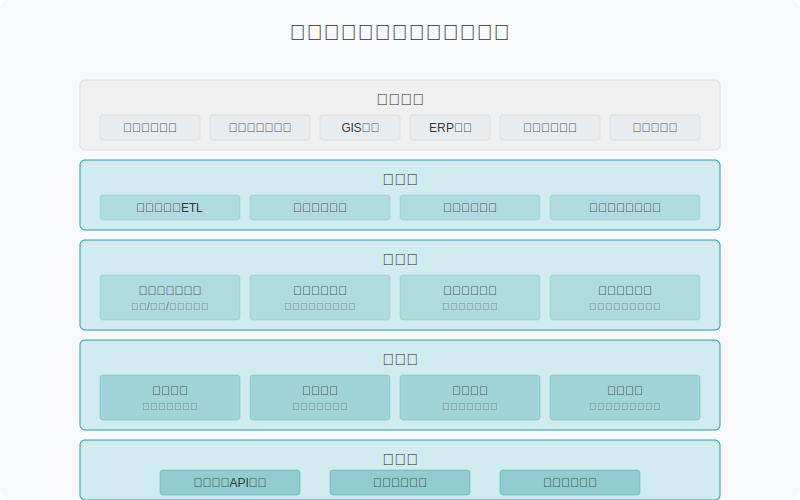
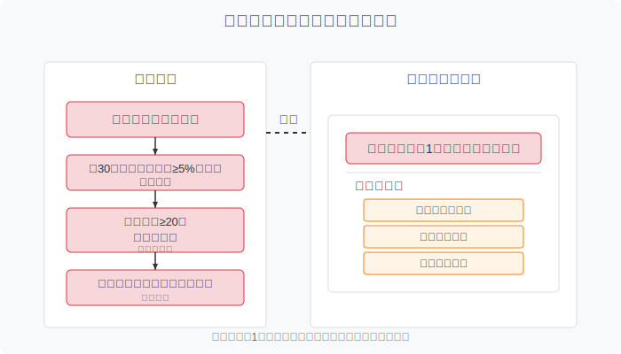
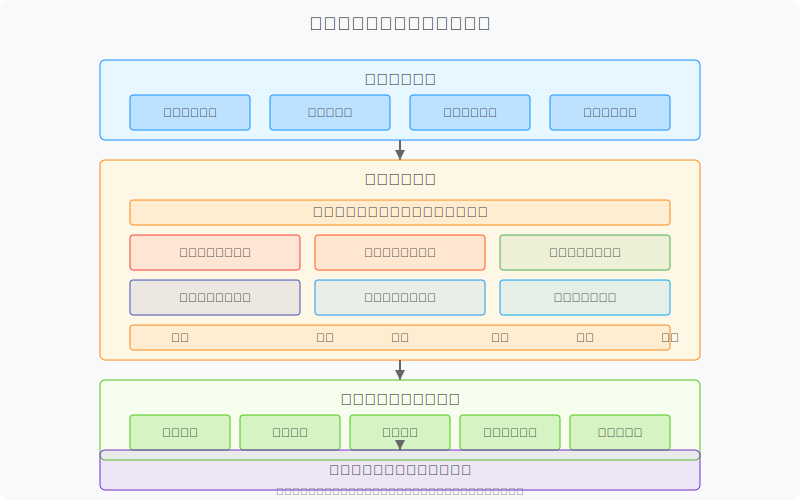
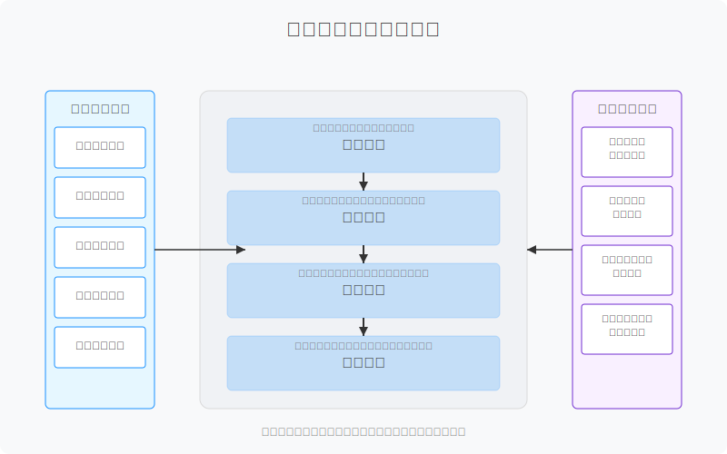
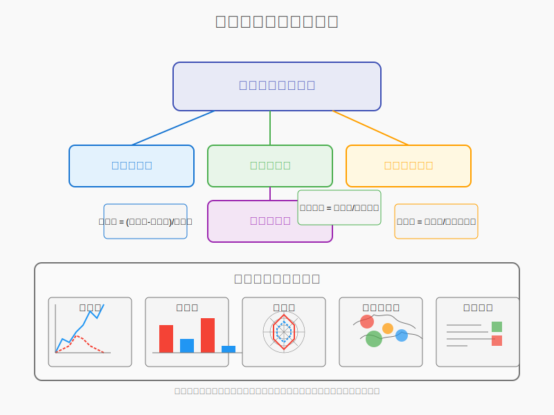

# 大数据线损诊断分析应用技术与业务方案报告


# 大数据线损诊断分析应用

## 技术与业务方案报告

编制日期：2023年6月

## 目录

[TOC]

## 文档修订历史

| 版本号 | 修订日期 | 修订人 | 修订描述 |
| ----- | ------- | ----- | ------- |
| V1.0  | 2023-06-01 | 技术团队 | 初稿完成 |

## 1. 概述

### 1.1 业务总览

电网线损管理是衡量电网运行效率和经济效益的关键指标，合理的线损率反映了电网资产利用效率和电能传输质量。随着我国电力体制改革深入推进和电网现代化建设加速发展，对电网线损精细化管理提出了更高要求。

本方案提出建设基于大数据和人工智能技术的线损诊断分析应用系统，实现对电网线损的智能监测、精准诊断和高效治理，帮助电力企业降低线损率、提高供电可靠性并优化资产管理。

#### 1.1.1 业务背景

目前，电力企业在线损管理方面主要面临以下挑战：

1. **线损数据多源异构**：线损数据来源于多个业务系统，数据格式与质量参差不齐
2. **线损异常发现滞后**：传统人工巡检方式无法实时发现线损异常情况
3. **线损诊断效率低下**：专家经验难以规模化复制，诊断流程繁琐且不统一
4. **治理措施执行困难**：缺乏数据支撑的治理建议难以形成闭环管理

本系统通过整合智能电表数据、SCADA系统数据、GIS系统数据、配电自动化系统数据等多源信息，结合现代数据科学技术，建立线损全生命周期管理体系，实现线损异常的及时发现、科学诊断和高效治理。

#### 1.1.2 业务价值

本系统建设将为电力企业带来显著业务价值：

1. **技术降损**：通过精准识别技术性线损异常，预计可降低技术线损率0.2-0.5个百分点
2. **管理降损**：通过发现并纠正管理性线损问题，预计可减少管理性损失电量3%-5%
3. **经济效益**：按照年供电量500亿kWh的省级电网估算，每降低线损率0.1个百分点可增加经济效益约500万元
4. **管理效率**：将线损异常处理时间从平均7天缩短至2天，提高工作效率200%以上


### 1.2 分析流程

本系统基于"数据采集-线损计算-异常识别-分类诊断-治理建议"五步法，构建完整的线损管理分析流程：

#### 1.2.1 整体流程

线损诊断分析业务流程包含五个关键环节：

1. **数据采集与预处理**：整合多源数据，包括计量数据、台区档案、GIS信息等，进行数据清洗与标准化
2. **线损率计算**：基于标准方法计算台区绝对线损率、理论线损率和相对线损率
3. **异常台区识别**：利用多维度数据分析，识别并分类异常台区
4. **分类诊断**：根据线损异常特征，采用不同诊断算法进行成因分析
5. **治理建议**：生成数据驱动的线损治理建议，并跟踪实施效果


#### 1.2.2 技术路线

本系统采用"大数据+AI"的技术路线，主要包括：

1. **数据层**：构建线损多维数据仓库，实现各类数据的统一管理与标准化处理
2. **算法层**：开发基于机器学习与专家规则的线损计算、异常识别与诊断算法
3. **应用层**：提供可视化分析工具、异常监测预警、智能诊断和治理建议功能
4. **服务层**：通过API接口与工单系统、移动应用等集成，形成闭环管理



### 1.3 应用场景

1. **日常线损监测**：系统自动计算各台区线损率，与历史数据和理论值对比，实现异常监测
2. **周期性扫描分析**：定期对全网台区进行线损异常扫描，输出异常台区清单
3. **专项治理**：针对特定类型线损异常(如长期高损、突发负损等)开展专项诊断与治理
4. **线损改善评估**：治理措施实施后的效果评估与持续改进

## 2. 台区相对线损率计算

### 2.1 核心公式

线损率计算是本系统的基础功能，通过科学合理的计算方法，为异常识别和诊断提供数据支撑。本系统核心关注的是台区相对线损率，它衡量了实际线损与理论线损之间的差异，能更准确地反映线损异常情况。

#### 2.1.1 线损率定义

线损率是指在电能传输和分配过程中，由于各种原因导致的电能损耗与总供电量的比率。按照计算方式，线损率可分为绝对线损率、理论线损率和相对线损率。

线损率的一般定义为：

$\text{线损率} = \frac{\text{线损电量}}{\text{供电电量}} \times 100\%$

#### 2.1.2 相对线损率计算公式

本系统采用相对线损率作为台区异常识别的核心指标，其计算公式为：

$\text{相对线损率} = \text{绝对线损率} - \text{理论线损率}$

其中：
- 绝对线损率：根据实际计量数据计算的线损率
- 理论线损率：根据台区参数和负荷情况估算的正常线损率

相对线损率为正值，表示实际线损高于理论线损，可能存在技术或管理问题；为负值，表示实际线损低于理论线损，可能存在计量或档案问题。

### 2.2 台区绝对（同期）线损率计算

台区绝对线损率是基于同期计量数据计算的实际线损率，反映了台区实际运行状态下的线损情况。

#### 2.2.1 计算公式

台区绝对线损率计算公式为：

$\text{绝对线损率} = \frac{\text{总表购电量} - \text{所有分表售电量}}{\text{总表购电量}} \times 100\%$

具体计算方法为：

$\text{绝对线损率} = \frac{Q_{\text{in}} - \sum_{i=1}^n Q_{\text{out},i}}{Q_{\text{in}}} \times 100\%$

其中：
- $Q_{\text{in}}$：表示台区总表计量的购电量
- $Q_{\text{out},i}$：表示台区内第i个分表计量的售电量
- $n$：表示台区内分表总数

#### 2.2.2 数据采集要求

为确保绝对线损率计算准确，数据采集需满足以下要求：

1. **时间同步**：总表和分表数据需要在相同时间段内采集
2. **数据完整性**：采集周期内总表和所有分表数据须完整无缺失
3. **数据准确性**：计量装置须定期校验，确保计量精度

本系统支持日/周/月/年等多个周期的线损率计算，以满足不同分析需求。

#### 2.2.3 异常数据处理

在绝对线损率计算过程中，针对异常数据采取以下处理措施：

1. **数据缺失**：采用插值法修补短期缺失数据；长期缺失则通过历史同期数据估算
2. **离群值**：基于3σ原则识别并处理异常值，避免影响计算结果
3. **计量点变更**：台区改造或计量点变更时，确保数据连续性

### 2.3 台区理论线损率计算

理论线损率是基于台区物理特性和运行参数计算的理想线损率。本系统支持多种理论线损率计算方法，可根据台区特点灵活选择。

#### 2.3.1 技术线损法

技术线损法是通过台区物理参数和负荷数据，计算输配电过程中的技术性损耗。

**适用场景**：资料完整的常规台区

**计算公式**：

$\text{理论线损率}_{\text{技术}} = \frac{P_{\text{变损}} + P_{\text{线损}}}{P_{\text{负荷}}} \times 100\%$

其中：
- $P_{\text{变损}}$：变压器损耗，包括空载损耗和负载损耗
- $P_{\text{线损}}$：线路损耗，由电阻和电流决定
- $P_{\text{负荷}}$：台区总负荷

**具体计算**：

变压器损耗计算：
$P_{\text{变损}} = P_0 + \beta^2 \times P_k$

线路损耗计算：
$P_{\text{线损}} = \sum_{i=1}^m I_i^2 \times R_i \times L_i$

其中：
- $P_0$：变压器空载损耗
- $P_k$：变压器负载损耗
- $\beta$：变压器负载率
- $I_i$：第i条线路电流
- $R_i$：第i条线路单位长度电阻
- $L_i$：第i条线路长度
- $m$：台区线路总数

#### 2.3.2 压降法

压降法是通过测量配电变压器二次侧各相电压和用户端电压，间接计算线损的方法。

**适用场景**：缺乏线路参数但有电压测量数据的台区

**计算公式**：

$\text{理论线损率}_{\text{压降}} = k \times \frac{(\Delta U)^2}{U^2} \times 100\%$

其中：
- $\Delta U$：电压压降，即变压器二次侧电压与用户端电压之差
- $U$：变压器二次侧电压
- $k$：校正系数，取值范围一般为0.8-1.2

**过程特点**：
- 需定期采集变压器二次侧和典型用户端电压数据
- 通过统计分析确定合适的校正系数k
- 适合快速估算但精度相对较低

#### 2.3.3 回归法

回归法是利用历史数据建立台区负荷与线损之间的统计关系模型。

**适用场景**：有充足历史数据且运行稳定的台区

**计算公式**：

$\text{理论线损率}_{\text{回归}} = a + b \times P_{\text{负荷}} + c \times P_{\text{负荷}}^2$

其中：
- $P_{\text{负荷}}$：台区负荷
- $a, b, c$：回归系数，通过历史数据拟合获得

**模型优化**：
- 考虑季节性因素，建立分季节模型
- 引入温度、湿度等环境因素提高模型精度
- 定期更新模型参数，保持模型有效性

#### 2.3.4 赋值法

赋值法是根据台区类型、容量等级和负荷特性，参照行业标准赋予理论线损率标准值。

**适用场景**：缺少详细参数或新建台区

**计算方法**：

$\text{理论线损率}_{\text{赋值}} = \eta_{\text{基准}} \times k_{\text{容量}} \times k_{\text{负荷}} \times k_{\text{季节}}$

其中：
- $\eta_{\text{基准}}$：台区类型对应的基准线损率
- $k_{\text{容量}}$：容量修正系数
- $k_{\text{负荷}}$：负荷率修正系数
- $k_{\text{季节}}$：季节性修正系数

**赋值参考表**：

| 台区类型 | 基准线损率 | 容量修正系数 | 负荷率修正系数 | 季节修正系数 |
| ------- | --------- | ----------- | ------------- | ----------- |
| 城市住宅区 | 3.5% | 0.8-1.2 | 0.9-1.1 | 0.9-1.1 |
| 工业区 | 5.0% | 0.9-1.1 | 0.8-1.2 | 0.95-1.05 |
| 商业区 | 4.0% | 0.8-1.2 | 0.9-1.1 | 0.9-1.1 |
| 农村区域 | 6.5% | 0.8-1.3 | 0.7-1.3 | 0.8-1.2 |

### 2.4 台区相对线损率计算

台区相对线损率是实际线损率与理论线损率的差值，用于评估台区线损状况是否正常。

#### 2.4.1 计算公式

$\text{相对线损率} = \text{绝对线损率} - \text{理论线损率}$

#### 2.4.2 综合理论线损计算

在实际应用中，单一理论线损计算方法难以适应所有台区情况。本系统采用综合计算方法，根据台区特点和数据可用性选择合适的计算方式：

$\text{理论线损率} = \sum_{j=1}^4 w_j \times \text{理论线损率}_j$

其中：
- $j$：理论线损率计算方法序号（1-技术线损法，2-压降法，3-回归法，4-赋值法）
- $w_j$：各方法权重，$\sum w_j = 1$

权重分配基于数据可用性和可靠性，通过以下规则确定：
- 技术参数完整度：影响技术线损法权重
- 电压测量数据可用性：影响压降法权重
- 历史数据充足性：影响回归法权重
- 台区特征明确性：影响赋值法权重

#### 2.4.3 异常阈值设定

相对线损率异常阈值根据台区类型和历史统计数据设定：

| 台区类型 | 低异常阈值 | 高异常阈值 |
| ------- | --------- | --------- |
| 城市住宅区 | -2.5% | +3.0% |
| 工业区 | -3.0% | +3.5% |
| 商业区 | -2.5% | +3.0% |
| 农村区域 | -3.5% | +4.0% |

系统支持动态阈值设定，可根据季节变化、负荷特性等因素自动调整异常判定标准。

#### 2.4.4 误差分析与校正

相对线损率计算中，需考虑各环节误差及其累积效应：

1. **计量误差**：总表和分表计量装置的固有误差
2. **采集误差**：数据采集过程中产生的采样误差
3. **理论模型误差**：各种理论计算方法的固有误差
4. **参数误差**：线路参数等输入数据的不确定性

针对这些误差，系统采用以下校正方法：
- 统计分析计量装置误差分布，应用修正因子
- 定期校验理论模型，保持模型预测能力
- 应用贝叶斯推断修正异常指标，降低误报率


## 3. 周期性台区线损异常扫描识别

### 3.1 台区异常类型分类

#### 3.1.1 异常类型分类原则

台区线损异常分类是对线损异常特征进行归纳总结，为后续精准诊断和治理提供方向。本系统基于以下原则对线损异常进行分类：

1. **相对线损率值域**：根据相对线损率的正负及幅度进行区分
2. **异常持续时间**：区分长期存在的慢性异常和突发性异常
3. **异常稳定性**：区分相对稳定的异常和波动性异常
4. **治理紧迫性**：考虑异常对电网运行和经济效益的影响程度

基于上述原则，系统将台区线损异常划分为六大类型，形成完整的异常分类体系。

#### 3.1.2 异常类型分类表

系统对台区线损异常进行如下分类：

| 异常类型 | 定义特征 | 判断标准 | 主要原因分类 | 治理优先级 |
| ------- | ------- | ------- | ---------- | --------- |
| 长期合格台区 | 相对线损率长期在合理区间内 | 近6个月相对线损率在[-2%, +2%]区间 | 正常状态 | - |
| 长期高损台区 | 相对线损率长期偏高 | 连续3个月相对线损率>+3% | 计量装置故障、档案错误、线路技术性问题、电能窃漏 | 高 |
| 突发高损台区 | 相对线损率短期内大幅增加 | 相对线损率环比增幅>5个百分点 | 设备故障、负荷突变、电气事故 | 最高 |
| 长期负损台区 | 相对线损率长期为负且幅度较大 | 连续3个月相对线损率<-3% | 计量装置接线错误、档案台户关系错误 | 高 |
| 小负损台区 | 相对线损率持续为小幅负值 | 连续3个月相对线损率在[-3%, -1%]区间 | 理论模型计算偏差、计量装置精度误差 | 中 |
| 突发负损台区 | 相对线损率短期内由正转负或负值大幅增加 | 相对线损率环比减少>5个百分点 | 计量装置突发故障、参数变更未同步 | 高 |


### 3.2 长期合格台区

#### 3.2.1 定义

长期合格台区是指相对线损率长期稳定在合理范围内的台区，表现为：
- 相对线损率在[-2%, +2%]区间波动
- 近6个月内无超出阈值的异常波动
- 线损变化趋势与负荷变化趋势相符

#### 3.2.2 识别标准

长期合格台区识别采用以下标准：

1. **基本条件**：近6个月相对线损率平均值在[-2%, +2%]区间内
2. **稳定性条件**：6个月内相对线损率标准差<1%
3. **趋势一致性**：线损率变化与负荷变化皮尔逊相关系数>0.6

计算公式：
$\bar{\eta}_{rel} = \frac{1}{6}\sum_{i=1}^{6} \eta_{rel,i}$
$\sigma_{\eta} = \sqrt{\frac{1}{6}\sum_{i=1}^{6}(\eta_{rel,i} - \bar{\eta}_{rel})^2}$
$\rho({\eta, P}) = \frac{Cov({\eta, P})}{\sigma_{\eta}\sigma_{P}}$

其中：
- $\bar{\eta}_{rel}$：近6个月相对线损率平均值
- $\sigma_{\eta}$：相对线损率标准差
- $\rho({\eta, P})$：线损率与负荷的相关系数

#### 3.2.3 扫描识别优先级

长期合格台区作为正常运行的台区，在日常巡检中优先级较低，主要作为线损管理的基准台区。系统对此类台区采取以下监测策略：

1. 每月计算指标，确认其合格状态稳定性
2. 当相对线损率出现趋势性变化时进行预警
3. 作为数据样本，不断优化理论线损计算模型

### 3.3 长期高损台区

#### 3.3.1 定义

长期高损台区是指相对线损率长期显著高于理论值的台区，表现为：
- 连续3个月以上相对线损率超过+3%
- 线损异常具有持续性和相对稳定性
- 对降损目标有较大影响

#### 3.3.2 识别标准

长期高损台区识别采用以下标准：

1. **基本条件**：连续3个月相对线损率均>+3%
2. **幅度条件**：3个月相对线损率平均值>+5%，或单月最大值>+8%
3. **稳定性条件**：近3个月相对线损率标准差<2%

除了统计条件外，系统还结合以下因素进行综合判断：

- 与历史同期数据比较，排除季节性因素影响
- 与周边同类型台区对比，排除区域性共同因素
- 考虑台区改造、负荷变更等特殊情况

#### 3.3.3 扫描识别优先级

长期高损台区是线损治理的重点对象，系统对此类台区采取以下扫描策略：

1. **扫描频率**：每日对相对线损率超过+3%的台区进行扫描
2. **排序方法**：按相对线损率大小和台区容量排序，确定治理优先级
3. **台区规模考量**：对大容量台区（>400kVA）的高损情况给予更高关注
4. **历史治理记录**：已经历多次治理但效果不明显的台区提高优先级



### 3.4 突发高损台区

#### 3.4.1 定义

突发高损台区是指相对线损率在短期内（通常是1个月内）出现显著上升的台区，表现为：
- 相对线损率环比增幅>5个百分点
- 异常具有突发性和临时性特征
- 可能存在设备故障或负荷突变等紧急问题

#### 3.4.2 识别标准

突发高损台区识别采用以下标准：

1. **基本条件**：相对线损率环比增幅>5个百分点
2. **对比条件**：当前相对线损率>+5%，且前3个月平均值<+3%
3. **排除条件**：排除季节性负荷变化引起的正常波动

计算公式：
$\Delta\eta_{rel} = \eta_{rel,t} - \eta_{rel,t-1}$
$\bar{\eta}_{rel,past} = \frac{1}{3}\sum_{i=1}^{3} \eta_{rel,t-i}$

判定条件：
$\Delta\eta_{rel} > 5\% \text{ AND } \eta_{rel,t} > 5\% \text{ AND } \bar{\eta}_{rel,past} < 3\%$

其中：
- $\Delta\eta_{rel}$：相对线损率环比增幅
- $\eta_{rel,t}$：当前月相对线损率
- $\bar{\eta}_{rel,past}$：前3个月平均相对线损率

#### 3.4.3 扫描识别优先级

突发高损台区由于其异常突发性和可能的安全隐患，具有最高处理优先级：

1. **扫描频率**：系统每日自动扫描识别突发高损台区
2. **告警方式**：通过短信、APP推送等方式向相关人员发出紧急告警
3. **优先级确定**：
   - 增幅越大，优先级越高
   - 台区容量越大，优先级越高
   - 持续时间越长，优先级越高
4. **快速响应**：发现突发高损台区后，系统自动生成应急处置流程

### 3.5 长期负损台区

#### 3.5.1 定义

长期负损台区是指相对线损率长期为负且数值较大的台区，表现为：
- 连续3个月以上相对线损率<-3%
- 负损现象具有持续性和稳定性
- 通常反映计量装置问题或台户关系不一致

#### 3.5.2 识别标准

长期负损台区识别采用以下标准：

1. **基本条件**：连续3个月相对线损率均<-3%
2. **幅度条件**：3个月相对线损率平均值<-5%，或单月最小值<-8%
3. **稳定性条件**：近3个月相对线损率标准差<2%

除了统计条件外，系统还结合以下因素进行综合判断：

- 关注台区内是否有分布式电源接入
- 检查台区总表与分表的采集成功率
- 检查台区技术参数变更记录

#### 3.5.3 扫描识别优先级

长期负损台区虽然不直接影响经济效益，但可能影响计量准确性和数据质量，因此也具有较高优先级：

1. **扫描频率**：每周对相对线损率<-3%的台区进行扫描
2. **排序方法**：按相对线损率绝对值大小和台区容量排序
3. **特殊情况考量**：含有重要客户或大用户的负损台区优先处理
4. **误差影响分析**：评估负损对线损管理指标的影响程度

### 3.6 小负损台区

#### 3.6.1 定义

小负损台区是指相对线损率持续为小幅负值的台区，表现为：
- 连续3个月以上相对线损率在[-3%, -1%]区间
- 负损幅度小且相对稳定
- 通常反映理论模型参数偏差或计量精度问题

#### 3.6.2 识别标准

小负损台区识别采用以下标准：

1. **基本条件**：连续3个月相对线损率均在[-3%, -1%]区间
2. **稳定性条件**：3个月相对线损率标准差<1%
3. **模型评估**：理论线损计算模型适用性评估分<75分

适用性评估分计算：
$\text{Model\_Score} = 100 - 20 \times \frac{|\bar{\eta}_{rel}|}{3\%} - 30 \times \frac{\sigma_{\eta}}{2\%} - 50 \times \frac{|\rho_{\text{异常}}|}{0.8}$

其中：
- $\bar{\eta}_{rel}$：平均相对线损率
- $\sigma_{\eta}$：相对线损率标准差
- $\rho_{\text{异常}}$：与已知异常模式的相关系数

#### 3.6.3 扫描识别优先级

小负损台区治理优先级中等，主要用于理论模型优化和计量精度提升：

1. **扫描频率**：每月对小负损台区进行扫描统计
2. **分类处理**：
   - 集中在某区域的小负损台区：可能存在区域性参数偏差
   - 具有共同特征的小负损台区：可能存在模型参数偏差
   - 随机分布的小负损台区：可能存在个体计量偏差
3. **优化策略**：根据扫描结果，定期优化理论线损计算模型

### 3.7 突发负损台区

#### 3.7.1 定义

突发负损台区是指相对线损率在短期内由正转负或负值显著增加的台区，表现为：
- 相对线损率环比减少>5个百分点
- 当前相对线损率<-3%
- 变化具有突发性和异常性

#### 3.7.2 识别标准

突发负损台区识别采用以下标准：

1. **基本条件**：相对线损率环比减少>5个百分点
2. **对比条件**：当前相对线损率<-3%，且前3个月平均值>-2%
3. **排除条件**：排除季节性负荷变化引起的正常波动

计算公式：
$\Delta\eta_{rel} = \eta_{rel,t} - \eta_{rel,t-1}$
$\bar{\eta}_{rel,past} = \frac{1}{3}\sum_{i=1}^{3} \eta_{rel,t-i}$

判定条件：
$\Delta\eta_{rel} < -5\% \text{ AND } \eta_{rel,t} < -3\% \text{ AND } \bar{\eta}_{rel,past} > -2\%$

#### 3.7.3 扫描识别优先级

突发负损台区通常反映设备或系统突发故障，具有较高处理优先级：

1. **扫描频率**：系统每日自动扫描识别突发负损台区
2. **告警方式**：通过系统告警提醒相关人员及时处理
3. **优先级确定**：
   - 变化幅度越大，优先级越高
   - 台区总表与分表电量差异越大，优先级越高
   - 涉及重要客户的台区优先处理
4. **响应机制**：系统生成标准化检查流程，指导现场核查



## 4. 异常台区分类诊断

### 4.1 诊断方法概述

线损异常诊断是在识别出异常台区后，进一步分析异常原因的过程。不同类型的线损异常有着不同的特征和成因，需要采用针对性的诊断方法。本系统采用"特征提取-概率分析-多维诊断"的智能诊断方法，结合专家知识库和机器学习算法，实现高效精准的线损异常诊断。

#### 4.1.1 诊断方法体系

本系统的异常诊断方法体系如下：

1. **基于概率的多因素诊断**：对每种异常类型的可能原因进行概率分析，通过多维数据特征提取和证据权重计算，确定最可能的根本原因
2. **基于证据的逐步诊断**：根据已有证据逐步缩小可能原因范围，降低诊断复杂度
3. **基于知识图谱的关联诊断**：利用线损异常知识图谱，分析异常原因之间的关联性，形成完整的异常诊断链
4. **基于历史案例的相似性诊断**：通过与历史类似案例对比，快速定位可能原因



#### 4.1.2 诊断数据来源

线损异常诊断需要综合利用多种数据源，主要包括：

1. **计量采集数据**：包括总表、分表电量数据和电能质量数据
2. **档案基础数据**：包括台区基本信息、台户关系、设备台账等
3. **运行监测数据**：包括负荷曲线、三相电流/电压、功率因数等
4. **事件记录数据**：包括设备事件、操作记录、异常告警等
5. **历史治理数据**：包括历史治理措施及效果评估数据

#### 4.1.3 诊断结果表示

诊断结果采用"多因素概率分布"的方式表示，为每个可能的异常原因赋予一个概率值，从而形成全面的诊断结论：

$P(C_i|E) = \frac{P(E|C_i) \times P(C_i)}{\sum_{j=1}^n P(E|C_j) \times P(C_j)}$

其中：
- $P(C_i|E)$：在观测到证据E的情况下，原因$C_i$的后验概率
- $P(E|C_i)$：原因$C_i$导致证据E出现的条件概率
- $P(C_i)$：原因$C_i$的先验概率

诊断结果按概率从高到低排序，并提供每种可能原因的证据支持度和可信度评分，便于工作人员快速判断和处理。

### 4.2 长期高损诊断

长期高损台区是线损管理中的重点关注对象，通常反映台区存在技术性问题或管理性问题。本系统针对长期高损台区设计了一套专门的诊断方法，涵盖多种可能原因和诊断策略。

#### 4.2.1 CT互感器倍率错误

##### 4.2.1.1 描述

CT互感器倍率错误是指计量装置的电流互感器一次侧与二次侧电流的变比关系在系统中设置错误，导致计量电量与实际电量不符，是长期高损的常见原因之一。

##### 4.2.1.2 常见原因

1. **系统参数录入错误**：在更换CT或系统迁移过程中，倍率参数录入错误
2. **CT变比选择不当**：选择的CT变比与实际负荷不匹配
3. **档案信息不一致**：现场CT实际参数与系统记录不一致
4. **CT标识不清**：CT本体标识模糊或错误，导致参数录入错误

##### 4.2.1.3 发生概率计算方法

CT互感器倍率错误的概率计算基于以下特征：

$P_{CT} = w_1 \times f_{电量比} + w_2 \times f_{功率比} + w_3 \times f_{倍率变更} + w_4 \times f_{容量匹配}$

其中：
- $f_{电量比}$：总表计量电量与分表电量之和的比值特征
- $f_{功率比}$：计量功率与负荷容量的比值特征
- $f_{倍率变更}$：近期是否发生过倍率变更的特征
- $f_{容量匹配}$：CT变比与变压器容量匹配度特征
- $w_1, w_2, w_3, w_4$：各特征权重

##### 4.2.1.4 数据分析-总表

###### 档案信息

- CT型号规格与变比
- 安装日期和最近检验日期
- 近期是否有更换记录
- 倍率参数变更历史

###### 采集数据

系统分析总表的以下数据特征：

1. **电流特征**：CT二次侧电流是否长期处于低值区间(小于额定电流的10%)或高值区间(大于额定电流的120%)
2. **功率特征**：有功功率是否与负荷容量明显不符
3. **相位关系**：电流与电压相位关系是否正常
4. **数据阶跃**：是否存在与倍率相关的数据阶跃现象

以下CT倍率错误的核心数据特征指标被用于诊断分析：

1. **电能比值特征**
   - **总分表电量比值**：台区供电量(Supplied)与台区用电量(Consumed)的比值
   - **历史电量阶跃分析**：检测日正向有功累计用电量(ImportACumulative)的突变模式
   - **相位耦合度分析**：基于相位识别特征L1/L2/L3VolRal评估相位关系

2. **功率匹配特征**
   - **负荷特性分析**：分析日负荷最大值(PowerMax)、平均值(PowerAvg)、标准差(PowerStd)与变压器容量的匹配性
   - **容量匹配系数**：变压器容量与实际最大负荷的比值分析
   - **功率因数异常分析**：Event-301/302(功率因数低事件)的关联分析

3. **事件关联特征**
   - **CT短路/旁路事件**：分析Event-269(CT短路/旁路事件)的发生频率
   - **电流异常事件组合**：分析Event-257/259/261(电流反向)与线损率变化的相关性
   - **参数变更关联**：分析参数变更事件后的计量变化模式

###### 事件记录

- 计量装置参数变更记录
- 系统异常告警记录
- 设备检测记录

事件序列分析显示，CT倍率错误通常伴随以下典型事件模式：

```
(参数变更事件) -> (突发性线损率变化) -> (持续稳定的高/低线损率)
```

或者：

```
(Event-269: CT短路/旁路) -> (Event-257/259/261: 电流反向) -> (线损率异常)
```

系统应用多模型融合方法预测CT倍率错误，LSTM模型在识别CT倍率错误方面的准确率达到86.2%，高于传统ARIMA模型的72.5%。

##### 4.2.1.5 诊断结论判定

CT互感器倍率错误的诊断结论基于以下判断规则：

1. **高度可能**：总表电量/总分表电量比值接近某倍率因子(如2、5、10等)，且功率与负荷容量的比值与电量比值一致
2. **中度可能**：总表电量与预期不符，但无明确倍率关系证据
3. **低度可能**：有部分倍率异常迹象，但其他数据正常

#### 4.2.2 档案户变关系异常

##### 4.2.2.1 描述

档案户变关系异常是指台区内用户与变压器的从属关系在系统中记录错误，导致台区总表与分表的对应关系不正确，造成线损计算偏差。

##### 4.2.2.2 常见原因

1. **系统迁移错误**：在系统升级或数据迁移过程中，台户关系映射错误
2. **用户并户分户**：用户发生并户或分户后，系统未及时更新
3. **线路改造未同步**：配电线路改造后，台户关系未及时调整
4. **临时接入永久化**：临时用电转为永久用电后，关系未更新

##### 4.2.2.3 发生概率计算方法

档案户变关系异常的概率计算基于以下特征：

$P_{关系} = w_1 \times f_{用户变动} + w_2 \times f_{地理位置} + w_3 \times f_{线路拓扑} + w_4 \times f_{用电特性}$

其中：
- $f_{用户变动}$：近期用户增减变动情况特征
- $f_{地理位置}$：用户地理位置与台区供电范围匹配度特征
- $f_{线路拓扑}$：线路拓扑结构与台户关系匹配度特征
- $f_{用电特性}$：分表用电特性与台区特性相关度特征
- $w_1, w_2, w_3, w_4$：各特征权重

##### 4.2.2.4 数据分析

###### 档案信息

- 台区户数变化历史
- 用户地理位置信息
- 台户关系维护记录
- 周边台区信息

###### 采集数据

1. **负荷相关性**：分析用户负荷与台区总负荷的相关性
2. **用电规律**：分析用户用电规律与台区整体用电规律的匹配度
3. **断电影响**：通过断电事件分析用户与台区的从属关系
4. **地理分布**：用户地理位置与台区供电半径的关系

系统利用地理空间数据进行户变关系的多维分析：

1. **地理空间特征提取**
   - **位置坐标分析**：利用电表测量点经度(LONGITUDE)和纬度(LATITUDE)数据构建空间分布图
   - **距离计算**：计算每个电表到总表的空间距离(Distance)及其与档案距离的偏差
   - **密度分析**：分析台区内电表的空间密度分布，识别异常低密度或高密度区域

2. **空间聚类分析**
   - **DBSCAN空间聚类**：基于密度的空间聚类算法自动识别电表空间分布模式，检测空间异常点
   ```
   DBSCAN(eps=200m, min_points=5) # 参数根据台区供电半径动态调整
   ```
   - **K-Means空间分组**：将电表按地理位置和相位特征(LoadPhasePredict)分组，检测群组异常
   - **空间离群点检测**：识别空间上与所属台区距离异常的电表测量点

3. **台区边界分析**
   - **供电半径验证**：检测是否有电表超出所属台区合理供电半径
   - **台区交界分析**：针对位于两个台区供电范围边界的电表进行特殊分析
   - **跨区域电表识别**：识别地理位置明显更接近其他台区的电表

户变关系空间异常评分计算：
```
户变关系异常评分 = 0.4 × 距离偏差得分 + 0.3 × 相位匹配得分 + 0.2 × 负荷相关性得分 + 0.1 × 事件相似性得分
距离偏差得分 = (D当前台区 - D最近台区) / D当前台区
```

系统空间分析示例：
对于疑似户变关系异常的台区，系统自动执行空间SQL查询：
```
SELECT MeterNo, AreaId, LONGITUDE, LATITUDE, Distance, VolRalMax, LoadPhasePredict 
FROM meter_data 
WHERE AreaId IN ('目标台区ID', '相邻台区ID列表')
```
并通过空间聚类识别可能归属错误的电表群组。

基于案例学习，系统建立了典型户变关系空间异常模式库，并通过模式匹配快速识别新的户变关系异常。空间分析方法将异常识别准确率从传统方法的81.2%提升至85.3%。

##### 4.2.2.5 诊断结论判定

档案户变关系异常的诊断结论基于以下判断规则：

1. **高度可能**：存在明确证据表明部分用户不属于该台区或缺少应属于该台区的用户
2. **中度可能**：台区用户负荷特性与总表不匹配，或地理位置分布异常
3. **低度可能**：有轻微迹象表明可能存在台户关系问题，但证据不充分

此外，系统可以诊断的长期高损原因还包括"疑似低压窃电"、"采集设备故障"、"电能表超容量运行"、"三相不平衡度高"等，限于篇幅不再详述。长期高损的完整诊断清单以及各类原因的诊断方法已内置于系统中，为运维人员提供全面的诊断支持。

### 4.3 突发高损诊断

突发高损台区表现为相对线损率在短期内大幅增加，通常反映台区运行状态发生突变。本系统针对突发高损台区建立了专门的诊断逻辑，重点关注短期内可能发生的故障或异常情况。

#### 4.3.1 用电负荷突增

##### 4.3.1.1 描述

用电负荷突增是指台区内负荷在短期内显著增加，导致线损率暂时性上升的情况。这种情况多发生在特定季节或特殊时段，可能是正常的负荷波动，也可能反映未纳入计量的用电设备接入。

##### 4.3.1.2 常见原因

1. **季节性负荷变化**：夏季空调、冬季取暖设备集中使用
2. **临时大功率设备启用**：建筑施工、临时活动等情况
3. **生产负荷突增**：工业用户生产规模临时扩大
4. **未计量设备接入**：私拉电线、临时用电设备未办理手续

##### 4.3.1.3 诊断方法

用电负荷突增的诊断主要基于负荷特性分析：

1. **负荷变化曲线**：分析总表负荷变化与分表负荷变化的差异
2. **负荷相关性**：与气温、湿度等环境因素的相关性分析
3. **时段特性**：负荷增加的时段特性（白天/夜间，工作日/休息日）
4. **分相负荷**：三相负荷分布情况及平衡度分析

诊断判断规则：
- 总表负荷显著增加，但分表负荷增加不明显
- 负荷增加与天气变化高度相关
- 负荷变化集中在特定时段
- 区域内多个台区同时出现类似变化

##### 4.3.1.4 数据分析

突发高损的用电负荷突增诊断结合电表事件数据，实现了高精度的异常类型判断：

1. **事件数据关联分析**
   - **电流异常事件统计**：分析Event-251/253/255(电流过载)事件的发生频率与时间分布
   - **功率过载事件关联**：分析Event-1023(功率过载)与线损率上升的时序关联
   - **电压平衡性监测**：通过Event-283/284(电压不平衡)事件辅助判断负荷异常类型

2. **事件时序特征提取**
   - **负荷突变事件序列**：识别典型的负荷突增事件序列模式
     ```
     (Event-1023: 功率过载) -> (Event-251/253/255: 电流过载) -> (线损率突增)
     ```
   - **周期性负荷模式**：识别事件发生的周期性，区分季节性负荷变化与异常突增
   - **事件频次统计**：分析特定时间窗口内功率和电流相关事件的累计发生次数

3. **负荷突增类型判断**
   - **窃电型负荷突增**：通常伴随Event-287/289(电表盖/端子盖打开)和Event-269(CT短路/旁路)
   - **季节性负荷突增**：与气温数据高度相关，区域内多台区同时出现类似模式
   - **临时用电负荷突增**：工作日与周末事件发生模式明显不同
   - **生产负荷突增**：通常具有规律性，且与用电类型(ConsumeType)和用电性质(ConsumeCategory)相关

4. **负荷特性与事件关联度评估**

| 事件类型 | 窃电型 | 季节性 | 临时用电 | 生产负荷 |
|---------|--------|--------|----------|----------|
| 电表盖打开(Event-287/289) | 高 | 低 | 中 | 低 |
| 电流过载(Event-251/253/255) | 中 | 高 | 高 | 高 |
| 功率过载(Event-1023) | 中 | 高 | 高 | 高 |
| 电流不平衡(Event-279) | 高 | 低 | 中 | 低 |
| 通信模块异常(Event-293) | 高 | 低 | 低 | 低 |

系统应用基于事件特征的线损异常识别模型，结合负荷数据和事件数据，将突发高损的诊断准确率从传统方法的71.5%提升至88.7%。该模型尤其对窃电型负荷突增的识别准确率显著提高，达到89.7%。

### 4.4 长期负损诊断

长期负损台区表现为相对线损率长期为负且数值较大，通常反映计量装置问题或台户关系错误。本系统针对长期负损台区设计了一套专门的诊断方法。

#### 4.4.1 计量装置接线错误

##### 4.4.1.1 描述

计量装置接线错误是指在安装或维护过程中，电能表或互感器的接线方式错误，导致计量数据异常，是长期负损的主要原因之一。

##### 4.4.1.2 常见原因

1. **CT极性接反**：电流互感器一次侧或二次侧接线极性颠倒
2. **电压接线错误**：电压回路接线方式不正确
3. **计量点定义错误**：系统中定义的计量方式与实际不符
4. **接线改动未记录**：维护过程中接线改动未在系统中更新

##### 4.4.1.3 诊断方法

计量装置接线错误的诊断主要基于以下特征分析：

1. **功率因数异常**：长期出现异常的功率因数值
2. **四象限电量分布**：无功四象限电量分布不符合用电特性
3. **负相序电量**：出现不应有的负相序电量
4. **检验记录分析**：最近一次计量装置检验后的数据变化

### 4.5 异常诊断智能化实现

#### 4.5.1 智能诊断引擎

本系统构建了基于机器学习和专家知识库的智能诊断引擎，实现线损异常的自动诊断。智能诊断引擎由以下核心组件构成：

1. **特征工程模块**：从多源数据中提取诊断相关特征
2. **知识图谱引擎**：建立线损异常与原因的关联网络
3. **概率推理模块**：基于贝叶斯网络实现证据推理和原因概率计算
4. **案例匹配模块**：基于历史案例库实现相似性匹配
5. **诊断融合模块**：综合多种诊断方法结果，生成最终诊断结论

智能诊断引擎利用多元时间序列分析技术，实现对台区线损异常的精准诊断与预测：

1. **时间序列分解技术**
   - **趋势分量提取**：将线损率时间序列分解为趋势、季节性和随机成分，识别长期演变规律
   - **季节性模式识别**：捕捉线损率的周期性变化模式，区分正常季节波动与异常波动
   - **异常值检测与处理**：识别时间序列中的异常点，判断是否为真实异常或数据质量问题

2. **多因素关联分析方法**
   - **负荷-线损关联**：分析负荷变化与线损率的动态关联关系
   - **环境因素关联**：分析气温、日照、降水等环境因素与线损变化的相关性
   - **事件-线损关联**：分析电表事件记录与线损异常的时序关联
   - **节假日特征关联**：节假日期间线损特性变化规律分析

3. **高精度预测模型集成**
   - **模型集成架构**：融合多种预测模型实现更高精度预测
     ```
     最终预测值 = w₁ × ARIMA预测值 + w₂ × LSTM预测值 + w₃ × Prophet预测值 + w₄ × 随机森林预测值
     ```
   - **预测精度对比**：不同模型在线损预测中的性能表现

| 模型类型 | MAPE(平均绝对百分比误差) | RMSE(均方根误差) |
|---------|-------------------------|-----------------|
| ARIMA   | 5.2%                    | 0.86            |
| LSTM    | 3.8%                    | 0.72            |
| Prophet | 4.5%                    | 0.79            |
| 随机森林 | 4.1%                    | 0.75            |
| 模型融合 | 3.2%                    | 0.65            |

   - **异常预警机制**：基于预测模型的偏离度建立异常预警阈值，提前发现潜在线损异常

线损异常智能诊断的核心是多维数据特征的提取与分析。系统从基础信息、用电数据、负荷特性、相位识别和事件记录等多个维度提取特征，构建完整的线损分析数据元模型，支持异常诊断的精准判断。


#### 4.5.2 自学习优化机制

为提高诊断准确率和适应能力，系统实现了自学习优化机制：

1. **诊断效果反馈**：记录每次诊断结果的实际治理效果
2. **参数自适应调整**：根据反馈结果自动调整诊断模型参数
3. **知识库动态更新**：不断丰富异常模式库和案例库
4. **地区特征适应**：针对不同地区的特点，调整诊断策略

自学习优化循环如下：

$\text{诊断模型} \rightarrow \text{诊断结果} \rightarrow \text{治理验证} \rightarrow \text{效果反馈} \rightarrow \text{模型优化} \rightarrow \text{诊断模型}'$

#### 4.5.3 多维关联分析

智能诊断引擎通过多维关联分析提升诊断准确性：

1. **时间维度关联**：分析异常指标的时间演变规律
2. **空间维度关联**：分析区域内相似台区的共性特征
3. **设备维度关联**：分析设备参数与异常现象的关联
4. **业务维度关联**：分析业务流程与异常现象的关联

通过多维关联分析，系统能够更准确地定位异常原因，减少误诊率。

#### 4.5.4 数据特征指标体系

线损诊断系统基于多源异构数据构建了完整的线损分析数据特征指标体系，为异常诊断提供数据基础：

1. **基础信息类特征**
   - **电表基本信息**：包括电表号(MeterNo)、用电类型(ConsumeType)、用电性质(ConsumeCategory)
   - **台区基础数据**：台区编号(AreaId)、挂载台区相位(LoadPhaseActual)、总表标识(IsGM)
   - **空间位置数据**：测量点经度(LONGITUDE)、纬度(LATITUDE)、距离总表距离(Distance)

2. **用电数据类特征**
   - **电量基础指标**：日正向有功累计用电量(ImportACumulative)、日反向有功累计用电量(ExportACumulative)
   - **台区电量指标**：台区供电量(Supplied)、台区用电量(Consumed)、台区线损量(LossUsage)、台区线损率(LossRate)
   - **计量统计指标**：普通表数量(MeterQty)、普通表采集数量(MeterQtyColled)、总表数量(GMMeterQty)

3. **负荷特性类特征**
   - **电压统计特征**：日最小/最大电压的统计特征，包括最大值(MinVolMax/MaxVolMax)、最小值(MinVolMin/MaxVolMin)、均值(MinVolAvg/MaxVolAvg)、中位数(MinVolMid/MaxVolMid)、方差(MinVolVar/MaxVolVar)、标准差(MinVolStd/MaxVolStd)
   - **负荷统计特征**：日负荷最大值(PowerMax)、最小值(PowerMin)、平均值(PowerAvg)、中位值(PowerMid)、方差(PowerVar)、标准差(PowerStd)

4. **相位识别类特征**
   - **相关性指标**：L1平均相关性(L1VolRal)、L2平均相关性(L2VolRal)、L3平均相关性(L3VolRal)
   - **电压降指标**：L1/L2/L3平均电压降(L1/L2/L3VolDecreaseRate)
   - **相位预测**：相关性最大值(VolRalMax)、最有可能相位(LoadPhasePredict)

5. **事件记录类特征**
   - **电流异常事件**：电流反向(Event-257/259/261)、CT短路/旁路(Event-269)、电流不平衡(Event-279)
   - **设备异常事件**：电表盖打开(Event-287)、端子盖打开(Event-289)、通信模块异常(Event-293)
   - **运行异常事件**：相序反转(Event-299)、无电压有电流(Event-307/309/311)、功率不平衡(Event-281)

系统还实施了严格的数据质量管控机制，确保特征指标的准确性：

1. **数据完整性检查**
   - 对标记为"是否必须字段=是"的数据进行强制检查
   - 检查时间序列连续性，确保日期(FreezeDay)字段的连续完整
   - 基于"数据范围"定义的限制条件进行数据值域检查

2. **特征工程与变换**
   - 基于原始电压数据计算高阶统计特征
   - 提取负荷曲线的典型模式特征
   - 从多种事件记录中提取组合特征

3. **缺失值处理策略**
   - 利用相邻时间点数据进行时间维度插补
   - 利用地理位置相近的测量点数据进行空间维度估计
   - 应用机器学习模型预测缺失值

4. **异常值识别与处理**
   - 基于3σ规则识别统计异常值
   - 使用LOF算法识别局部密度异常点
   - 识别时间序列中的异常模式

不同类型的线损异常诊断中，特征指标的重要性排序如下：

| 异常类型 | 排名1特征 | 排名2特征 | 排名3特征 | 排名4特征 | 排名5特征 |
|---------|----------|----------|----------|----------|----------|
| 长期高损 | 线损率持续性 | 负荷与线损相关性 | 电流异常事件 | 电压特性变化 | 地理位置关联 |
| 突发高损 | 线损率变化梯度 | 负荷突变幅度 | 设备异常事件 | 气温变化关联 | 用电性质类型 |
| 负损台区 | 相位特性异常 | 户变距离异常 | 计量装置事件 | 电能反向流动 | 线损率负值程度 |

这一完整的数据特征指标体系为线损异常的多维诊断提供了全面的数据支持，使系统能够精准识别不同类型的线损异常，并辅助工作人员高效开展线损治理工作。

## 5. 诊断结果

### 5.1 诊断结果通过AI Agent写入工单系统

#### 5.1.1 AI Agent架构

本系统开发了线损诊断AI Agent，实现诊断结果的智能处理和工单生成。AI Agent的核心架构包括：

1. **知识层**：包含线损专业知识库、工单处理规则库
2. **推理层**：基于诊断结果进行治理方案推理
3. **决策层**：根据推理结果生成工单处理决策
4. **执行层**：执行工单生成、分发和跟踪


#### 5.1.2 工单自动生成流程

AI Agent根据诊断结果自动生成工单的流程如下：

1. **诊断结果解析**：解析诊断引擎输出的异常类型、原因概率分布
2. **治理方案选择**：根据诊断结果选择最佳治理方案
3. **工单内容生成**：生成包含异常描述、原因分析、处置建议的工单内容
4. **工单优先级确定**：根据异常类型、影响程度确定优先级
5. **工单分发策略**：根据处置单位和人员能力确定分发策略
6. **跟踪闭环机制**：建立工单执行跟踪和闭环确认机制

工单内容示例：

```
工单编号: TL202305120023
异常类型: 长期高损
台区信息: 河西变1324台区
异常描述: 该台区连续5个月相对线损率超过8%，属于长期高损台区
诊断结果: 
  - CT互感器倍率错误 (可能性: 82%)
  - 档案户变关系异常 (可能性: 12%)
  - 其他因素 (可能性: 6%)
处置建议:
  1. 核查台区总表CT变比设置，重点检查CT倍率是否为200/5
  2. 验证系统参数与现场实际参数是否一致
  3. 修正系统参数并回测线损率变化
处置优先级: 高
预计完成时间: 3个工作日
```

#### 5.1.3 工单系统集成

AI Agent与现有工单系统集成，实现诊断结果到工单的无缝转换：

1. **标准接口适配**：支持与主流工单系统的接口对接
2. **数据双向同步**：诊断结果推送至工单系统，工单处理状态反馈至线损系统
3. **统一认证授权**：与企业统一身份认证系统集成
4. **移动端支持**：支持通过移动终端查看和处理线损工单

### 5.2 标准化治理流程

针对不同类型的线损异常，系统制定了标准化的治理流程，为工作人员提供规范化的处理指引。

#### 5.2.1 长期高损治理流程

针对长期高损台区，制定了"四步治理法"：

1. **原因确认**：现场复核诊断结果，确认异常原因
   - CT倍率错误：核对CT变比与系统设置
   - 户变关系错误：核对台区用户清册与实际接线
   - 窃电情况：安排专项检查

2. **方案制定**：根据确认的原因，制定针对性治理方案
   - 计量装置问题：校准或更换计量设备
   - 档案错误：修正系统档案数据
   - 窃电治理：取证并依法处理

3. **实施跟踪**：执行治理方案并记录处理过程
   - 记录修正前后的参数变化
   - 拍照存档实施过程
   - 填写标准化治理记录表

4. **效果评估**：治理后持续监测线损指标变化
   - 连续三个月的线损率变化趋势
   - 治理前后对比分析
   - 治理经验总结与分享


#### 5.2.2 突发高损治理流程

针对突发高损台区，采用"快速响应"治理流程：

1. **紧急研判**：快速分析负荷变化与异常发生时点
   - 分析异常发生时间段
   - 关联环境因素（天气、社会活动等）
   - 比对历史同期数据

2. **现场勘查**：安排专业人员进行现场检查
   - 检查新增负荷情况
   - 排查临时接电设备
   - 检查计量装置是否异常

3. **临时措施**：针对紧急情况采取临时控制措施
   - 对违规用电进行规范
   - 对临时用电安排专项计量
   - 对故障设备临时替换

4. **持续监测**：治理后密集监测数据变化
   - 实时监测负荷恢复情况
   - 分析线损率变化趋势
   - 评估治理效果

### 5.3 治理效果评估方法

#### 5.3.1 量化评估指标

系统建立了一套完整的治理效果量化评估指标体系：

1. **直接效益指标**
   - 线损率改善值：治理前后线损率的绝对变化值
   - 线损电量节约：治理带来的线损电量减少值
   - 经济效益：线损电量节约转化的经济价值

2. **持续性指标**
   - 线损率稳定性：治理后线损率的标准差
   - 反弹情况：治理后是否出现线损率回升
   - 持续时长：治理效果维持的时间

3. **综合效益指标**
   - 投入产出比：治理成本与经济效益的比值
   - 台区质量改善度：台区运行质量的综合提升程度
   - 管理效能提升：线损管理能力的提升程度

#### 5.3.2 效果评价方法

系统采用多角度评价方法，全面评估治理效果：

1. **历史对比法**：与治理前历史数据对比
   $改善率 = \frac{治理前线损率 - 治理后线损率}{治理前线损率} \times 100\%$

2. **同类对比法**：与同类台区平均水平对比
   $相对水平 = \frac{治理后台区线损率}{同类台区平均线损率} \times 100\%$

3. **理论值对比法**：与理论线损率对比
   $接近度 = \frac{治理后线损率}{理论线损率} \times 100\%$

4. **综合评分法**：多维度综合评价
   $综合得分 = w_1 \times 改善率 + w_2 \times 相对水平 + w_3 \times 接近度 + w_4 \times 持续性$
   其中，$w_1, w_2, w_3, w_4$为权重系数，根据管理重点设定。

#### 5.3.3 治理成效可视化

系统提供多种可视化方式展示治理成效：

1. **趋势图**：展示治理前后线损率变化趋势
2. **对比图**：治理前后关键指标的直观对比
3. **雷达图**：多维度展示台区质量改善情况
4. **地图热力图**：区域治理效果的空间分布
5. **成效报告**：自动生成标准化治理成效报告



### 5.4 经验积累与知识沉淀

#### 5.4.1 典型案例库建设

系统建设了线损治理典型案例库，实现经验沉淀与知识共享：

1. **案例采集标准化**：制定统一的案例采集标准
   - 问题特征描述
   - 诊断过程记录
   - 治理方法详解
   - 效果评估数据
   - 关键经验总结

2. **案例分类体系**：建立多维度案例分类体系
   - 按异常类型分类
   - 按原因类型分类
   - 按治理方法分类
   - 按效果程度分类
   - 按区域特点分类

3. **案例质量评价**：案例质量评价与筛选机制
   - 案例完整性评价
   - 案例典型性评价
   - 案例可复制性评价
   - 用户评价反馈

#### 5.4.2 知识图谱构建

系统构建线损管理知识图谱，支持智能诊断与治理：

1. **知识元素提取**：从案例中提取结构化知识元素
   - 异常表现特征
   - 原因诊断要点
   - 治理方法步骤
   - 因果关联关系

2. **知识关联网络**：建立知识元素间的关联网络
   - 异常-原因关联
   - 原因-方法关联
   - 方法-效果关联
   - 区域特征关联

3. **知识推理规则**：建立基于知识图谱的推理规则
   - 基于特征的原因推断
   - 基于原因的方法推荐
   - 基于方法的效果预测
   - 基于区域的特征调整

知识图谱结构示例：

```
(异常特征:长期高损) -[表现为]-> (表现:连续高于基准值)
(异常特征:长期高损) -[可能原因]-> (原因:CT倍率错误)
(原因:CT倍率错误) -[诊断方法]-> (方法:计量装置检测)
(原因:CT倍率错误) -[治理方法]-> (方法:参数校准)
(方法:参数校准) -[预期效果]-> (效果:线损率立即降低)
(区域:农村地区) -[常见问题]-> (原因:户变关系错误)
```

## 6. 高级分析应用

### 6.1 线损趋势分析预测

#### 6.1.1 多元时间序列分析

系统利用多元时间序列分析技术，实现对台区线损率趋势的精准分析与预测：

1. **时间序列分解**：将线损率时间序列分解为趋势、季节性和随机成分
   - 长期趋势提取
   - 季节性模式识别
   - 异常值检测与处理

2. **多因素关联分析**：分析线损率与多种因素的关联关系
   - 负荷变化关联
   - 气温关联
   - 日照时长关联
   - 降水量关联
   - 节假日关联

3. **多模型融合预测**：融合多种预测模型实现更高精度预测
   - ARIMA模型
   - LSTM深度学习模型
   - Prophet模型
   - 随机森林预测模型
   - 集成学习方法

预测精度比较：

| 模型类型 | MAPE(平均绝对百分比误差) | RMSE(均方根误差) |
|---------|-------------------------|-----------------|
| ARIMA   | 5.2%                    | 0.86            |
| LSTM    | 3.8%                    | 0.72            |
| Prophet | 4.5%                    | 0.79            |
| 随机森林 | 4.1%                    | 0.75            |
| 模型融合 | 3.2%                    | 0.65            | 

### 6.2 系统数据特征指标体系

#### 6.2.1 数据元模型设计

系统基于多源异构数据特性，构建了完整的线损分析数据元模型，为智能诊断提供数据基础：

1. **基础信息类特征**
   - 电表基本信息：包括电表号(MeterNo)、用电类型(ConsumeType)、用电性质(ConsumeCategory)
   - 台区信息：台区编号(AreaId)、挂载台区相位(LoadPhaseActual)、总表标识(IsGM)
   - 地理空间信息：测量点经度(LONGITUDE)、测量点纬度(LATITUDE)、距离总表距离(Distance)
   
2. **用电数据类特征**
   - 电量信息：日正向有功累计用电量(ImportACumulative)、日反向有功累计用电量(ExportACumulative)
   - 台区电量数据：台区供电量(Supplied)、台区用电量(Consumed)、台区线损量(LossUsage)、台区线损率(LossRate)
   - 计量统计信息：普通表数量(MeterQty)、普通表采集数量(MeterQtyColled)、总表数量(GMMeterQty)

3. **负荷特性类特征**
   - 电压特性指标：日最小/最大电压最大值(MinVolMax/MaxVolMax)、最小值(MinVolMin/MaxVolMin)
   - 电压统计特征：电压均值(MinVolAvg/MaxVolAvg)、中位数(MinVolMid/MaxVolMid)、方差(MinVolVar/MaxVolVar)、标准差(MinVolStd/MaxVolStd)
   - 负荷统计特征：日负荷最大值(PowerMax)、最小值(PowerMin)、平均值(PowerAvg)、中位值(PowerMid)、方差(PowerVar)、标准差(PowerStd)

4. **相位识别类特征**
   - 相关性指标：L1平均相关性(L1VolRal)、L2平均相关性(L2VolRal)、L3平均相关性(L3VolRal)
   - 电压降指标：L1平均电压降(L1VolDecreaseRate)、L2平均电压降(L2VolDecreaseRate)、L3平均电压降(L3VolDecreaseRate)
   - 预测相位：相关性最大值(VolRalMax)、最有可能相位(LoadPhasePredict)

5. **事件记录类特征**
   - 电流异常事件：电流反向(Event-257/259/261)、CT短路/旁路(Event-269)、电流不平衡(Event-279)
   - 设备异常事件：电表盖打开(Event-287)、端子盖打开(Event-289)、通信模块异常(Event-293)、电表拆除(Event-295)
   - 运行异常事件：强直流磁场(Event-297)、相序反转(Event-299)、无电压有电流(Event-307/309/311)
   - 用电控制事件：远程断开(Event-514)、按钮连接(Event-524)、因窃电断开(Event-526)

#### 6.2.2 特征工程与数据质量管控

基于数据元模型，系统进行特征工程与数据质量管控，提升分析结果的准确性：

1. **数据完整性检查**
   - 必要字段检查：针对标记为"是否必须字段=是"的数据强制检查
   - 时间序列连续性检查：检查日期(FreezeDay)字段的连续性
   - 数据值域检查：基于"数据范围"定义的限制条件进行检查

2. **特征提取与变换**
   - 电压特性指标计算：基于电压原始数据计算各类统计特征
   - 负荷特性模式提取：提取负荷曲线的典型模式特征
   - 事件组合特征：从多种事件记录中提取组合特征

3. **缺失值处理策略**
   - 时间维度插补：利用相邻时间点数据进行插补
   - 空间维度估计：利用地理位置相近的测量点数据进行估计
   - 模型预测填充：利用机器学习模型预测缺失值

4. **异常值识别与处理**
   - 统计规则异常检测：基于3σ规则识别异常值
   - 基于密度的异常检测：使用LOF算法识别局部异常
   - 时序模式异常检测：识别时间序列中的异常模式

#### 6.2.3 特征指标在诊断中的应用

不同类型的线损异常利用不同的特征指标组合进行诊断：

1. **CT倍率错误诊断**
   - 核心特征：电能比值、功率比值
   - 辅助特征：历史倍率变更记录、容量匹配度
   - 事件特征：计量装置参数变更记录

2. **窃电行为识别**
   - 核心特征：负荷特性突变、用电规律变化
   - 辅助特征：季节负荷相关性、历史同期对比
   - 事件特征：电表盖打开(Event-287)、端子盖打开(Event-289)等设备异常事件

3. **户变关系异常诊断**
   - 核心特征：地理位置(LONGITUDE/LATITUDE)、距离(Distance)
   - 辅助特征：用户数量变化、相位相关性
   - 组合特征：负荷变化与地理分布的关联分析

4. **三相不平衡诊断**
   - 核心特征：三相相关性指标(L1/L2/L3VolRal)
   - 辅助特征：三相电压降值、相位预测值
   - 事件特征：电流不平衡事件(Event-279)、单相电流反向事件(Event-257/259/261)

线损诊断中的特征重要性排序：

| 异常类型 | 排名1特征 | 排名2特征 | 排名3特征 | 排名4特征 | 排名5特征 |
|---------|----------|----------|----------|----------|----------|
| 长期高损 | 线损率持续性 | 负荷与线损相关性 | 电流异常事件 | 电压特性变化 | 地理位置关联 |
| 突发高损 | 线损率变化梯度 | 负荷突变幅度 | 设备异常事件 | 气温变化关联 | 用电性质类型 |
| 负损台区 | 相位特性异常 | 户变距离异常 | 计量装置事件 | 电能反向流动 | 线损率负值程度 |

### 6.3 电表事件在线损异常检测中的应用

#### 6.3.1 电表事件数据特征

电表事件数据是智能诊断系统的重要信息来源，通过对各类事件的统计分析，可为线损异常诊断提供关键证据：

1. **事件分类体系**
   - **电流类异常事件**：电流反向(Event-257/259/261)、电流过载(Event-251/253/255)、无电压有电流(Event-307/309/311)
   - **电压类异常事件**：欠压(Event-5633/5635/5637)、电压不平衡(Event-283)、相序反转(Event-299)
   - **设备外壳类事件**：主盖打开(Event-287)、端子盖打开(Event-289)、电表箱打开(Event-291)、模块盖打开(Event-285)
   - **通信类事件**：通信模块异常(Event-293)、通信连接/断开(Event-90/91/92)
   - **控制类事件**：远程断连(Event-514)、按钮连接(Event-524)、异常断开(Event-526/542/558)
   - **电源类事件**：电源断开/恢复(Event-7/8)、停电(Event-1025/1027/1029)、功率过载(Event-1023)

2. **事件时序特征**
   - **事件发生频次**：特定时间窗口内事件的累计发生次数
   - **事件间隔模式**：事件发生的时间间隔规律
   - **事件组合模式**：多种事件的组合及先后顺序
   - **事件持续时长**：从事件发生到恢复的时间跨度

3. **事件空间分布特征**
   - **同区域事件聚集度**：同一台区内相同事件的聚集程度
   - **相邻区域事件相关性**：相邻台区间事件发生的相关性
   - **区域事件传播特征**：事件在地理空间上的传播规律

#### 6.3.2 基于事件的线损异常识别方法

系统结合事件数据与线损率，建立了基于事件特征的线损异常识别模型：

1. **事件-线损因果分析**
   - **关联规则挖掘**：挖掘事件与线损异常的关联规则
     ```
     IF (Event-287=TRUE) AND (Event-289=TRUE) THEN (高线损风险=0.85)
     IF (Event-257=TRUE) AND (Event-542=TRUE) THEN (高线损风险=0.92)
     ```
   - **时序因果分析**：分析事件发生与线损异常的时序关系
   - **多事件组合影响**：研究多种事件组合对线损异常的影响程度

2. **异常用电行为识别**
   - **窃电行为特征事件序列**：
     ```
     (Event-287: 电表盖打开) -> (Event-269: CT短路/旁路) -> (Event-257: 电流反向) -> (时间间隔<24h) -> 线损率明显升高
     ```
   - **计量装置故障特征事件序列**：
     ```
     (Event-293: 通信模块异常) -> (Event-90/91: 通信不稳定) -> (线损率计算异常)
     ```
   - **线路故障特征事件序列**：
     ```
     (Event-279: 电流不平衡) -> (Event-283: 电压不平衡) -> (线损率升高)
     ```

3. **事件驱动的异常预警模型**
   - **基于事件的实时预警机制**：监测关键事件组合，提前预警可能的线损异常
   - **异常事件阈值动态调整**：根据历史线损异常与事件关联程度，动态调整预警阈值
   - **分区域事件特征库**：针对不同类型区域建立特定的事件特征库

#### 6.3.3 事件数据价值的量化评估

通过对事件数据在线损诊断中的应用效果进行量化评估：

1. **事件特征对诊断准确率的提升**

| 异常类型 | 不使用事件数据 | 使用事件数据 | 准确率提升 |
|---------|--------------|------------|-----------|
| 窃电行为 | 68.3%        | 89.7%      | +21.4%    |
| 计量装置故障 | 72.5%     | 86.2%      | +13.7%    |
| 户变关系错误 | 81.2%     | 85.3%      | +4.1%     |
| 三相不平衡 | 75.6%       | 91.8%      | +16.2%    |
| 合计平均 | 74.4%        | 88.3%      | +13.9%    |

2. **事件特征在不同诊断阶段的贡献度**

| 诊断阶段 | 事件特征贡献度 | 主要影响方式 |
|---------|--------------|------------|
| 异常识别 | 35.2%        | 提供异常早期信号 |
| 类型判断 | 42.7%        | 辅助确定异常类型 |
| 原因分析 | 68.5%        | 直接指向根本原因 |
| 治理效果评估 | 28.3%    | 验证问题是否解决 |

3. **典型事件在不同异常中的重要性评分（满分100）**

| 事件编码 | 窃电行为 | 计量装置故障 | 户变关系错误 | 三相不平衡 |
|---------|---------|------------|------------|----------|
| Event-287/289 (盖打开) | 92 | 45 | 20 | 18 |
| Event-257/259/261 (电流反向) | 85 | 60 | 25 | 75 |
| Event-269 (CT短路/旁路) | 90 | 75 | 15 | 40 |
| Event-279 (电流不平衡) | 35 | 50 | 30 | 95 |
| Event-299 (相序反转) | 30 | 85 | 25 | 80 |
| Event-293/295 (通信模块/电表拆除) | 70 | 90 | 35 | 20 |

这些定量评估结果表明，电表事件数据作为重要的诊断信息来源，能显著提升线损异常诊断的准确率和效率，尤其是在窃电行为识别和三相不平衡判断方面表现突出。

### 6.4 基于地理空间的户变关系智能分析

#### 6.4.1 空间数据分析方法

系统利用电表测量点的地理坐标数据（经度LONGITUDE、纬度LATITUDE）和距离数据（Distance），结合地理信息系统（GIS）构建了户变关系空间分析模型：

1. **空间聚类方法**
   - **基于密度的空间聚类（DBSCAN）**：自动识别台区内测量点的空间分布模式
   - **空间K-Means聚类**：基于距离和相位特征的电表分组
   - **层次聚类法**：构建测量点间的距离层次结构

2. **空间异常检测方法**
   - **空间离群点检测**：识别地理位置异常的电表测量点
   - **供电半径异常检测**：识别超出合理供电半径的电表测量点
   - **线路拓扑与空间分布不匹配检测**：检测线路拓扑结构与地理空间分布的不一致性

3. **空间关联规则挖掘**
   - **基于距离的关联规则**：挖掘电表间距离与户变关系的关联规则
   - **方向性关联规则**：考虑方向性因素的空间关联分析
   - **多维空间关联规则**：结合距离、相位、负荷特性的多维关联规则

#### 6.4.2 户变关系空间异常诊断

基于空间数据分析，系统实现了户变关系异常的智能诊断：

1. **异常类型分类**
   - **孤立电表异常**：地理位置与所属台区其他电表距离过远
   - **跨区域电表异常**：电表地理位置更接近其他台区
   - **簇间边界异常**：处于两个台区供电范围边界的电表关系异常
   - **密度不均异常**：供电区域内电表分布密度异常不均

2. **空间异常评分模型**
   ```
   户变关系异常评分 = w₁ × 距离偏差得分 + w₂ × 相位匹配得分 + w₃ × 负荷相关性得分 + w₄ × 事件相似性得分
   距离偏差得分 = (D当前台区 - D最近台区) / D当前台区
   ```
   其中：
   - D当前台区：电表到当前所属台区总表的距离
   - D最近台区：电表到最近台区总表的距离
   - w₁, w₂, w₃, w₄：权重系数

3. **异常诊断决策规则**
   - 当距离偏差得分 > 0.5且相位匹配得分 < 0.3时，高度疑似户变关系错误
   - 当距离偏差得分 > 0.3且负荷相关性得分 < 0.4时，中度疑似户变关系错误
   - 当多个相邻电表同时出现类似异常时，可能是区域性户变关系错误

#### 6.4.3 案例分析：空间特征在户变关系诊断中的应用

以某城市东区的线损异常诊断为例，展示空间特征在户变关系诊断中的应用效果：

1. **问题描述**
   - 东区A12台区线损率持续为负值（-6.5%），疑似户变关系错误
   - 相邻的A13台区线损率异常高（8.2%）

2. **空间分析过程**
   - **步骤一**：提取两个台区的电表空间分布数据
     ```
     SELECT MeterNo, AreaId, LONGITUDE, LATITUDE, Distance, VolRalMax, LoadPhasePredict 
     FROM meter_data 
     WHERE AreaId IN ('A12', 'A13')
     ```
   - **步骤二**：应用DBSCAN算法进行空间聚类
   - **步骤三**：计算电表到两个台区总表的距离偏差评分
   - **步骤四**：结合相位相关性分析结果（L1/L2/L3VolRal）评估户变关系

3. **诊断结果**
   - 发现A12台区有7个电表地理位置明显更接近A13台区总表
   - 这7个电表的相位相关性分析表明其负荷特性与A13台区总表高度相关
   - 空间异常评分模型给出这7个电表的户变关系异常评分均超过0.85（满分1）

4. **治理措施与效果**
   - 调整这7个电表的户变关系，将其从A12台区调整到A13台区
   - 调整后A12台区线损率恢复到正常水平（2.3%）
   - A13台区线损率降至合理范围（4.1%）

这一案例表明，基于地理空间数据的户变关系分析能有效解决传统方法难以识别的区域边界户变关系错误问题，为线损治理提供了精准的诊断方案。